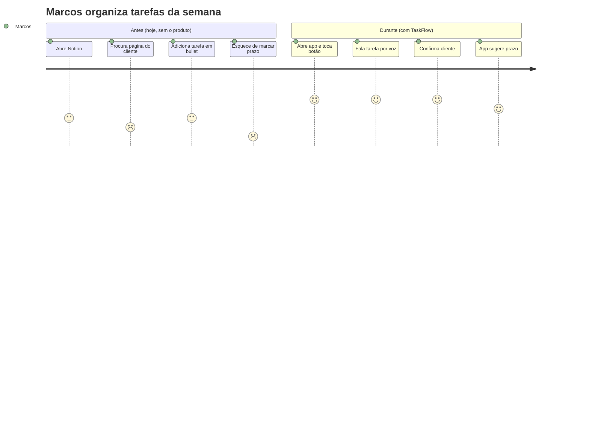

# Getting Started — RENATA

> 🇧🇷 [Versão em português](GETTING-STARTED.pt-br.md)

> **Guided tutorial** to go from **"I have an idea"** to **"I have running code"**.
>
> We'll follow along the fictional build of **TaskFlow** — a task management SaaS for freelancers — so you can see each step in action.
>
> You don't have to be a dev to start. Total estimated time: **8-12h** spread across **1-2 weeks**.

**Before you start — where things are:**

- 🏗 **Already have a codebase?** This tutorial assumes a new project. For an existing one, the entry point is `/renata:adopt` — read [`ADOPTION.md`](ADOPTION.md) first.
- 🧠 **The full flow map, the 4 views of the method** (flow · execution loop · responsibility · artifacts) **and "why this order?"** live in [`METHOD.md`](METHOD.md) — the "why" behind what you'll do here.
- 📎 **The appendices** (when NOT to use, anti-patterns, alternative orders, realistic times, quick cheatsheet) live in [`REFERENCE.md`](REFERENCE.md).

---

## 🧭 Your compass: `/renata:status`

Before the steps, meet the one command you'll run more than any other. **`/renata:status` is the navigator** — it answers "where am I, and what's next?" without ever doing the step for you.

```text
/renata:status
```

What it does, every time you run it:

1. **Reads `.claude/progress-map.yaml`** (the single source of truth — not a hard-coded list) and scans your `docs/` to see which artifacts exist and have real content.
2. **Prints the visual map** of all steps, each marked ⬜ pending · 🔄 in progress · ✅ verified by you.
3. **Points to the next step** — the lowest pending step whose prerequisites are met (it respects `prereq`, not just numeric order, so a technical project doing ADRs before personas isn't misled).
4. **Runs the human gate** on the step in progress: it checks that step's quality checklist against your actual files, shows the result, and — only if **you** confirm — stamps `> ✅ Verified by you on <date>` at the top of the artifact. It never marks a step done on its own.

Use it whenever you're unsure what comes next, after editing a doc (`/renata:status <N>` re-validates step N), or when you feel tempted to skip ahead — that's exactly when the gate earns its keep. Every `⛔ GATE` you'll see in this tutorial is just a reminder to run it.

> It's a **read-only navigator**: it informs and suggests, it never runs `/renata:prd`, `/renata:persona`, etc. for you. The doing stays with you.

> 🔒 **Optional strict mode:** exporting `RENATA_STRICT_GATE=1` makes the stage gate also require the human seal (`> ✅ Verified by you`) on prerequisite artifacts before letting a step command run — done ≠ verified. Off by default so the flow doesn't stiffen.

---

## 📖 Summary of the steps

| # | Step | Time | Command | Result |
|---|---|---|---|---|
| 0 | Pre-flight | 10min | — | Environment ready |
| 0.5 | Adopt (only if you already have a project) | varies | `/renata:adopt` | RENATA adopted over existing code — guide: [`ADOPTION.md`](ADOPTION.md) |
| 1 | Create project | 5min | — | Initial structure |
| **1.5** | **Discovery (optional)** | **30-60min** | **`/renata:discovery`** | **`docs/discovery/<date>-<slug>.md`** |
| 2 | Define the product | 1-2h | `/renata:prd` | `docs/prd/<slug>.md` |
| 3 | Map personas | 30min each | `/renata:persona` | `docs/business-context/personas.md` |
| 4 | Map journeys | 30min | `/renata:user-journey` | `docs/business-context/jornada.md` |
| 5 | Define metrics | 45min | `/renata:metrics` | `docs/business-context/metricas.md` |
| 6 | Technical decisions (ADRs) | 2-4h | `/renata:adr` | `docs/decisions/ADR-*.md` |
| **6.5** | **Competitive research (optional)** | **30-60min** | **`/renata:landscape`** | **`docs/research/<date>-landscape.md`** |
| 7 | Prioritize features | 1h | `/renata:feature-breakdown` | `docs/features/README.md` |
| 7.5 | Phase the system | 30-45min | `/renata:phase-roadmap` | `docs/roadmap/fases-overview.md` |
| **7.7** | **Feature behavior (optional)** | **30min per feature** | **`/renata:feature-behavior`** | **`docs/features/F<N>-*.behavior.md`** |
| 8 | Spec per phase (starts with Phase 0) | 1-2h | `/renata:feature-spec` | `docs/features/F1-*.md` |
| **8.5** | **Screen design (optional)** | **1-2h** | **`/renata:screens`** | **`docs/design/`** |
| 9 | Macro roadmap | 1h | `/renata:roadmap-gates` | `docs/roadmap/` |
| 10 | Technical architecture | 2-3h | `/renata:architecture` | `docs/technical-context/` |
| 11 | Execution plan | 15min | `/renata:plan-phase` (involves `superpowers:writing-plans`) | `docs/superpowers/plans/` |
| 12 | Execute | days-weeks | `/renata:execute <phase>` (involves `superpowers:executing-plans` + done gate) | real code |
| 13 | Phase retro | 1h | `/renata:retro` | `docs/roadmap/fase-N-retro.md` |

---

# 🛠 Step 0 — Pre-flight (10min)

**Goal:** make sure your computer is ready to use RENATA.

## What you need to have installed

| Tool | What it's for | How to install |
|---|---|---|
| **Claude Code** | It's the "IDE" where you'll operate | https://claude.com/claude-code (follow the site, it's 1-click) |
| **Git** | Version files | You probably already have it. Test: `git --version` |
| **yq** | ADR enforcement on commit + status line (no fallback — without it the hook validates nothing) | macOS: `brew install yq` · Linux: `sudo apt install yq` |
| **jq** (or **python3**) | Stage gate + status line (either one is enough) | macOS: `brew install jq` · Linux: `sudo apt install jq` |

## Validation

Open a terminal and paste, one at a time:

```bash
git --version          # deve sair: "git version 2.x.x"
claude --version       # deve sair número de versão
yq --version           # deve sair: "yq (https://...) version 4.x.x"
```

Missing something? Since 0.4.0, `/renata:init` checks these dependencies on first run and offers to install what's absent (brew/apt-get/dnf). Nothing aborts without them — the hooks degrade with warnings — but without `yq` the ADR enforcement validates nothing, so don't go past Step 6 without it.

## Concepts you'll see a lot

Before moving on, lock in these 3 concepts:

| Term | What it is |
|---|---|
| **Living doc** | A document in `docs/` that evolves along with the project. It is NOT "write it and forget it" — it's "write, decide, come back, update". |
| **Slash command** | A command you type in Claude Code starting with `/`. E.g.: `/renata:prd`. It asks you questions and generates a doc. |
| **Hook** | A script that runs on its own before each commit, checking that you're not violating old decisions. |

---

# 🏗 Step 0.5 — Existing project? (skip if it's a new project)

**Already have a codebase?** Don't retrofit by hand — one command orchestrates the whole adoption: reverse-engineered technical pattern (ADRs + code-pattern docs), feature inventory, as-built specs and a retroactive PRD, confirming every item with you:

```text
/renata:adopt
```

Read [`ADOPTION.md`](ADOPTION.md) — it explains each stage, **where every artifact lives**, what to verify afterward via `/renata:status`, and how to handle pre-existing ADRs.

If you're creating a project **from scratch**, skip to Step 1.

---

# 🚀 Step 1 — Create the project (5min)

**Goal:** have the initial project structure created on your machine.

## 1.1. Choose a name and location

Decide where the project will live and what it's called.

> 💡 **TaskFlow example:** human name `TaskFlow`, folder `~/projetos/taskflow`.

```bash
PROJECT_NAME="TaskFlow"
PROJECT_DIR=~/projetos/taskflow
```

## 1.2. Create the folder and start git

Do this **before** `/renata:init` — the ADR-enforcement hook only activates if git already exists:

```bash
mkdir -p $PROJECT_DIR
cd $PROJECT_DIR
git init
```

## 1.3. Install the plugin (once) and initialize the project

RENATA is a **Claude Code plugin** — you install it once and it stays available in every project.

**a) Install the plugin (only the first time):**

```text
/plugin marketplace add AInsteinsBR/renata
/plugin install renata@ainsteins
```

**b) Initialize the structure in the new project:** open Claude Code in the project directory and run:

```text
/renata:init "TaskFlow"
```

(or `/renata:init "TaskFlow" --starter <starter-URL>` if you have a frontend boilerplate.)

`/renata:init` creates the structure, fills `CLAUDE.md` with the name, and — since the project already has git (step 1.2) — **automatically enables** the blocking of commits that violate an ADR.

## 1.4. Check what was created and make the first commit

```bash
ls -la
```

You should see:

```text
.claude/           ← project's progress-map.yaml + rules.yaml
docs/              ← empty folders ready to be populated
CLAUDE.md          ← project context file
```

> The **commands, agents and hooks** don't live in the project — they come from the plugin installed in Claude Code. Only the data scaffold (`docs/`, `CLAUDE.md`, `.claude/progress-map.yaml`, `.claude/rules.yaml`) lives in the project.

```bash
git add .
git commit -m "chore: scaffold via RENATA"
```

## 1.5. Fill in the basic CLAUDE.md

Open `CLAUDE.md` in your editor (VSCode, Sublime, etc). You'll see several `{{PLACEHOLDERS}}` with comments indicating which step each one is filled in.

**Now, fill in only the Step 1 ones:**

- `{{PROJECT_CATEGORY}}` — a 1-line category. E.g.: `task management SaaS for freelancers`.
- `{{STAGE}}` — current state. E.g.: `pre-code, documentation in progress`.
- `{{TEAM}}` — who is on the project. E.g.: `Eric (solo)` or `Eric + 2 devs`.

**Leave the rest for later.** Each placeholder has a comment saying "fill in at Step N".

## Step 1 validation

- [ ] `/plugin` shows `renata` installed and enabled.
- [ ] `ls .claude/` shows `progress-map.yaml` and `rules.yaml` in the project.
- [ ] `CLAUDE.md` exists with `{{PROJECT_NAME}}` filled in.
- [ ] Git has 1 initial commit.

## Common pitfalls

- **`/renata:init` doesn't show up**: the plugin isn't installed/enabled. Run `/plugin install renata@ainsteins` and check in `/plugin`.
- **CLAUDE.md already existed**: `/renata:init` asks before overwriting — confirm only if it's intentional.

---

# 🌫️ Step 1.5 — Discovery (optional): from idea to problem, before the PRD

**Don't know yet what you want to build?** Before the PRD, run discovery — it converges a vague intuition into a clear problem, and teaches you the frameworks as it goes:

```text
/renata:discovery something to help freelancers track tasks
```

It walks you through the **5 whys** (dig the real pain), the **job-to-be-done** (what progress the person is hiring the product for), and **why now** — and forces you to frame the problem **2-3 different ways** before committing, so you don't crystallize on the first idea. The output (`docs/discovery/<date>-<slug>.md`) becomes the starting point for `/renata:prd`, and seeds clues for persona, journey and metrics.

The discovery also **stamps every claim with an evidence seal** (🔴 belief · 🟡 anecdote · 🟢 interviewed · ✅ measured). A bet stamped 🔴 is allowed — but the honest move is to get out of the building first: `/renata:interview-kit` generates a one-page Mom Test script (read it on your phone on the way), you record the conversation, and `/renata:interview-debrief` turns each transcript into graded evidence — moving the seal for real.

**Already arrive with a clear problem?** Skip this and go straight to Step 2.

---

# 📋 Step 2 — Define the product (1-2h)

**Goal:** write the Micro PRD — the most important document of the project. Everything afterward binds to it.

> 🧭 **Starting a system with several bets?** Method rule: **one project = one PRD**, and that PRD houses **N hypotheses** (each with its own falsification signal and its own decisive metric). Don't create "multiple PRDs" — if a bet is separable to the point of living on its own, it's **another project** (its own folder), not another PRD here. The full rule (with examples) is in [`METHOD.md` → "1 project = 1 PRD"](METHOD.md#um-prd-vs-n-prds). ADRs are **cross-cutting** (`docs/decisions/`), never inside the PRD.

## 2.1. Think for 5 minutes before running it

Before opening Claude Code, have draft answers for:

- **In 1 sentence, what's the problem?** With a NUMBER (hours, %, $, frequency).
- **Who suffers from this problem?** Role + context.
- **Why now?** What market/customer signal justifies it?
- **What do you imagine as the solution?** In 2-3 sentences.

> 💡 **TaskFlow example (draft):**
>
> - **Problem:** freelancers lose **6h/week** organizing tasks in spreadsheets and Notion, and still miss 30% of their client deadlines.
> - **Who suffers:** solo freelancer aged 25-45 (design, dev, marketing) managing 3-8 clients simultaneously.
> - **Why now:** the freelance market grew 40% post-pandemic. Trello/Asana are expensive and overdesigned for solo.
> - **Solution:** a simple app that captures a task in 1 tap, groups it by client, and warns before things are due.

## 2.2. Open Claude Code

```bash
cd $PROJECT_DIR
claude
```

## 2.3. Invoke `/renata:prd`

Type in Claude Code:

```text
/renata:prd task management app for solo freelancers managing multiple clients
```

## 2.4. Answer the 9 questions

The command will ask one at a time. Don't skip:

1. **Problem** with a number
2. **Who for** (anchor persona, name + role + 1 line)
3. **Why now**
4. **Falsifiable hypothesis** ("if X, then Y goes from Z to W")
5. **How the hypothesis fails** (falsification signal)
6. **Scope IN** (if the product is phased, ask per phase)
7. **Scope OUT** (what does NOT go in)
8. **Done criterion**
9. **Decisive metric** (the one you show a stakeholder to say "I won")

**Average time:** 30-60min if you don't get stuck on any of them.

> 💡 **TaskFlow example (some answers):**
>
> - **Hypothesis:** "If a freelancer can capture a task in <5s and see a client's agenda on 1 screen, then **time spent organizing drops from 6h/week to <1h/week**, and **% of deadlines met rises from 70% to 90%+**."
> - **Decisive metric:** % of tasks completed by the deadline (vs total created with a deadline).
> - **Scope OUT:** ❌ team/agency (solo only), ❌ invoicing (goes to Phase 3), ❌ web app (mobile only in Phase 1).

## 2.5. Review the generated PRD

Claude writes to `docs/prd/taskflow.md` (or a similar name). Open it and validate:

- [ ] Does the problem have a **number** (not "too much time wasted")?
- [ ] Is the hypothesis **falsifiable** (does it have a numeric target)?
- [ ] Are scope IN **and** OUT clear?
- [ ] Does the decisive metric have baseline + target + formula + source?

If any item failed, ask Claude to refine the specific section.

## 2.6. Update CLAUDE.md

Open `CLAUDE.md` and fill in now:

- `{{HYPOTHESES}}` — one line per hypothesis (H1, H2…). If the PRD has 1 hypothesis, it's a single line.
- `{{PRD_SLUG}}` — the name of the generated file (e.g.: `taskflow`).
- `{{PRD_NAME}}` — `TaskFlow (\`docs/prd/taskflow.md\`)`.

## Step 2 validation

- [ ] `docs/prd/<slug>.md` exists with 6 canonical sections.
- [ ] The hypothesis has the format "If X, then Y goes from Z to W".
- [ ] **Elevator test:** can you explain the product in 30s showing only this file? If not, refine.

> ⛔ **GATE.** Don't advance without the items above ✅. Run `/renata:status` to confirm the next step.

## Common pitfalls

| Symptom | Solution |
|---|---|
| Vague hypothesis ("it'll improve UX") | Force a number. Estimate if you have no data. |
| Giant scope IN | Decompose into phases. If you're describing a platform with 6 subsystems, pause and use `superpowers:brainstorming`. |
| No scope OUT | Force it. 3-5 items minimum. |
| Generic persona ("SMBs") | Pause here, go to Step 3, then come back. |

---

# 👤 Step 3 — Map personas (30min per persona)

**Goal:** turn the PRD's "who for" into structured personas with a name, numeric pain, and a quote.

## 3.1. Define who is primary, secondary, indirect

| Type | Who it is | How many |
|---|---|---|
| **Primary** | Suffers the problem most and decides on the solution | 1 |
| **Secondary** | Affected but with less weight | 0-2 |
| **Indirect** | Uses it but doesn't buy it (end-user) | 0-1 |

> 💡 **TaskFlow example:**
>
> - **Primary:** Marcos, freelance designer (decides and uses).
> - **Secondary:** Marcos's client (receives deliverables, doesn't use the app).
> - **Indirect:** none (Marcos operates alone).

## 3.2. Invoke `/renata:persona` for each one

```text
/renata:persona Marcos · Freelance Designer
```

**The command runs 4 turns:**

| Turn | Question |
|---|---|
| 1 | Role and context (job, company/situation, routine) |
| 2 | Specific pain with a **number** + alternatives already tried |
| 3 | Success criterion (in her own words, as a quote) + anchor phrase |
| 4 | Anti-personas (who it is **not**) |

## 3.3. Repeat for secondary and indirect personas

30min per persona. Total: 1-1h30 for 2-3 personas.

## 3.4. Review `docs/business-context/personas.md`

Validate **for EACH persona**:

- [ ] Proper name (not a generic role)
- [ ] Pain with a number
- [ ] An "Alternatives already tried" list with the reason for failure
- [ ] Success criterion as a quote `> "..."`
- [ ] A short, impactful anchor phrase

And at the end of the file (a single consolidated section):

- [ ] "Who is **not** a persona for this product" with 3+ items

## 3.5. Update CLAUDE.md

- `{{PRIMARY_PERSONA}}` — the name of the primary persona.

## Step 3 validation

- [ ] Primary persona with 5 complete blocks.
- [ ] Anti-personas listed.
- [ ] **Mantra test:** can you recite the primary's anchor phrase by heart?

> ⛔ **GATE.** Don't advance without the items above ✅. Run `/renata:status` to confirm the next step.

## Common pitfalls

| Symptom | Solution |
|---|---|
| "The persona is everyone" | Force a specific profile. "Marcos, freelance designer, 32, manages 5 clients across 3 different social networks" is a persona. "Tech freelancers" is not. |
| Pain without a number | Estimate, even roughly. Without a number, it's a wish. |
| Technical success criterion ("they'll use our API") | Success is what **she** wants, not what the product does. |

---

# 🗺 Step 4 — Map journeys (30min)

**Goal:** understand how each persona solves the problem **today** (without the product) and how they will solve it **afterward**.

## 4.1. Decide which journeys to map

Usually 1 journey per persona. If two personas follow the same sequence, do 1 with a note on the differences.

## 4.2. Invoke `/renata:user-journey`

```text
/renata:user-journey Marcos
```

**Expected output:** a journey in 3 phases (`before`, `during`, `after`) using `mermaid journey`.

💡 **TaskFlow example (partial):**



## 4.3. Validate critical points

Each journey produces **critical points** — moments where, if we fail, we lose the user.

**Good example:**

> 1. **First 3 seconds** — if the widget doesn't load fast, Marcos closes it. → **drives** a TTFB <500ms requirement.

**Bad example (no binding):**

> 1. **The experience needs to be good.**

## 4.4. List anti-journeys

Scenarios we do NOT want to support. 2-4 items.

> 💡 **TaskFlow example:**
>
> - ❌ Marcos wants to invite 5 colleagues to collaborate on a project → the product is solo, suggest an alternative.
> - ❌ Marcos wants integrated invoicing → out of Phase 1 scope.

## 4.5. Metrics the journey produces

A table binding each critical point → an observable metric.

## Step 4 validation

- [ ] `docs/business-context/jornada.md` has 1+ journeys with `mermaid journey`
- [ ] Critical points bound to requirements
- [ ] Anti-journeys listed
- [ ] Metrics mapped in a table

> ⛔ **GATE.** Don't advance without the items above ✅. Run `/renata:status` to confirm the next step.

## Common pitfalls

| Symptom | Solution |
|---|---|
| A journey of only the "during" | The "before" is just as important. It explains why your solution wins. |
| Mermaid journey too long | If a section has >7 steps, split it into more sections. |
| Generic critical point ("everything needs to be fast") | Point to **specific** moments. |

---

# 📊 Step 5 — Define metrics (45min)

**Goal:** structure how you're going to measure whether things are working — in 4 layers.

## 5.1. Invoke `/renata:metrics`

```text
/renata:metrics
```

**The command structures into 4 layers:**

| Layer | Key question |
|---|---|
| 1. Adoption | Does anyone use it? |
| 2. Engagement | Do they use it properly? |
| 3. Value | Does it deliver a result? (this is the decisive metric) |
| 4. Perceived quality (optional) | Does it feel good to whoever uses it? |

## 5.2. Be careful with the decisive metric (Layer 3)

It must:

- [ ] Bind to the PRD's hypothesis (same direction, same scale)
- [ ] Have a numeric baseline (even if approximate)
- [ ] Have a clear target per phase
- [ ] Have an explicit formula
- [ ] Have a source (where the data comes from)

> 💡 **TaskFlow example:**
>
> **Decisive metric:** % of tasks completed by the deadline
> **Baseline:** 70% (self-reported by the freelancers interviewed)
> **Phase 1 target:** 85%
> **Phase 2 target:** 90%
> **Formula:** `tarefas com status=done AND completed_at <= due_date ÷ tarefas com due_date != null`
> **Source:** internal dashboard, daily cron

## 5.3. Technical metrics that unlock business

Table:

| Technical metric | Target | Why it matters |
|---|---|---|
| App TTFB | <500ms | Marcos abandons it if it's slow |
| STT latency (if it has voice) | <2s | The conversation breaks above that |

## 5.4. Anti-metrics

What is NOT a metric. List 3+:

- ❌ "Number of tasks registered" — vanity, not output.
- ❌ "Time in the app" — the less, the better (not more).

## 5.5. Review cadence

Who looks at which metric and how often.

## Step 5 validation

- [ ] 3 minimum layers filled in (4 if the product has subjective quality)
- [ ] The decisive metric binds to the PRD's hypothesis
- [ ] Every metric has baseline + target + formula + source
- [ ] Anti-metrics listed

## Common pitfalls

| Symptom | Solution |
|---|---|
| The decisive metric is NPS | NPS is Layer 4. Find an operational/commercial output metric. |
| 5 decisive metrics | Force 1. The others become secondary. |
| Baseline is "we'll find out" | Estimate, even roughly. |

> ⛔ **GATE 5→6 (do not skip).** Before touching features, the **ADRs** (Step 6) are
> mandatory. The PRD + metrics already force technical decisions (database, stack, transport).
> Going to features without an ADR = loose features that come back as rework. If you're
> tempted to skip to `/renata:feature-breakdown` now, **stop and run `/renata:status`** — it will
> point to Step 6. The `etapa-gate` hook blocks the breakdown if the ADRs are missing.

---

# 🛠 Step 6 — Technical decisions (ADRs) (2-4h)

> 🛠 **From here on, bring in the technical team.** You (PM) lead the conversation, but the decisions need technical validation.

**Goal:** document all the structural decisions (database, framework, patterns, etc) in ADRs that stay linked to the code by an automatic hook.

## This step is not linear

You open an ADR whenever a decision with impact > 1 sprint shows up. You may run `/renata:adr` several times over the course of days.

## 6.1. List pending decisions

Ask the tech team:

> "Which structural decisions do we need to make before coding?"

**Typical list for a new product:**

- Which is the main database? (Postgres? MySQL? something NoSQL?)
- Backend language/framework?
- Frontend language/framework?
- How is authentication done?
- Multi-tenancy? Single-tenancy?
- How to deploy? (Docker? K8s? serverless?)
- Data access pattern? (ORM? Repository? raw SQL?)
- Self-host vs SaaS for key components?

**Each one → 1 ADR.**

## 6.2. For each decision, invoke `/renata:adr`

```text
/renata:adr usar PostgreSQL como banco principal
```

**The command guides you through 6 questions:**

1. Context (why now)
2. Alternatives considered (minimum 2)
3. Why each alternative was rejected
4. Accepted trade-offs
5. Review trigger (when to reopen this decision)
6. Enforcement (hook, lint, review checklist)

> 💡 **TaskFlow example (summary of ADR-001):**
>
> **Decision:** PostgreSQL.
> **Rejected alternatives:** MongoDB (team doesn't know it + relational domain), SQLite (doesn't scale in multi-region).
> **Accepted trade-off:** rigid schema, mandatory migrations.
> **Review trigger:** if a feature with a real dynamic schema shows up.
> **Enforcement:** hook blocks `import mongoose` or `import pymongo`.

## 6.3. `/renata:adr` updates `rules.yaml` automatically

When enforcement is via a hook, **`/renata:adr` itself** adds the YAML block to `.claude/rules.yaml` with your confirmation. **You don't edit it manually.**

Flow:

1. `/renata:adr` asks whether enforcement is via a hook.
2. If so, it asks for the regex pattern + scope + message.
3. **Shows** the YAML block it's going to add.
4. **Asks for confirmation** ("I'm going to add this block to rules.yaml. OK?").
5. After `OK`, it edits and validates the YAML.

**Your responsibility:** review the block before confirming — does the pattern make sense? does the scope cover what's needed? does the message help whoever violates it?

> ⚠️ **`rules.yaml` is project content, not framework content.** Each block is a twin of an ADR. If you catch yourself editing it manually outside of `/renata:adr`, stop — you're losing the ADR ↔ rule binding. Use `/renata:adr` in refine mode.

## 6.4. Pre-commit hook: confirm it's enabled

`/renata:init` already enables this automatically when the project has git (Step 1.2). Confirm:

```bash
ls -l .git/hooks/pre-commit   # should point to RENATA's rules-violation.sh
```

If the symlink isn't there (e.g., git was only created after the init), just re-run `/renata:init` — recreating it is the documented remedy.

From here on, every commit runs the hook.

## 6.5. Update the ADR index

`/renata:adr` already updates `docs/decisions/README.md` automatically. Check that it's there.

## 6.6. (Optional) Configure MCP integrations

Want the project to use MCP — Jira for tasks, GitHub for PRs, Postgres to query the database? It's **optional and configurable**, and the local copy always remains the source of truth.

**Step 1 — declare the server.** Edit `.mcp.json` at the project root (created by `init.sh`, starts empty) or use `claude mcp add`. Jira example:

```json
{
  "mcpServers": {
    "jira": { "command": "npx", "args": ["-y", "@some/jira-mcp-server"], "env": { "JIRA_URL": "...", "JIRA_TOKEN": "..." } }
  }
}
```

(The server name — here `jira` — is what you reference in the next step. Credentials are your responsibility, not the framework's.)

**Step 2 — decide via `/renata:adr`.** Adopting an MCP as a mirrored source is a structural decision. Run `/renata:adr usar Jira pra tarefas` — it creates the ADR and writes the `integrations:` block in `.claude/rules.yaml`:

```yaml
integrations:
  tasks: { mcp: jira, adr: ADR-009, mirror: true }
```

**How it works afterward:** when you run `/renata:todo` or `/renata:triage`, the command writes **to the local copy first** (`docs/backlog/todos.md`) and then **asks** if you want to mirror it to Jira. You confirm → it becomes a card. Without confirming → it stays local only. If the MCP isn't available in the session, it operates 100% locally and warns you. Nothing breaks for lack of an MCP.

**`mirror: true` vs `false`:** `true` = writes locally and offers a push (tasks). `false` = MCP only for reads/one-off actions, without mirroring writes (typical of `db`).

## 6.7. (Optional) Distill the pattern of a boilerplate/repo

Do you have a repo that already follows the house pattern — a cloned starter, an old project, a boilerplate? Instead of having Claude mine that code every session, **distill the pattern** once:

```text
/renata:extract-pattern frontend/
```

The command fires the `@pattern-mapper` agent, which scans the repo across 4 axes (architecture, stack, design system, conventions). You **confirm item by item** what it detected (the code is the truth, but you are the judge of what becomes a rule). It then generates:

- **ADRs** — one per structural decision (stack, architecture, design system), with alternatives and a review trigger.
- **`docs/technical-context/code-pattern-frontend.md`** — the operational detail (components, tokens, examples), which `CLAUDE.md` then loads automatically.

**Multiple patterns in the same project** (e.g.: front and back): run it once per scope — `/renata:extract-pattern frontend/` and `/renata:extract-pattern backend/`. Each generates its own `code-pattern-<scope>.md` and ADRs tagged by scope, without mixing.

> ADR ≠ doc: the ADR records **the decision** (why shadcn, not Material); the `code-pattern-*.md` records **the detail** (which components, which tokens). The ADR points to the doc; nothing is duplicated.

> 🏗 **Adopting a whole existing project?** extract-pattern is Stage 1 of `/renata:adopt`, which also reverse-engineers the feature inventory, as-built specs and a retroactive PRD — see [`ADOPTION.md`](ADOPTION.md).

## Step 6 validation

- [ ] `docs/decisions/` has ≥ 5 accepted ADRs (typical)
- [ ] `rules.yaml` has rules for all the ones with hook enforcement
- [ ] **Manual hook test:** paste an `import` that violates some ADR and try to commit — it should fail
- [ ] Each ADR has an explicit review trigger

> ⛔ **GATE.** Don't advance without the items above ✅. Run `/renata:status` to confirm the next step.

## Common pitfalls

| Symptom | Solution |
|---|---|
| ADR "Status: proposed" for weeks | Decide or discard. Eternal proposed is noise. |
| ADR without alternatives | You didn't make a decision — you made a choice by inertia. Force 2+ alternatives. |
| Enforcement is only "code review" | Whenever possible, automate it via a hook. Code review forgets. |

---

# 🔭 Step 6.5 — Competitive research (optional): find your differentiation gaps

**Want to know what's already out there before you commit to features?** After the PRD, map the landscape:

```text
/renata:landscape
```

It researches similar solutions **anchored on your PRD** (via a Perplexity MCP if you have one configured, otherwise native web search), and **dumps everything with sources** into `docs/research/<date>-landscape.md` for you to read at your own pace. Then run it again and it **curates with you** — block by block, proposing angles you might not have seen; you keep, cut, or add with your domain knowledge. The output: prioritized **differentiation gaps** that become candidate features for `/renata:feature-breakdown`.

Every competitor claim carries a source — no source, not a fact. The point isn't to copy or to "have everything": it's to find the gap that's yours.

---

# 🎯 Step 7 — Prioritize features (1h)

**Goal:** break the product into 3-7 features and mark which ones make up the **anchor set** (the minimal slice that delivers end-to-end value — it becomes Phase 0).

## 7.1. Free brainstorm

Before `/renata:feature-breakdown`, draft a list of:

- What does the product **need** to have for the hypothesis to hold?
- What will it explicitly **NOT** have?

## 7.2. Invoke `/renata:feature-breakdown`

```text
/renata:feature-breakdown
```

**The command asks for 3-7 candidate features, and classifies each one in binary:**

- **MUST** — without it, the hypothesis fails.
- **OUT-OF-SCOPE** — doesn't go in the product, goes to anti-features.

> 💡 **TaskFlow example (5 features):**
>
> | ID | Name | Category | Effort | Phase | Depends |
> |---|---|---|---|---|---|
> | **F1** | **Quick task capture** ⚓ | MUST | L | 0 | — |
> | F2 | Per-client view | MUST | M | 1 | F1 |
> | F3 | Deadline notification | MUST | M | 1 | F1 |
> | F4 | Cloud backup | MUST | S | 2 | F1 |
> | F5 | Multi-device sync | MUST | L | 2 | F4 |

## 7.3. Mark features for the anchor set (Phase 0)

The "anchor" is not ONE feature — it's the **minimal set** that delivers end-to-end
value (one closed anchor journey). Mark which features make up Phase 0. The rest
will be distributed across phases in Step 7.5 (`/renata:phase-roadmap`).

Criteria for the anchor set:
1. ✅ Together, they close ≥1 end-to-end journey
2. ✅ Each one is a MUST without a doubt
3. ✅ The set fits into a first short cycle
4. ✅ Even on its own, the set proves something of the hypothesis

## 7.4. Dependency diagram

`mermaid flowchart` showing F1 → F2 → F3...

## 7.6. Anti-features

3-5 things that could be confused but are out.

## 7.7. (Optional) Refine the behavior before the technical detail

Do you have a Product discipline separate from Engineering, or dense business rules? Before the technical spec, refine each feature **purely as observable user behavior**:

```text
/renata:feature-behavior F1
```

This generates `docs/features/F1-<slug>.behavior.md` with user stories, Gherkin scenarios for the critical points, explicit business rules, observable acceptance criteria, and the anti-behavior ("what it does NOT do") — **with zero technical detail**. It's the clean Product→Engineering handoff.

Then `/renata:feature-spec` reads this behavior, links to it, and covers only the technical *how* (no duplication). A solo dev who is both Product and Engineering can skip this and go straight to `/renata:feature-spec`.

## Step 7 validation

- [ ] `docs/features/README.md` lists 3-7 features
- [ ] Anchor set marked (Phase 0 features) + 4 justified criteria
- [ ] Clear dependency diagram
- [ ] Anti-features listed

> ⛔ **GATE.** Don't advance without the items above ✅. Run `/renata:status` to confirm the next step.

## Common pitfalls

| Symptom | Solution |
|---|---|
| 10+ features | Merge the smaller ones. |
| Vague anchor set | Force a choice. "All equal" doesn't fly. |
| XL anchor set | Reduce the slice. The set must fit into a first short cycle. |

---

# 🗂 Step 7.5 — Phase the system (30-45min)

**Goal:** distribute **ALL** the features across phases (Phase 0, 1, 2...) with an
approximate time. None is left out — Phase 0 is the anchor set.

## 7.5.1. Invoke `/renata:phase-roadmap`

```text
/renata:phase-roadmap
```

The command distributes each feature from the breakdown into a phase and generates
`docs/roadmap/fases-overview.md` with a gantt + a coverage table.

## 7.5.2. Check coverage

- [ ] Every feature from `README.md` appears in some phase
- [ ] Phase 0 closes an end-to-end journey
- [ ] Each phase has an approximate time
- [ ] The order respects dependencies

## Step 7.5 validation

- [ ] `docs/roadmap/fases-overview.md` exists with all the features phased
- [ ] Coverage table with no orphans
- [ ] Phase 0 = anchor set

> ⛔ **GATE 7.5→8.** The spec (Step 8) only starts after phasing. You spec **phase by
> phase**, starting with Phase 0. Run `/renata:status` to confirm.

---

# 🔬 Step 8 — Spec per phase (starts with Phase 0) (1-2h per feature)

**Goal:** detail ALL the Phase 0 features (anchor set) to the point of starting
implementation. Spec phase by phase — not just one feature.

## 8.1. Invoke `/renata:feature-spec`

```text
/renata:feature-spec F1
```

**The command guides you through:**

- Category + effort + phase + dependencies
- Problem (which pain this feature attacks)
- Scope (capabilities + how it works at a high level)
- Value
- Dependencies
- Bindings (PRD, ADRs, persona, metric)
- Verifiable done criterion
- Refinements for a later phase
- **Phased plan** (each phase preferably XS-M, L with justification, XL must be broken up)

## 8.2. Validate the phased plan

Each `Fn.x` must have:

- [ ] A clear name
- [ ] Effort in a t-shirt size
- [ ] A single objective
- [ ] A task list (checkboxes)
- [ ] A verifiable done criterion
- [ ] A declared dependency if there is one

Phases preferably XS-M. L acceptable with justification. XL → break it up.

## 8.3. (Optional) Spec of secondary features

It can wait — you don't need to do them all now. Focus on the anchor.

## Step 8 validation

- [ ] Every Phase 0 feature has `docs/features/F<n>-<slug>.md` with complete sections
- [ ] Each spec has a phased plan with a verifiable criterion
- [ ] No Phase 0 feature was left without a spec

> ⛔ **GATE.** Don't advance without the items above ✅. Run `/renata:status` to confirm the next step.

---

# 🎨 Step 8.5 — Screen design (optional, 1-2h)

> **Skip if:** the product has no UI (CLI, API, library) or if the current phase has 1 trivial screen.
> **Don't skip if:** the product has multiple screens with real users (B2B/B2C).

**Goal:** structure the **screen inventory**, the **flow between them** and the **structured briefs** that will serve as input for:

- An external design tool (Lovable, Claude Design, v0.dev, Figma), OR
- Direct implementation in the starter kit (if you use the `--starter` flag in `init.sh`).

## 8.5.1 — Two possible scenarios

### Scenario A — You have your own starter kit

If you ran `init.sh ... --starter <URL>`, you already have:

- `frontend/` cloned from your starter (Next.js + Tailwind + shadcn + your own components, for example).
- `docs/decisions/ADR-001-frontend-starter.md` documenting that choice.

In this case, `/renata:screens` generates briefs that **assume** the code will live in the starter. You won't paste into Lovable — you'll implement directly.

### Scenario B — You do NOT have a starter (you'll use an external tool)

Without a starter, `/renata:screens` generates **generic** briefs that you paste into an external tool (Lovable, Claude Design, v0).

> ⚠️ **Important:** the output of the external tool is a **PROTOTYPE**, not final code. Step 10 (technical architecture) and Step 11 (execution plan) decide how much to reuse vs rewrite according to your ADRs.

## 8.5.2 — Invoke `/renata:screens`

```text
/renata:screens
```

The command automatically detects whether you're in Scenario A or B (it looks for a frontend ADR) and adjusts the output.

## 8.5.3 — Answer the questions

- **Which screens does the product have?** (3-15, a lean list).
- **For each screen:** name, purpose, anchor persona, feature(s) it serves.
- **Flow between screens:** which goes to which?
- **Shared vs specific screens?**
- **Special states per screen:** loading, error, empty, success.
- **Anti-screens:** what will NOT exist even though it seems obvious.
- **External tool (if Scenario B):** Lovable? Claude Design? v0?

## 8.5.4 — Generated files

```text
docs/design/
├── inventory.md             ← list of screens with persona + feature
├── flow.md                  ← mermaid of transitions
├── briefs/                  ← 1 brief per MUST screen
│   ├── tela-login.md
│   ├── tela-dashboard.md
│   └── ...
└── artifacts/
    └── README.md            ← links to Lovable/Claude Design OR paths in the starter
```

## 8.5.5 — For each brief

### Scenario A (with starter)

The brief contains:

- Starter components to reuse
- The path of the file to create (`frontend/src/pages/...`)
- The constraints of the design system documented in the starter

**Next step:** the technical team implements directly, without an external tool.

### Scenario B (without starter)

The brief contains:

- The product's constraints (palette, tone, mobile-first)
- MUST/SHOULD/NOT elements
- Special states

**Next step:**

1. Paste the brief into the external tool.
2. Iterate until you like the result.
3. Note the link/snapshot in `docs/design/artifacts/README.md`.
4. **Remember:** it's a prototype. Step 10 decides reuse.

## 8.5.6 — Validate with the anchor persona before continuing

> 💡 **TaskFlow example:** Marcos (anchor persona) opens the generated mockups, navigates the flow. Critical points:
>
> - Task capture in <5s? Count the clicks.
> - Does the per-client view make sense without training?
> - Does any special state (e.g.: "no tasks today") seem to engage?

If the anchor persona gets stuck at some point, **go back to the brief**. Don't proceed to Step 9 with a bad design.

## Step 8.5 validation

- [ ] `docs/design/inventory.md` lists 3-15 screens with persona+feature.
- [ ] `docs/design/flow.md` has a clear mermaid.
- [ ] Briefs generated for all MUST screens.
- [ ] Anti-screens listed.
- [ ] If Scenario B: prototypes validated with the anchor persona.
- [ ] If Scenario A: briefs include file paths in the starter.

## Common pitfalls

| Symptom | Solution |
|---|---|
| 25 screens in the initial inventory | You're probably fragmenting too much, or the product is too big for the phase. Go back and reduce. |
| Screen without an anchor persona cited | The screen exists for nobody. Cut it or bind it. |
| Scenario B without persona validation | Don't proceed to Step 9. Iterate until the persona approves. |
| Scenario B accepted Lovable's output as final code | ⚠️ It'll fall over at Step 10 — Lovable chose a stack that may not match the ADRs. Redo it or accept it consciously. |
| Scenario A with a brief trying to "create a new component" | No. Reuse what the starter already has. If you really need a new one, open `/renata:adr` to authorize it. |

---

# 🛣 Step 9 — Macro roadmap (1h)

**Run `/renata:roadmap-gates`** — it consolidates the roadmap from Step 7.5 with explicit gates (the sections below describe what it produces; use them to review the output).

**Goal:** define the product's macro phases (Phase 0, 1, 2, 3...) with clear gates between them.

## 9.1. How many phases?

For a new product, usually 3-4:

| Phase | Typical theme |
|---|---|
| Phase 0 | Technical spike (validate the biggest risk) |
| Phase 1 | Single-tenant / single-customer MVP |
| Phase 2 | Generalization (multi-tenant, SaaS) |
| Phase 3 | Scale (K8s, optimizations, sovereignty) |

> 💡 **TaskFlow:**
>
> - Phase 0: voice-capture spike (validate STT latency)
> - Phase 1: solo MVP (capture + per-client view + notifications)
> - Phase 2: backup + multi-device
> - Phase 3: advanced features

## 9.2. For each phase, create `docs/roadmap/fase-N-<nome>.md`

Basic template:

```markdown
# Fase N — <Nome>

> **Duração:** <t-shirt>
> **Objetivo único:** <1 frase>
> **Pré-requisito:** <gate da fase anterior>

## Pra que serve
<2-3 parágrafos>

## Escopo IN
- ...

## Escopo OUT (fica para Fase N+1)
- ❌ ...

## Features que entram
| ID | Feature | Pasta |

## Gate para Fase N+1
- [ ] critério 1
- [ ] critério 2

**Anti-critérios (sinais de NÃO-pronto):**
- ...

## Riscos
| Risco | Prob | Impacto | Mitigação |

## Tarefas (resumo)
| ID | Tarefa | Tamanho |
```

## 9.3. Create `docs/roadmap/fases-overview.md`

A consolidated view with `mermaid gantt` + a table.

## 9.4. Validate gates

Each phase has an **explicit gate** — an objective criterion to start the next one. Without a gate, it's not a phase, it's a wishlist.

## Step 9 validation

- [ ] `docs/roadmap/fases-overview.md` with gantt + table
- [ ] 1 `fase-N-<nome>.md` file per phase
- [ ] Explicit gates in all of them
- [ ] Anti-roadmap listed (what will NOT be done)

> ⛔ **GATE.** Don't advance without the items above ✅. Run `/renata:status` to confirm the next step.

---

# 🛠 Step 10 — Technical architecture (2-3h)

> 🛠 **This step is led by the technical team.** You (PM) review, validate the binding to personas/metrics.

**Run `/renata:architecture`** — it synthesizes the ADRs + feature-specs + spikes into `stack.md` + `arquitetura.md` with C4 (the sections below describe what it produces; use them to review the output).

**Goal:** define the stack and macro architecture, with each decision bound to a constraint coming from a persona, an ADR, or an operational constraint.

## 10.1. `docs/technical-context/stack.md`

Each stack decision bound to a constraint.

**Template per component:**

```markdown
### Componente · Escolha

- **Restrição (@persona/X):** <de onde vem a restrição>
- **Alternativas viáveis:** A, B, C
- **Trade-off:** <o que abre mão>
- **Gatilho de revisão:** <quando reabrir>
```

Without a constraint anchor, it becomes an orphan ADR.

## 10.2. `docs/technical-context/arquitetura.md`

- A 1-paragraph view of the system
- C4 Level 1 (Context) in mermaid
- C4 Level 2 (Container) in mermaid
- Logical layers (flowchart)
- Data model in an ER mermaid (high level)
- Related architectural decisions (links ADRs)
- Future extension points

## 10.3. (Optional) `docs/architecture/` for detailed diagrams

When the macro view isn't enough:

- `data-flow.md` — sequence diagrams of the pipeline
- `data-model.md` — complete ER with each table
- `deployment.md` — Docker Compose, K8s, CI/CD
- `adapter-pattern.md` — interfaces and plug-in

## Step 10 validation

- [ ] `stack.md` has each component with a bound constraint
- [ ] `arquitetura.md` has C4 Level 1 and 2
- [ ] Decisions reflected as ADRs (go back to Step 6 if missing)
- [ ] "What is NOT in this stack" listed

> ⛔ **GATE.** Don't advance without the items above ✅. Run `/renata:status` to confirm the next step.

## Common pitfalls

| Symptom | Solution |
|---|---|
| Stack without an anchor ("we use Postgres") | Why? Force a bound constraint. |
| Ideal architecture without a phase | Everything that appears in the architecture needs to fit into some roadmap phase. |

---

# 🛠 Step 11 — Execution plan (15min)

> 🛠 **Led by the technical team.** Here we invoke `superpowers:writing-plans` **with our method's armor**.

**Goal:** turn the feature-spec into a detailed plan with TDD red/green and checkpoints **respecting all the ADRs**.

> ⚠️ **Critical warning:** `superpowers:writing-plans` on its own is **generic** — it doesn't know our method. Without armor, it can generate a plan that ignores ADRs, does scope-creep, or skips tests at critical steps.
>
> **Always use `/renata:plan-phase`** instead of invoking `superpowers:writing-plans` directly. `/renata:plan-phase` wraps `writing-plans` with 11 prerequisites + an automatic `@architect` review.
>
> 📦 **Declared dependency:** the `superpowers` plugin does NOT ship with RENATA. Install it before this step: `/plugin marketplace add obra/superpowers` + `/plugin install superpowers@superpowers-marketplace`. The pre-flight checks for it and aborts if it's missing — do not write the plan by hand as a workaround.

## 11.1. Pre-flight checklist (mandatory before invoking `/renata:plan-phase`)

Confirm **manually** that each item below is ready. If any fails, **DO NOT invoke `/renata:plan-phase`** — fix it first.

| # | Item | How to confirm |
|---|---|---|
| 0 | `superpowers` plugin installed (external dependency) | `/plugin` → superpowers appears as installed |
| 1 | CLAUDE.md has its identity filled in | Open and verify Section 1 has no `{{...}}` |
| 2 | PRD exists and has a falsifiable hypothesis | `cat docs/prd/*.md \| grep "Hipótese"` |
| 3 | ≥1 structured persona exists | `ls docs/business-context/personas.md` |
| 4 | Metrics defined (Layers 1-3 at a minimum) | `cat docs/business-context/metricas.md` |
| 5 | ≥1 `accepted` ADR | `grep -l "Status:.*accepted" docs/decisions/ADR-*.md` |
| 6 | The anchor feature has a spec with a phased plan | `ls docs/features/F1-*.md` |
| 7 | The phase to plan has its own doc | `ls docs/roadmap/fase-N-*.md` |
| 8 | `rules.yaml` valid | `bash "${CLAUDE_PLUGIN_ROOT}/hooks/scripts/rules-violation.sh"` |
| 9 | No `running` plan for the same phase active | `grep -l "Status:.*running" docs/superpowers/plans/*.md` returns empty |
| 10 | If the phase has UI: design exists | feature-spec mentions screens/UI → `docs/design/inventory.md` exists (otherwise `/renata:screens`) |

> 💡 **TaskFlow example:** when reaching this step for Phase 0, confirm that: the PRD exists (`taskflow.md`), the Marcos persona is in `personas.md`, the metrics have a contained rate, the ADRs cover Postgres + framework + auth, feature F1 is spec'd, `fase-0-spike.md` exists.

## 11.2. Invoke `/renata:plan-phase`

```text
/renata:plan-phase 0
```

Or by name:

```text
/renata:plan-phase Fase 0 Spike Técnico
```

## 11.3. What `/renata:plan-phase` does internally

1. **Validates the 11 prerequisites** (if any fails, it aborts and guides you).
2. **Lists the artifacts** it will pass to `writing-plans` (PRD + ADRs + feature-spec + roadmap).
3. **Asks for your confirmation** before proceeding.
4. **Invokes `superpowers:writing-plans`** with an armored prompt that forces respect for the ADRs.
5. **Calls `@architect` automatically** to review the generated plan.
6. **Blocks execution** if `@architect` returns blockers.
7. **Updates CLAUDE.md** pointing to the active plan.

## 11.4. What to expect as output

`docs/superpowers/plans/<YYYY-MM-DD>-fase-N-plan.md` with:

- The **exact** sequence of steps.
- TDD red/green per step.
- Specific file paths.
- Validation commands.
- Checkpoints for confirmation with the user (before an irreversible operation, before significant spend, at the end of each phase).
- **Each step citing the relevant ADR when applicable.**

## 11.5. Your final manual review

Even after `@architect` approves, **you (PM + tech lead) read the plan before executing**:

- [ ] Does the order of the steps make sense for the product?
- [ ] Does each step have a test **before** the code?
- [ ] Are the checkpoints at critical moments (not too many, not too few)?
- [ ] Are ADRs cited where they apply?
- [ ] Do the estimates (t-shirt sizes) add up to something realistic for the phase's time budget?
- [ ] Does any step sound like "scope-creep" (a capability not foreseen in the feature-spec)?

If something sounds wrong, either refine it directly in the file, or re-invoke `/renata:plan-phase` with an additional instruction.

## Step 11 validation

- [ ] `docs/superpowers/plans/<date>-fase-N-plan.md` exists
- [ ] The plan went through the `@architect` review (attached report or inline)
- [ ] The plan has TDD at each step
- [ ] The plan has ≥3 checkpoints with the user
- [ ] The plan cites ADRs where they apply
- [ ] CLAUDE.md Section 5 (session) points to the plan

> ⛔ **GATE.** Don't advance without the items above ✅. Run `/renata:status` to confirm the next step.

## Common pitfalls

| Symptom | Solution |
|---|---|
| `/renata:plan-phase` aborts at prerequisite #6 ("anchor feature without a spec") | Go back to Step 8. |
| `@architect` returns 5+ blockers | A sign that the feature-spec is vague. Refine the spec before re-planning. |
| A plan with 1500+ lines and rare checkpoints | Re-invoke asking for more granularity (smaller steps). |
| The plan cites ADR-X but the ADR file doesn't say so | A `writing-plans` error misinterpreting it. Refine the plan manually or open `/renata:adr refinar ADR-X`. |

---

# 🛠 Step 12 — Execute (days to weeks)

> 🛠 **The technical team leads.** The PM follows along the checkpoints and takes part in emergent decisions.

**Goal:** turn the plan into running code — **without it becoming vibe coding**. Everything you've decided up to here (PRD, ADRs, feature-spec, plan) now becomes the rail of execution. This step explains **who drives, what the loop is, and what to call at each step**.

## 12.0. Who drives the execution

You do **not** keep calling command after command by hand. The entry point is **`/renata:execute <phase>`** — the output mirror of `/renata:plan-phase`. Just as `/renata:plan-phase` wraps `superpowers:writing-plans` with the method's guardrails, `/renata:execute` wraps **`superpowers:executing-plans`** with the execution guardrails: it validates prerequisites, loads context (ADRs, plan, spec), drives the task-by-task loop, and applies the **done gate** (no task closes without a green test + a non-blocking hook). It reads the plan generated in Step 11, grabs one task at a time, executes it, and **pauses at the checkpoints** for you to review.

Your role (PM) during Step 12 is to:

1. **Open the execution** (12.1) — once, with `/renata:execute`.
2. **Answer the checkpoints** — when the loop pauses, you check and release (or correct).
3. **Trigger subagents/skills** when the loop signals that it needs them (12.5).

The rest (writing the test, coding, running it, updating the doc) the loop drives. **The method doesn't disappear at Step 12 — it becomes the checklist the loop follows task by task.**

## 12.1. Open the execution

```text
/renata:execute 0
```

(or `/renata:execute Fase 0 Spike Técnico` — the same argument format as `/renata:plan-phase`. If you omit it, it infers from the active phase in `CLAUDE.md`.)

`/renata:execute` does a **pre-flight** (confirms there's a plan approved by `@architect`, with no open blockers, no other `running` plan, valid `rules.yaml`) and only then takes the wheel, orchestrating `superpowers:executing-plans` under the hood. Sections 12.2-12.4 describe **what it does on the inside** — read them to know what to expect and where you come in.

> **Always use `/renata:execute`** instead of invoking `superpowers:executing-plans` directly — just like you use `/renata:plan-phase` instead of `writing-plans` directly. The command on its own doesn't know the method or the done gate.

## 12.2. The loop of one task (the cycle that repeats)

> 📊 **See the diagram of this loop** in [View B of METHOD.md](METHOD.md#-view-b--the-execution-loop-step-12). The table below is the same thing in text, with the command for each step.

For **each task** in the plan, this 7-step cycle runs. Who executes each step is marked: 🤖 the loop drives · 🧑 you decide.

| # | Step | Who | What happens | What to call |
|---|---|---|---|---|
| 1 | **Grab the next task** | 🤖 | The loop reads the next uncompleted task from the plan | — (automatic) |
| 2 | **Load the relevant ADRs** | 🤖 | The `respecting-adrs` skill activates and injects the ADRs that touch this task | `respecting-adrs` (auto) |
| 3 | **Red test (red)** | 🤖 | Writes the test **before** the code; runs it; confirms it fails | `superpowers:test-driven-development` (auto) |
| 4 | **Code + green test (green)** | 🤖 | Implements the minimum to pass; runs the tests; confirms green | TDD (auto) |
| 5 | **Verify for real (done gate)** | 🤖 | Runs the plan's validation command (doesn't trust "it should work"); the task doesn't close without a green test + a non-blocking hook | `superpowers:verification-before-completion` (the `/renata:execute` gate) |
| 6 | **Code review** | 🧑→🤖 | Before closing the task | `@code-reviewer` on the diff |
| 7 | **Update living docs + close the task** | 🤖 | Marks the task as done in the plan; refreshes CLAUDE.md Section 5 (resumable state) | `keeping-docs-alive` (auto) |

After step 7: if the next thing in the plan is a **checkpoint**, the loop **pauses** and hands control back to you (a 🧑 step). If not, it goes back to step 1 with the next task.

> **Where the other subagents come in (on demand, not every task):**
>
> - **`@architect`** — when an **architectural question** comes up in the middle of the task (a decision not foreseen in the plan). Reviews **before** coding.
> - **`@qa-tester`** — at the end of a **significant task** (one that delivers a visible capability), validates against the acceptance criterion of the feature-spec.
> - **`@perf-auditor`** — if the task touches a hot path and the latency doesn't hit the PRD's target.
> - **`@security-reviewer`** — if the task touches auth, permissions, or sensitive data.

## 12.3. Walkthrough — a real TaskFlow task

> 💡 **Context:** Phase 0, feature F1 (quick capture). The plan's first task is: *"F0.1 — POST /tasks endpoint that persists a task with title + cliente_id"*. See the cycle running:
>
> 1. **🤖 Grabs the task** F0.1 from `2026-01-15-fase-0-plan.md`.
> 2. **🤖 `respecting-adrs` activates:** injects ADR-001 (PostgreSQL) and ADR-004 (Repository pattern, not raw ORM in the controller). The loop knows it has to persist via the repository.
> 3. **🤖 Red test:** writes `test_post_tasks_persiste_tarefa()`, runs it → **fails** (the endpoint doesn't exist). ✅ expected.
> 4. **🤖 Green code:** creates the endpoint + `TaskRepository.save()`, runs it → **passes**.
> 5. **🤖 Verifies:** runs `curl -X POST localhost:8000/tasks -d '{...}'` (the plan's command) → returns 201 with an id.
> 6. **🧑→🤖 `@code-reviewer`:** you trigger it; it points out "missing validation for a non-existent `cliente_id` → 422". You fix it (back to step 3 with a new test).
> 7. **🤖 `keeping-docs-alive`:** marks F0.1 as `[x]` in the plan, notes in the session "creation endpoint done, listing still missing".
>
> **Next item in the plan = checkpoint "Phase 0 data model validated?".** The loop **pauses**. You check the schema in the database, answer "ok", and it moves on to F0.2.

## 12.4. When something goes wrong

It's not "if" — it's "when". The loop doesn't hide a failure; it stops and shows it to you. What to do:

| Symptom | What to do |
|---|---|
| **The test doesn't pass after 2-3 attempts** | Stop trying variations. Trigger `superpowers:systematic-debugging` — it forces hypothesis → test → conclusion instead of guessing. |
| **The hook blocked the commit** (violated an ADR) | Don't turn off the hook. Either **refactor** to respect the ADR, or open `/renata:adr` to **supersede** the old decision consciously. |
| **The task revealed an unforeseen structural decision** | Pause the task. Open `/renata:adr <decision>` **before** coding. If in doubt, `@architect` reviews the proposal. |
| **The task is bigger than the plan said** | Probable scope-creep or wrong estimate. `detecting-scope-creep` should activate; if the real task is XL, go back and break it up in the plan (`/renata:plan-phase` or manual editing). |
| **The feature's acceptance criterion doesn't match** | `@qa-tester` rejected it. Don't mark the feature as done. Go back to the loop with the missing tasks. |
| **You don't know if the phase is over** | The phase ends when **all the plan's tasks are `[x]`** AND the **phase gate** (in `docs/roadmap/fase-N-*.md`) is satisfied. Without a green gate, it's not the end of the phase. |

## 12.5. Reference — execution subagents and skills

> A consolidated summary of what appears in the loop above. Use it as a cheat sheet.

- **`@architect`** reviews emergent decisions **before** coding (an architectural question).
- **`@code-reviewer`** reviews finished code (before closing a task / creating a PR).
- **`@qa-tester`** validates a feature against the acceptance criterion at the end of each significant task.
- **`@perf-auditor`** if latency/throughput doesn't hit the PRD's target.
- **`@security-reviewer`** after touching auth, permissions, or sensitive data.
- **The hook blocks a commit** that violates an ADR. If it violated one, refactor or open a superseding ADR.

### Skills that auto-activate during execution

Skills load on their own from the context — you don't need to invoke them:

- **`respecting-adrs`** activates before any coding, ensures respect for the ADRs.
- **`superpowers:test-driven-development`** activates when implementing, forces a test before the code.
- **`superpowers:verification-before-completion`** activates before declaring done, requires running the validation.
- **`superpowers:systematic-debugging`** activates when a bug shows up, forces a methodical investigation.
- **`keeping-docs-alive`** activates when finishing a task/pausing, updates the active plan + CLAUDE.md Section 5 — the only two carriers of resumable state.
- **`detecting-scope-creep`** activates when you say "I'll also do X", forces a conscious decision.

## 12.6. Useful slash commands during execution

| When | Command |
|---|---|
| Unvalidated technical risk in the middle of a phase | `/renata:spike <question>` |
| You've accumulated a queue of bugs/debts | `/renata:triage <context>` |
| You used provisional data in a doc that's worth validating later (without blocking) | inline mark `<!-- TODO[data][impacto]: ... -->` + `/renata:todo sync` |
| You want to see/prioritize all the pending items in one place | `/renata:todo list` |
| The phase scope started to look too big | `/renata:phase-scope <phase>` |
| The current code is blocking the next feature | `/renata:refactor <target>` |
| An unforeseen structural decision shows up | `/renata:adr <decision>` before coding |
| An untested business assumption before building ("does anyone want it? will they pay?") | `/renata:assumption-test <assumption>` |
| The phase delivered a measurable feature — did the hypothesis hold? | `/renata:hypothesis-check [hypothesis]` |
| The delivered feature didn't move the metric — remove it? | `/renata:hypothesis-check` (decides sunset) |

### `/renata:refactor` — a disciplined refactor, not a cleanup

Of those, `/renata:refactor <target>` deserves a word, because it's the one most likely to be misused. In RENATA a refactor is **not** "tidy up the code I don't like". It's a scope-controlled, behavior-preserving change with a concrete objective — and the command enforces that discipline:

- It **refuses** a refactor with no concrete pain ("make it cleaner" isn't a reason) — it asks for a measurable new capability instead.
- It **requires a test first**: no coverage on the target code → it blocks, because a refactor without tests is a guaranteed regression.
- It **separates** refactor from feature (different PRs) and breaks an L+ effort into smaller pieces.
- It produces `docs/refactors/<date>-<slug>.md` with the preserved invariants, a step-by-step plan (one commit per step), risks, and a rollback — anchored to the ADR it implements (or it tells you to open one via `/renata:adr` first).

Use it when an ADR is being violated, a file/function grew unwieldy, duplication hit the rule of 3, or a perf audit flagged a hot path. Not for a critical release, and not on a whim.

## 12.7. Scope changes during execution

Every scope change:

1. Reflect it in the roadmap (`docs/roadmap/fase-N-<nome>.md`)
2. If it becomes an ADR, open it via `/renata:adr`
3. Update the feature spec if it affects capabilities

**NEVER change code without reflecting it in the living docs.**

## Continuous validation

- [ ] Every commit passes the hook with no warning
- [ ] Tests green before proceeding
- [ ] Session updated before pausing

## 12.8. Measure-Learn: the two commands that close the loop

The PRD opens hypotheses; metrics make them falsifiable. But a hypothesis that's never confronted with reality is just an opinion in a doc. Two commands close that loop — they are the method's product-validation backbone (the principle **"Evidence reopens decisions"**), and they're easy to forget precisely because they're not automatic gates. You invoke them on purpose.

**`/renata:assumption-test <assumption>` — *before* building.**
Takes the PRD and surfaces the **riskiest business assumption** (not the technical one — the Cagan risks: value, viability, usability, feasibility) and designs the **cheapest test that could kill it**. The point is to find out a bet is wrong *before* spending phases on it, not after. Use it when the PRD rests on an untested "someone wants this / will pay for this" — the diamond in the map (Step 8 → "value/viability assumption tested?") is exactly this moment. If the assumption fails, evidence sends you back to the PRD.

**`/renata:interview-kit` + `/renata:interview-debrief` — the interview loop inside the cheapest test.**
When the cheapest test is a problem interview, these two carry it: the **kit** is a one-page Mom Test field guide (past-and-behavior questions, a NEVER-ask list, signals to listen for) made to be read on your phone — because you won't be at the computer. You record the conversation (your recorder/Meet already transcribes). Back home, the **debrief** takes the transcript and extracts **verbatim** quotes per assumption — spontaneous 🥇 counts, prompted 🥈 barely counts, contaminated 🚫 (said after you pitched) doesn't count — updates the evidence board, and **coaches your questions** so the next interview is better. After N≥3 with a clear pattern, `assumption-test` issues the verdict.

**`/renata:hypothesis-check [hypothesis]` — *after* measuring.**
Takes **each** PRD hypothesis (never aggregated — N hypotheses, N verdicts) and confronts it with the **real measured number**, forcing an explicit verdict (✅ confirmed · ❌ failed · 🤔 inconclusive) and, for each, a concrete action. If you don't have real data yet, it **stops** and tells you to instrument the metric first — it won't invent a verdict. A failed hypothesis can trigger **sunset** (remove the feature that didn't move the metric) or reopen the PRD/an ADR. This is the arrow that loops back on the map after a measurable feature ships.

Together: `assumption-test` keeps you from building the wrong thing; `hypothesis-check` keeps you from *keeping* the wrong thing. Skipping them is how a "falsifiable hypothesis" quietly becomes a permanent assumption nobody ever checked.

---

# 🔁 Step 13 — Phase retro (1h)

**Goal:** at the end of each phase, capture learnings and decide the next step.

## 13.1. Invoke `/renata:retro`

```text
/renata:retro 0
```

Generates `docs/roadmap/fase-0-retro.md` with a standard structure.

## 13.2. Content

The command guides you through:

1. Result vs the phase gate
2. What worked (keep)
3. What didn't work (change)
4. Surprises
5. New ADRs that arose
6. ADRs that became superseded
7. Refactorings needed before the next phase
8. Key metrics
9. Final decision: next phase / repeat / pivot

## 13.3. If the hypothesis changed, update the PRD

If during the phase you learned something that changes a PRD hypothesis, update `docs/prd/<slug>.md` "History" section + rewrite the affected hypothesis.

## 13.4. If discoveries affected decisions, update the ADRs

ADRs can become `superseded` if the phase proved a decision was wrong. No shame — the method is about learning.

## 13.5. Decide the next phase or pivot

Explicit output of the retro: **does it go to Phase N+1, repeat Phase N, or pivot the product?**

## Step 13 validation

- [ ] `docs/roadmap/fase-N-retro.md` exists with an explicit decision
- [ ] PRD/ADRs updated if necessary
- [ ] Next phase clear or pivot decided

---

# 🚑 Step 14 — Post-production: when reality finds a bug (cross-cutting)

> 🛠 **Whoever notices drives.** No PM/tech split here — this can start from a customer message, a support ticket, or you noticing something broken.

**Goal:** the tutorial above ends at "phase retro → next phase or pivot," as if the story stopped there. It doesn't. Once code is running in production, a customer's real use will eventually surface a problem the plan never foresaw. This step is what to do when that happens — it isn't numbered into the 0-13 flow because it doesn't happen once per project; it recurs for as long as the product is alive.

## 14.1. Start here: `/renata:bug-report`

Every fresh production problem — a customer complaint, a support ticket, a bug you noticed yourself — starts as a single structured report:

```text
/renata:bug-report <paste the raw complaint or describe what you saw>
```

It asks what the user expected vs what actually happened, whether it reproduces, who/how many are affected, and whether any data is at risk — then classifies severity (🔴 Critical / 🟠 Significant / 🟡 Minor) and tells you the next move: fix it now, file it with `/renata:todo add`, wait for the next `/renata:triage` round, or escalate.

## 14.2. Escalate to `/renata:incident` when it's bigger than one report

Most production bugs stay at the `/renata:bug-report` level. Escalate when the report meets 2+ of: data loss/corruption, active security exposure, a growing or unclear blast radius, or a broken SLA/contract — or when several reports are clearly the same underlying event.

```text
/renata:incident <short description of the impact>
```

This opens a **live** timeline: what was tried, what was communicated externally, and a resolution checklist that requires more than "the errors stopped" before you call it done (a defined quiet window, an identified mitigation, no data still in a bad state, and comms sent if any were owed).

## 14.3. Close the loop: `/renata:retro` does the post-mortem

`/renata:incident` deliberately does **not** analyze root cause — that's `/renata:retro`'s job, once things are calm:

```text
/renata:retro <incident slug or phase>
```

If an incident file exists, the retro reads its timeline instead of re-asking you what happened. If the bug revealed a wrong product assumption, the retro may point onward to `/renata:hypothesis-check` (the hypothesis didn't hold) or `/renata:adr` (a structural decision needs to be superseded).

## 14.4. The full path, at a glance

```text
customer/support/you notice something wrong
        │
        ▼
/renata:bug-report  ──── small & isolated ────▶ /renata:todo add ──▶ fixed in the normal flow
        │
        └── 2+ critical signals / growing ──▶ /renata:incident (live coordination)
                                                        │
                                                        ▼
                                                /renata:retro (post-mortem)
                                                        │
                                                        ▼
                                    maybe /renata:hypothesis-check or /renata:adr
```

## Step 14 validation

- [ ] Every fresh production report has a `docs/bugs/<date>-<slug>.md` — nothing stays only in someone's memory or a chat thread
- [ ] An incident was only closed after all 4 resolution-checklist items were met, not just "symptoms stopped"
- [ ] A resolved incident has a scheduled or completed `/renata:retro` — no incident closes without one

---

# 📎 Appendices

The appendices moved to [`REFERENCE.md`](REFERENCE.md): **A** — when NOT to use this method · **B** — method anti-patterns · **C** — alternative order for different projects · **D** — realistic total time · **E** — quick cheatsheet · **F** — how to evolve the method.
