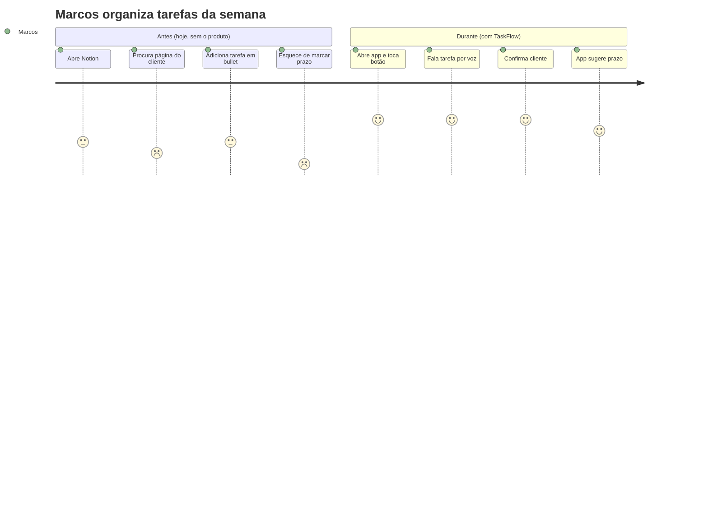

# Getting Started — RENATA

> 🇬🇧 [English version](GETTING-STARTED.md)

> **Tutorial guiado** para sair de **"tenho uma ideia"** até **"tenho código rodando"**.
>
> Acompanhamos junto a construção fictícia do **TaskFlow** — um SaaS de gestão de tarefas para freelancers — para você ver cada etapa em ação.
>
> Você não precisa ser dev pra começar. Tempo total estimado: **8-12h** distribuídas em **1-2 semanas**.

**Antes de começar — onde as coisas estão:**

- 🏗 **Já tem uma codebase?** Este tutorial assume um projeto novo. Para um projeto existente, a porta de entrada é o `/renata:adopt` — leia [`ADOPTION.pt-br.md`](ADOPTION.pt-br.md) primeiro.
- 🧠 **O mapa completo do fluxo, as 4 visões do método** (fluxo · loop de execução · responsabilidade · artefatos) **e o "por que essa ordem?"** vivem no [`METHOD.pt-br.md`](METHOD.pt-br.md) — o "porquê" por trás do que você vai fazer aqui.
- 📎 **Os apêndices** (quando NÃO usar, anti-padrões, ordens alternativas, tempos realistas, cheatsheet rápido) vivem no [`REFERENCE.pt-br.md`](REFERENCE.pt-br.md).

---

## 🧭 Sua bússola: `/renata:status`

Antes das etapas, conheça o comando que você vai rodar mais que qualquer outro. **`/renata:status` é o navegador** — ele responde "onde estou e qual o próximo passo?" sem nunca fazer a etapa por você.

```text
/renata:status
```

O que ele faz, toda vez que você roda:

1. **Lê o `.claude/progress-map.yaml`** (a única fonte da verdade — não uma lista chumbada) e varre o seu `docs/` pra ver quais artefatos existem e têm conteúdo real.
2. **Imprime o mapa visual** de todas as etapas, cada uma marcada ⬜ pendente · 🔄 em andamento · ✅ verificada por você.
3. **Aponta o próximo passo** — a etapa pendente mais baixa cujos pré-requisitos estão satisfeitos (respeita `prereq`, não só a ordem numérica, então um projeto técnico que faz ADRs antes das personas não se perde).
4. **Roda o gate humano** na etapa em andamento: confere o checklist de qualidade daquela etapa contra os seus arquivos reais, mostra o resultado e — só se **você** confirmar — carimba `> ✅ Verified by you on <data>` no topo do artefato. Ele nunca marca uma etapa como feita por conta própria.

Use sempre que estiver em dúvida sobre o que vem a seguir, depois de editar um doc (`/renata:status <N>` revalida a etapa N), ou quando sentir vontade de pular adiante — é exatamente aí que o gate prova seu valor. Todo `⛔ GATE` que você vai ver neste tutorial é só um lembrete pra rodá-lo.

> É um **navegador read-only**: informa e sugere, nunca roda `/renata:prd`, `/renata:persona`, etc. por você. O fazer continua sendo seu.

---

## 📖 Sumário das etapas

| #             | Etapa                                         | Tempo                       | Comando                                                                               | Resultado                                       |
| ------------- | --------------------------------------------- | --------------------------- | ------------------------------------------------------------------------------------- | ----------------------------------------------- |
| 0             | Pré-flight                                   | 10min                       | —                                                                                    | Ambiente pronto                                 |
| 0.5           | Adotar (só se você já tem projeto)           | varia                       | `/renata:adopt`                                                                       | RENATA adotada sobre código existente — guia: [`ADOPTION.pt-br.md`](ADOPTION.pt-br.md) |
| 1             | Criar projeto                                 | 5min                        | —                                                                                    | Estrutura inicial                               |
| **1.5** | **Discovery (opcional)**                | **30-60min**          | **`/renata:discovery`**                                                       | **`docs/discovery/<data>-<slug>.md`**   |
| 2             | Definir produto                               | 1-2h                        | `/renata:prd`                                                                       | `docs/prd/<slug>.md`                          |
| 3             | Mapear personas                               | 30min cada                  | `/renata:persona`                                                                   | `docs/business-context/personas.md`           |
| 4             | Mapear jornadas                               | 30min                       | `/renata:user-journey`                                                              | `docs/business-context/jornada.md`            |
| 5             | Definir métricas                             | 45min                       | `/renata:metrics`                                                                   | `docs/business-context/metricas.md`           |
| 6             | Decisões técnicas (ADRs)                    | 2-4h                        | `/renata:adr`                                                                       | `docs/decisions/ADR-*.md`                     |
| **6.5** | **Pesquisa competitiva (opcional)**     | **30-60min**          | **`/renata:landscape`**                                                       | **`docs/research/<data>-landscape.md`** |
| 7             | Priorizar features                            | 1h                          | `/renata:feature-breakdown`                                                         | `docs/features/README.md`                     |
| 7.5           | Fasear o sistema                              | 30-45min                    | `/renata:phase-roadmap`                                                             | `docs/roadmap/fases-overview.md`              |
| **7.7** | **Comportamento da feature (opcional)** | **30min por feature** | **`/renata:feature-behavior`**                                                | **`docs/features/F<N>-*.behavior.md`**  |
| 8             | Spec por fase (começa pela Fase 0)           | 1-2h                        | `/renata:feature-spec`                                                              | `docs/features/F1-*.md`                       |
| **8.5** | **Design de telas (opcional)**          | **1-2h**              | **`/renata:screens`**                                                         | **`docs/design/`**                      |
| 9             | Roadmap macro                                 | 1h                          | `/renata:roadmap-gates` | `docs/roadmap/`                               |
| 10            | Arquitetura técnica                          | 2-3h                        | `/renata:architecture` | `docs/technical-context/`                     |
| 11            | Plano de execução                           | 15min                       | `/renata:plan-phase` (envolve `superpowers:writing-plans`)                        | `docs/superpowers/plans/`                     |
| 12            | Executar                                      | dias-semanas                | `/renata:execute <fase>` (envolve `superpowers:executing-plans` + gate de pronto) | código real                                    |
| 13            | Retro da fase                                 | 1h                          | `/renata:retro`                                                                     | `docs/roadmap/fase-N-retro.md`                |

---

# 🛠 Etapa 0 — Pré-flight (10min)

**Objetivo:** garantir que seu computador está pronto pra usar o RENATA.

## O que você precisa ter instalado

| Ferramenta            | Pra que serve                                     | Como instalar                                               |
| --------------------- | ------------------------------------------------- | ----------------------------------------------------------- |
| **Claude Code** | É a "IDE" onde você vai operar                  | https://claude.com/claude-code (siga o site, é 1-clique)   |
| **Git**         | Versionar arquivos                                | Provavelmente já tem. Testar:`git --version`             |
| **yq**          | Ferramenta usada pelo hook automático (opcional) | macOS:`brew install yq` · Linux: `sudo apt install yq` |

## Validação

Abra terminal e cole, uma de cada vez:

```bash
git --version          # deve sair: "git version 2.x.x"
claude --version       # deve sair número de versão
yq --version           # deve sair: "yq (https://...) version 4.x.x"
```

Se `yq` não estiver instalado, **não trava nada agora** — só o hook fica em modo degradado. Mas instale antes da Etapa 12.

## Conceitos que você vai ver muito

Antes de seguir, fixe esses 3 conceitos:

| Termo                   | O que é                                                                                                                      |
| ----------------------- | ----------------------------------------------------------------------------------------------------------------------------- |
| **Doc viva**      | Documento em`docs/` que evolui junto com o projeto. NÃO é "escreveu e esqueceu" — é "escreve, decide, volta, atualiza". |
| **Slash command** | Comando que você digita no Claude Code começando com`/`. Ex: `/renata:prd`. Ele te faz perguntas e gera doc.            |
| **Hook**          | Script que roda sozinho antes de cada commit, conferindo se você não está violando decisões antigas.                      |

---

# 🏗 Etapa 0.5 — Projeto existente? (pule se for projeto novo)

**Já tem uma codebase?** Não faça o retrofit na mão — um comando orquestra a adoção inteira: padrão técnico de engenharia reversa (ADRs + docs de code-pattern), inventário de features, specs as-built e um PRD retroativo, confirmando cada item com você:

```text
/renata:adopt
```

Leia [`ADOPTION.pt-br.md`](ADOPTION.pt-br.md) — ele explica cada estágio, **onde cada artefato mora**, o que verificar depois via `/renata:status`, e como lidar com ADRs pré-existentes.

Se você está criando um projeto **do zero**, pule para a Etapa 1.

---

# 🚀 Etapa 1 — Criar o projeto (5min)

**Objetivo:** ter a estrutura inicial do projeto criada na sua máquina.

## 1.1. Escolher nome e local

Decida onde o projeto vai morar e como ele se chama.

> 💡 **TaskFlow exemplo:** nome humano `TaskFlow`, pasta `~/projetos/taskflow`.

```bash
PROJECT_NAME="TaskFlow"
PROJECT_DIR=~/projetos/taskflow
```

## 1.2. Criar a pasta e iniciar o git

Faça isso **antes** do `/renata:init` — o hook de enforcement de ADR só ativa se o git já existir:

```bash
mkdir -p $PROJECT_DIR
cd $PROJECT_DIR
git init
```

## 1.3. Instalar o plugin (uma vez) e inicializar o projeto

O RENATA é um **plugin do Claude Code** — você instala uma vez e ele fica disponível em todo projeto.

**a) Instalar o plugin (só na primeira vez):**

```text
/plugin marketplace add AInsteinsBR/renata
/plugin install renata@ainsteins
```

**b) Inicializar a estrutura no projeto novo:** abra o Claude Code no diretório do projeto e rode:

```text
/renata:init "TaskFlow"
```

(ou `/renata:init "TaskFlow" --starter <URL-do-starter>` se você tem um boilerplate de frontend.)

O `/renata:init` cria a estrutura, preenche o `CLAUDE.md` com o nome, e — como o projeto já tem git (passo 1.2) — **ativa automaticamente** o bloqueio de commits que violam ADR.

## 1.4. Conferir o que foi criado e fazer o primeiro commit

```bash
ls -la
```

Você deve ver:

```text
.claude/           ← progress-map.yaml + rules.yaml do projeto
docs/              ← pastas vazias prontas pra serem populadas
CLAUDE.md          ← arquivo de contexto do projeto
```

> Os **comandos, agentes e hooks** não ficam no projeto — vêm do plugin instalado no Claude Code. Só o scaffold de dados (`docs/`, `CLAUDE.md`, `.claude/progress-map.yaml`, `.claude/rules.yaml`) vive no projeto.

```bash
git add .
git commit -m "chore: scaffold via RENATA"
```

## 1.5. Preencher CLAUDE.md básico

Abra `CLAUDE.md` no seu editor (VSCode, Sublime, etc). Você vai ver vários `{{PLACEHOLDERS}}` com comentários indicando em qual etapa cada um é preenchido.

**Agora, preencha apenas os da Etapa 1:**

- `{{PROJECT_CATEGORY}}` — categoria de 1 linha. Ex: `SaaS de gestão de tarefas para freelancers`.
- `{{STAGE}}` — estado atual. Ex: `pré-código, documentação em andamento`.
- `{{TEAM}}` — quem está no projeto. Ex: `Eric (solo)` ou `Eric + 2 devs`.

**Deixe o resto pra depois.** Cada placeholder tem comentário dizendo "preenche na Etapa N".

## Validação da Etapa 1

- [ ] `/plugin` mostra o `renata` instalado e habilitado.
- [ ] `ls .claude/` mostra `progress-map.yaml` e `rules.yaml` no projeto.
- [ ] `CLAUDE.md` existe com o `{{PROJECT_NAME}}` preenchido.
- [ ] Git tem 1 commit inicial.

## Pegadinhas comuns

- **`/renata:init` não aparece**: o plugin não está instalado/habilitado. Rode `/plugin install renata@ainsteins` e confira em `/plugin`.
- **CLAUDE.md já existia**: o `/renata:init` pergunta antes de sobrescrever — confirme só se for proposital.

---

# 🌫️ Etapa 1.5 — Discovery (opcional): da ideia ao problema, antes do PRD

**Ainda não sabe o que quer construir?** Antes do PRD, rode o discovery — ele converge uma intuição vaga num problema claro, e te ensina os frameworks enquanto conduz:

```text
/renata:discovery algo pra ajudar freelancers a controlar tarefas
```

Ele te leva pelos **5 porquês** (cavar a dor real), pelo **job-to-be-done** (que progresso a pessoa contrata o produto pra fazer), e pelo **por que agora** — e força enquadrar o problema de **2-3 formas diferentes** antes de comprometer, pra você não cristalizar na primeira ideia. A saída (`docs/discovery/<data>-<slug>.md`) vira o ponto de partida do `/renata:prd`, e semeia pistas pra persona, jornada e métricas.

O discovery também **carimba cada afirmação com um selo de evidência** (🔴 crença · 🟡 anedota · 🟢 entrevistado · ✅ medido). Uma aposta carimbada 🔴 é permitida — mas o movimento honesto é sair do prédio antes: `/renata:interview-kit` gera um roteiro Mom Test de 1 página (leia no celular a caminho), você grava a conversa, e `/renata:interview-debrief` transforma cada transcrição em evidência graduada — movendo o selo de verdade.

**Já chega com o problema claro?** Pule e vá direto pra Etapa 2.

---

# 📋 Etapa 2 — Definir o produto (1-2h)

**Objetivo:** escrever o Micro PRD — o documento mais importante do projeto. Tudo depois amarra nele.

> 🧭 **Começando um sistema com várias apostas?** Regra do método: **um projeto = um PRD**, e esse PRD abriga **N hipóteses** (cada uma com seu sinal de falsificação e sua métrica decisiva). Não crie "vários PRDs" — se uma aposta é separável a ponto de viver sozinha, ela é **outro projeto** (pasta própria), não outro PRD aqui. A regra completa (com exemplos) está em [`METHOD.pt-br.md` → &#34;1 projeto = 1 PRD&#34;](METHOD.pt-br.md#um-prd-vs-n-prds). ADRs são **transversais** (`docs/decisions/`), nunca dentro do PRD.

## 2.1. Pensar 5 minutos antes de rodar

Antes de abrir Claude Code, ter respostas-rascunho pra:

- **Em 1 frase, qual o problema?** Com NÚMERO (horas, %, R$, frequência).
- **Quem sofre desse problema?** Cargo + contexto.
- **Por que agora?** Que sinal de mercado/cliente justifica?
- **O que você imagina como solução?** Em 2-3 frases.

> 💡 **TaskFlow exemplo (rascunho):**
>
> - **Problema:** freelancers perdem **6h/semana** organizando tarefas em planilhas e notion, e ainda assim atrasam 30% dos prazos com cliente.
> - **Quem sofre:** freelancer solo de 25-45 anos (design, dev, marketing) gerenciando 3-8 clientes simultaneamente.
> - **Por que agora:** mercado freelancer cresceu 40% pós-pandemia. Trello/Asana são caros e overdesigned pra solo.
> - **Solução:** app simples que captura tarefa em 1-toque, agrupa por cliente, e avisa antes de vencer.

## 2.2. Abrir Claude Code

```bash
cd $PROJECT_DIR
claude
```

## 2.3. Invocar `/renata:prd`

Digite no Claude Code:

```text
/renata:prd app de gestão de tarefas pra freelancers solo gerenciando múltiplos clientes
```

## 2.4. Responder as 9 perguntas

O comando vai perguntar uma de cada vez. Não pula:

1. **Problema** com número
2. **Pra quem** (persona-âncora, nome + cargo + 1 linha)
3. **Por que agora**
4. **Hipótese falsificável** ("se X, então Y sai de Z pra W")
5. **Como a hipótese cai** (sinal de falsificação)
6. **Escopo IN** (se produto for faseado, perguntar por fase)
7. **Escopo OUT** (o que NÃO entra)
8. **Critério de pronto**
9. **Métrica decisiva** (a que você mostra pra stakeholder dizer "venci")

**Tempo médio:** 30-60min se você não trava em nenhuma.

> 💡 **TaskFlow exemplo (algumas respostas):**
>
> - **Hipótese:** "Se freelancer puder capturar tarefa em <5s e ver agenda do cliente em 1 tela, então **tempo gasto organizando cai de 6h/sem pra <1h/sem**, e **% de prazos cumpridos sobe de 70% pra 90%+**."
> - **Métrica decisiva:** % de tarefas concluídas até o prazo (vs total criadas com prazo).
> - **Escopo OUT:** ❌ time/agência (só solo), ❌ faturamento (vai pra Fase 3), ❌ web app (só mobile na Fase 1).

## 2.5. Revisar o PRD gerado

O Claude grava em `docs/prd/taskflow.md` (ou nome similar). Abra e valide:

- [ ] Problema tem **número** (não "muito tempo perdido")?
- [ ] Hipótese é **falsificável** (tem alvo numérico)?
- [ ] Escopo IN **e** OUT estão claros?
- [ ] Métrica decisiva tem baseline + meta + fórmula + fonte?

Se algum item falhou, peça pro Claude refinar a seção específica.

## 2.6. Atualizar CLAUDE.md

Abra `CLAUDE.md` e preencha agora:

- `{{HYPOTHESES}}` — uma linha por hipótese (H1, H2…). Se o PRD tem 1 hipótese, é uma linha só.
- `{{PRD_SLUG}}` — nome do arquivo gerado (ex: `taskflow`).
- `{{PRD_NAME}}` — `TaskFlow (\`docs/prd/taskflow.md\`)`.

## Validação da Etapa 2

- [ ] `docs/prd/<slug>.md` existe com 6 seções canônicas.
- [ ] Hipótese tem formato "Se X, então Y sai de Z pra W".
- [ ] **Teste do elevador:** você consegue explicar o produto em 30s mostrando só esse arquivo? Se não, refine.

> ⛔ **GATE.** Não avance sem os itens acima ✅. Rode `/renata:status` pra confirmar o próximo passo.

## Pegadinhas comuns

| Sintoma                            | Solução                                                                                               |
| ---------------------------------- | ------------------------------------------------------------------------------------------------------- |
| Hipótese vaga ("vai melhorar UX") | Força um número. Estime se não tem dado.                                                             |
| Escopo IN gigante                  | Decompor em fases. Se descrever plataforma com 6 subsistemas, pause e use`superpowers:brainstorming`. |
| Sem escopo OUT                     | Force. 3-5 itens mínimo.                                                                               |
| Persona genérica ("PMEs")         | Pause aqui, vá pra Etapa 3, depois volte.                                                              |

---

# 👤 Etapa 3 — Mapear personas (30min por persona)

**Objetivo:** transformar o "pra quem" do PRD em personas estruturadas com nome, dor numérica, e citação.

## 3.1. Definir quem é primária, secundária, indireta

| Tipo                  | Quem é                                       | Quantas |
| --------------------- | --------------------------------------------- | ------- |
| **Primária**   | Sofre mais o problema e decide pela solução | 1       |
| **Secundária** | Afetada mas com peso menor                    | 0-2     |
| **Indireta**    | Usa mas não compra (end-user)                | 0-1     |

> 💡 **TaskFlow exemplo:**
>
> - **Primária:** Marcos, freelancer designer (decide e usa).
> - **Secundária:** Cliente do Marcos (recebe entregas, não usa o app).
> - **Indireta:** nenhuma (Marcos opera sozinho).

## 3.2. Invocar `/renata:persona` para cada uma

```text
/renata:persona Marcos · Freelancer Designer
```

**O comando faz 4 turnos:**

| Turno | Pergunta                                                                |
| ----- | ----------------------------------------------------------------------- |
| 1     | Papel e contexto (cargo, empresa/situação, rotina)                    |
| 2     | Dor específica com**número** + alternativas que já tentou      |
| 3     | Critério de sucesso (em palavras dela, como citação) + frase âncora |
| 4     | Anti-personas (quem**não** é)                                   |

## 3.3. Repetir para personas secundárias e indiretas

30min por persona. Total: 1-1h30 pra 2-3 personas.

## 3.4. Revisar `docs/business-context/personas.md`

Validar **para CADA persona**:

- [ ] Nome próprio (não cargo genérico)
- [ ] Dor com número
- [ ] Lista "Alternativas que já tentou" com motivo de falha
- [ ] Critério de sucesso em citação `> "..."`
- [ ] Frase âncora curta e impactante

E no fim do arquivo (uma única seção consolidada):

- [ ] "Quem **não** é persona deste produto" com 3+ itens

## 3.5. Atualizar CLAUDE.md

- `{{PRIMARY_PERSONA}}` — nome da persona primária.

## Validação da Etapa 3

- [ ] Persona primária com 5 blocos completos.
- [ ] Anti-personas listadas.
- [ ] **Teste do mantra:** você consegue citar a frase âncora da primária de cor?

> ⛔ **GATE.** Não avance sem os itens acima ✅. Rode `/renata:status` pra confirmar o próximo passo.

## Pegadinhas comuns

| Sintoma                                              | Solução                                                                                                                                                 |
| ---------------------------------------------------- | --------------------------------------------------------------------------------------------------------------------------------------------------------- |
| "Persona é todo mundo"                              | Force perfil específico. "Marcos, designer freelancer, 32, gerencia 5 clientes em 3 redes sociais diferentes" é persona. "Freelancers de tech" não é. |
| Dor sem número                                      | Estime, mesmo aproximado. Sem número, é desejo.                                                                                                         |
| Critério de sucesso técnico ("vai usar nossa API") | Sucesso é o que**ela** quer, não o que produto faz.                                                                                               |

---

# 🗺 Etapa 4 — Mapear jornadas (30min)

**Objetivo:** entender como cada persona resolve o problema **hoje** (sem o produto) e como vai resolver **depois**.

## 4.1. Decidir quais jornadas mapear

Geralmente 1 jornada por persona. Se duas personas fazem a mesma sequência, fazer 1 com nota das diferenças.

## 4.2. Invocar `/renata:user-journey`

```text
/renata:user-journey Marcos
```

**Saída esperada:** jornada em 3 fases (`antes`, `durante`, `depois`) usando `mermaid journey`.

💡 **TaskFlow exemplo (parcial):**



## 4.3. Validar pontos críticos

Cada jornada gera **pontos críticos** — momentos em que se falhamos, perdemos o usuário.

**Exemplo bom:**

> 1. **Primeiros 3 segundos** — se o widget não carregar rápido, Marcos fecha. → **drives** requisito de TTFB <500ms.

**Exemplo ruim (sem amarração):**

> 1. **Experiência precisa ser boa.**

## 4.4. Listar anti-jornadas

Cenários que NÃO queremos suportar. 2-4 itens.

> 💡 **TaskFlow exemplo:**
>
> - ❌ Marcos quer convidar 5 colegas pra colaborar em projeto → produto é solo, sugere alternativa.
> - ❌ Marcos quer faturamento integrado → fora do escopo da Fase 1.

## 4.5. Métricas que a jornada gera

Tabela amarrando ponto crítico → métrica observável.

## Validação da Etapa 4

- [ ] `docs/business-context/jornada.md` tem 1+ jornadas com `mermaid journey`
- [ ] Pontos críticos amarrados a requisitos
- [ ] Anti-jornadas listadas
- [ ] Métricas mapeadas em tabela

> ⛔ **GATE.** Não avance sem os itens acima ✅. Rode `/renata:status` pra confirmar o próximo passo.

## Pegadinhas comuns

| Sintoma                                               | Solução                                                          |
| ----------------------------------------------------- | ------------------------------------------------------------------ |
| Jornada só do "durante"                              | O "antes" é tão importante. Explica por que sua solução ganha. |
| Mermaid journey muito longo                           | Se uma seção tem >7 passos, fragmenta em mais seções.          |
| Ponto crítico genérico ("tudo precisa ser rápido") | Aponte momentos**específicos**.                             |

---

# 📊 Etapa 5 — Definir métricas (45min)

**Objetivo:** estruturar como você vai medir se está dando certo — em 4 camadas.

## 5.1. Invocar `/renata:metrics`

```text
/renata:metrics
```

**O comando estrutura em 4 camadas:**

| Camada                            | Pergunta-chave                                   |
| --------------------------------- | ------------------------------------------------ |
| 1. Adoção                       | Alguém usa?                                     |
| 2. Engajamento                    | Usa direito?                                     |
| 3. Valor                          | Entrega resultado? (esta é a métrica decisiva) |
| 4. Qualidade percebida (opcional) | Parece bom pra quem usa?                         |

## 5.2. Cuidado com a métrica decisiva (Camada 3)

Ela tem que:

- [ ] Amarrar com a hipótese do PRD (mesma direção, mesma escala)
- [ ] Ter baseline numérico (mesmo que aproximado)
- [ ] Ter meta clara por fase
- [ ] Ter fórmula explícita
- [ ] Ter fonte (de onde vem o dado)

> 💡 **TaskFlow exemplo:**
>
> **Métrica decisiva:** % de tarefas concluídas até o prazo
> **Baseline:** 70% (auto-relato dos freelancers entrevistados)
> **Meta Fase 1:** 85%
> **Meta Fase 2:** 90%
> **Fórmula:** `tarefas com status=done AND completed_at <= due_date ÷ tarefas com due_date != null`
> **Fonte:** dashboard interno, cron diário

## 5.3. Métricas técnicas que destravam negócio

Tabela:

| Métrica técnica          | Alvo   | Por que importa             |
| -------------------------- | ------ | --------------------------- |
| TTFB do app                | <500ms | Marcos abandona se demorar  |
| Latência STT (se tem voz) | <2s    | Conversa quebra acima disso |

## 5.4. Anti-métricas

O que NÃO é métrica. Listar 3+:

- ❌ "Quantidade de tarefas cadastradas" — vaidade, não output.
- ❌ "Tempo no app" — quanto menos, melhor (não maior).

## 5.5. Cadência de revisão

Quem olha qual métrica e com que frequência.

## Validação da Etapa 5

- [ ] 3 camadas mínimas preenchidas (4 se produto tem qualidade subjetiva)
- [ ] Métrica decisiva amarra com hipótese do PRD
- [ ] Toda métrica tem baseline + meta + fórmula + fonte
- [ ] Anti-métricas listadas

## Pegadinhas comuns

| Sintoma                  | Solução                                                           |
| ------------------------ | ------------------------------------------------------------------- |
| Métrica decisiva é NPS | NPS é Camada 4. Encontre métrica de output operacional/comercial. |
| 5 métricas decisivas    | Força 1. Outras viram secundárias.                                |
| Baseline "vai descobrir" | Estime, mesmo grosseiro.                                            |

> ⛔ **GATE 5→6 (não pule).** Antes de tocar em features, as **ADRs** (Etapa 6) são
> obrigatórias. O PRD + métricas já forçam decisões técnicas (banco, stack, transporte).
> Ir pra features sem ADR = features soltas que voltam pra retrabalho. Se você está
> tentado a pular pra `/renata:feature-breakdown` agora, **pare e rode `/renata:status`** — ele vai
> apontar a Etapa 6. O hook `etapa-gate` bloqueia o breakdown se as ADRs faltarem.

---

# 🛠 Etapa 6 — Decisões técnicas (ADRs) (2-4h)

> 🛠 **A partir daqui, traga o time técnico.** Você (PM) lidera a conversa, mas as decisões precisam de validação técnica.

**Objetivo:** documentar todas as decisões estruturais (banco, framework, padrões, etc) em ADRs que ficam vinculadas ao código por hook automático.

## Esta etapa não é linear

Você abre ADR sempre que aparece decisão com impacto > 1 sprint. Pode rodar `/renata:adr` várias vezes ao longo de dias.

## 6.1. Listar decisões pendentes

Pergunte ao time tech:

> "Quais decisões estruturais precisamos tomar antes de codar?"

**Lista típica para produto novo:**

- Qual banco principal? (Postgres? MySQL? algo NoSQL?)
- Linguagem/framework do backend?
- Linguagem/framework do frontend?
- Como autenticação?
- Multi-tenancy? Single-tenancy?
- Como deploy? (Docker? K8s? serverless?)
- Padrão de acesso a dados? (ORM? Repository? raw SQL?)
- Self-host vs SaaS para componentes-chave?

**Cada uma → 1 ADR.**

## 6.2. Para cada decisão, invocar `/renata:adr`

```text
/renata:adr usar PostgreSQL como banco principal
```

**O comando guia em 6 perguntas:**

1. Contexto (por que agora)
2. Alternativas consideradas (mínimo 2)
3. Por que cada alternativa foi rejeitada
4. Trade-offs aceitos
5. Gatilho de revisão (quando reabrir essa decisão)
6. Enforcement (hook, lint, review checklist)

> 💡 **TaskFlow exemplo (resumo de ADR-001):**
>
> **Decisão:** PostgreSQL.
> **Alternativas rejeitadas:** MongoDB (time não conhece + domínio relacional), SQLite (não escala em multi-region).
> **Trade-off aceito:** schema rígido, migrations obrigatórias.
> **Gatilho de revisão:** se aparecer feature com schema dinâmico real.
> **Enforcement:** hook bloqueia `import mongoose` ou `import pymongo`.

## 6.3. `/renata:adr` atualiza `rules.yaml` automaticamente

Quando o enforcement é via hook, o **próprio `/renata:adr`** adiciona o bloco YAML em `.claude/rules.yaml` com sua confirmação. **Você não edita manualmente.**

Fluxo:

1. `/renata:adr` pergunta se enforcement é via hook.
2. Se sim, pede o pattern regex + scope + mensagem.
3. **Mostra** o bloco YAML que vai adicionar.
4. **Pede confirmação** ("Vou adicionar este bloco ao rules.yaml. OK?").
5. Após `OK`, edita e valida o YAML.

**Sua responsabilidade:** revisar o bloco antes de confirmar — pattern faz sentido? scope cobre o que precisa? mensagem ajuda quem violar?

> ⚠️ **`rules.yaml` é conteúdo do projeto, não do framework.** Cada bloco é gêmeo de uma ADR. Se você se pegar editando manualmente fora do `/renata:adr`, pare — perdendo a amarração ADR ↔ regra. Use `/renata:adr` em modo refinar.

## 6.4. Ativar hook em pre-commit

Uma única vez (não precisa repetir):

```bash
ln -sf ../../.claude/hooks/rules-violation.sh .git/hooks/pre-commit
chmod +x .git/hooks/pre-commit
```

A partir daqui, todo commit roda o hook.

## 6.5. Atualizar índice de ADRs

`/renata:adr` já atualiza `docs/decisions/README.md` automaticamente. Confira que está lá.

## 6.6. (Opcional) Configurar integrações MCP

Quer que o projeto use MCP — Jira pra tarefas, GitHub pra PRs, Postgres pra consultar banco? É **opcional e configurável**, e o local sempre continua sendo a fonte de verdade.

**Passo 1 — declarar o servidor.** Edite `.mcp.json` na raiz do projeto (criado pelo `init.sh`, começa vazio) ou use `claude mcp add`. Exemplo de Jira:

```json
{
  "mcpServers": {
    "jira": { "command": "npx", "args": ["-y", "@some/jira-mcp-server"], "env": { "JIRA_URL": "...", "JIRA_TOKEN": "..." } }
  }
}
```

(O nome do servidor — aqui `jira` — é o que você referencia no próximo passo. Credenciais são responsabilidade sua, não do framework.)

**Passo 2 — decidir via `/renata:adr`.** Adotar um MCP como fonte espelhada é decisão estrutural. Rode `/renata:adr usar Jira pra tarefas` — ele cria a ADR e escreve o bloco `integrations:` no `.claude/rules.yaml`:

```yaml
integrations:
  tasks: { mcp: jira, adr: ADR-009, mirror: true }
```

**Como funciona depois:** ao rodar `/renata:todo` ou `/renata:triage`, o command grava **primeiro no local** (`docs/backlog/todos.md`) e então **pergunta** se quer espelhar no Jira. Você confirma → vira card. Sem confirmar → fica só local. Se o MCP não estiver disponível na sessão, opera 100% local e avisa. Nada quebra por falta de MCP.

**`mirror: true` vs `false`:** `true` = escreve no local e oferece push (tarefas). `false` = MCP só pra leitura/ação pontual, sem espelhar escrita (típico de `db`).

## 6.7. (Opcional) Destilar o padrão de um boilerplate/repo

Tem um repo que já segue o padrão da casa — um starter clonado, um projeto antigo, um boilerplate? Em vez de o Claude garimpar esse código toda sessão, **destile o padrão** uma vez:

```text
/renata:extract-pattern frontend/
```

O command dispara o agente `@pattern-mapper`, que varre o repo em 4 eixos (arquitetura, stack, design system, convenções). Você **confirma item a item** o que detectou (o código é a verdade, mas você é o juiz do que vira regra). Ele então gera:

- **ADRs** — uma por decisão estrutural (stack, arquitetura, design system), com alternativas e gatilho de revisão.
- **`docs/technical-context/code-pattern-frontend.md`** — o detalhe operacional (componentes, tokens, exemplos), que o `CLAUDE.md` passa a carregar automaticamente.

**Vários padrões no mesmo projeto** (ex: front e back): rode uma vez por escopo — `/renata:extract-pattern frontend/` e `/renata:extract-pattern backend/`. Cada um gera seu `code-pattern-<escopo>.md` e ADRs marcadas pelo escopo, sem misturar.

> ADR ≠ doc: a ADR registra **a decisão** (por que shadcn, não Material); o `code-pattern-*.md` registra **o detalhe** (quais componentes, quais tokens). A ADR aponta pro doc; nada é duplicado.

> 🏗 **Adotando um projeto existente inteiro?** o extract-pattern é o Stage 1 do `/renata:adopt`, que também faz a engenharia reversa do inventário de features, specs as-built e um PRD retroativo — veja [`ADOPTION.pt-br.md`](ADOPTION.pt-br.md).

## Validação da Etapa 6

- [ ] `docs/decisions/` tem ≥ 5 ADRs accepted (típico)
- [ ] `rules.yaml` tem regras pra todas com enforcement por hook
- [ ] **Teste manual do hook:** cole um `import` que viola alguma ADR e tente commitar — deve falhar
- [ ] Cada ADR tem gatilho de revisão explícito

> ⛔ **GATE.** Não avance sem os itens acima ✅. Rode `/renata:status` pra confirmar o próximo passo.

## Pegadinhas comuns

| Sintoma                            | Solução                                                                     |
| ---------------------------------- | ----------------------------------------------------------------------------- |
| ADR "Status: proposed" há semanas | Decide ou descarta. Proposed eterno é ruído.                                |
| ADR sem alternativas               | Você não tomou decisão — fez escolha por inércia. Force 2+ alternativas. |
| Enforcement só "code review"      | Sempre que possível, automatize via hook. Code review esquece.               |

---

# 🔭 Etapa 6.5 — Pesquisa competitiva (opcional): ache seus gaps de diferenciação

**Quer saber o que já existe lá fora antes de comprometer features?** Depois do PRD, mapeie o território:

```text
/renata:landscape
```

Ele pesquisa soluções similares **ancorado no seu PRD** (via um MCP do Perplexity se você tiver configurado, senão busca web nativa), e **salva tudo com fontes** em `docs/research/<data>-landscape.md` pra você ler no seu tempo. Depois você roda de novo e ele **cura junto com você** — bloco a bloco, propondo ângulos que você pode não ter visto; você mantém, corta ou adiciona com seu conhecimento de domínio. A saída: **gaps de diferenciação** priorizados que viram features candidatas pro `/renata:feature-breakdown`.

Toda afirmação sobre concorrente vem com fonte — sem fonte, não é fato. O ponto não é copiar nem "ter tudo": é achar o gap que é seu.

---

# 🎯 Etapa 7 — Priorizar features (1h)

**Objetivo:** quebrar o produto em 3-7 features e marcar quais compõem o **conjunto-âncora** (o slice mínimo que entrega valor de ponta a ponta — vira a Fase 0).

## 7.1. Brainstorm livre

Antes do `/renata:feature-breakdown`, liste em rascunho:

- O que o produto **precisa** ter pra hipótese se sustentar?
- O que explicitamente **NÃO** vai ter?

## 7.2. Invocar `/renata:feature-breakdown`

```text
/renata:feature-breakdown
```

**O comando pede 3-7 features candidatas, e classifica cada uma em binário:**

- **MUST** — sem ela, hipótese cai.
- **OUT-OF-SCOPE** — não entra no produto, vai pra anti-features.

> 💡 **TaskFlow exemplo (5 features):**
>
> | ID           | Nome                                   | Categoria | Esforço | Fase | Depende |
> | ------------ | -------------------------------------- | --------- | -------- | ---- | ------- |
> | **F1** | **Captura rápida de tarefa** ⚓ | MUST      | L        | 0    | —      |
> | F2           | Visão por cliente                     | MUST      | M        | 1    | F1      |
> | F3           | Notificação de prazo                 | MUST      | M        | 1    | F1      |
> | F4           | Backup em nuvem                        | MUST      | S        | 2    | F1      |
> | F5           | Multi-device sync                      | MUST      | L        | 2    | F4      |

## 7.3. Marcar features para o conjunto-âncora (Fase 0)

A "âncora" não é UMA feature — é o **conjunto mínimo** que entrega valor de ponta a
ponta (uma jornada-âncora fechada). Marque quais features compõem a Fase 0. As demais
serão distribuídas em fases na Etapa 7.5 (`/renata:phase-roadmap`).

Critérios pro conjunto-âncora:

1. ✅ Juntas, fecham ≥1 jornada de ponta a ponta
2. ✅ Cada uma é MUST sem dúvida
3. ✅ O conjunto cabe num primeiro ciclo curto
4. ✅ Mesmo sozinho, o conjunto prova algo da hipótese

## 7.4. Diagrama de dependências

`mermaid flowchart` mostrando F1 → F2 → F3...

## 7.6. Anti-features

3-5 coisas que poderiam ser confundidas mas estão fora.

## 7.7. (Opcional) Refinar o comportamento antes do detalhe técnico

Tem uma disciplina de Produto separada de Engenharia, ou regras de negócio densas? Antes da spec técnica, refine cada feature **só como comportamento observável pelo usuário**:

```text
/renata:feature-behavior F1
```

Isso gera `docs/features/F1-<slug>.behavior.md` com user stories, cenários Gherkin nos pontos críticos, regras de negócio explícitas, critérios de aceite observáveis, e o anti-comportamento ("o que NÃO faz") — **com zero técnico**. É o handoff limpo Produto→Engenharia.

Depois o `/renata:feature-spec` lê esse comportamento, linka pra ele, e trata só do *como* técnico (sem duplicar). Um solo dev que é Produto e Engenharia ao mesmo tempo pode pular e ir direto pro `/renata:feature-spec`.

## Validação da Etapa 7

- [ ] `docs/features/README.md` lista 3-7 features
- [ ] Conjunto-âncora marcado (features da Fase 0) + 4 critérios justificados
- [ ] Diagrama de dependências claro
- [ ] Anti-features listadas

> ⛔ **GATE.** Não avance sem os itens acima ✅. Rode `/renata:status` pra confirmar o próximo passo.

## Pegadinhas comuns

| Sintoma               | Solução                                                      |
| --------------------- | -------------------------------------------------------------- |
| 10+ features          | Junta as menores.                                              |
| Conjunto-âncora vago | Force escolha. Não dá "todas iguais".                        |
| Conjunto-âncora XL   | Reduz o slice. O conjunto deve caber num primeiro ciclo curto. |

---

# 🗂 Etapa 7.5 — Fasear o sistema (30-45min)

**Objetivo:** distribuir **TODAS** as features em fases (Fase 0, 1, 2...) com tempo
aproximado. Nenhuma fica de fora — a Fase 0 é o conjunto-âncora.

## 7.5.1. Invocar `/renata:phase-roadmap`

```text
/renata:phase-roadmap
```

O comando distribui cada feature do breakdown numa fase e gera
`docs/roadmap/fases-overview.md` com gantt + tabela de cobertura.

## 7.5.2. Conferir cobertura

- [ ] Toda feature do `README.md` aparece em alguma fase
- [ ] Fase 0 fecha uma jornada de ponta a ponta
- [ ] Cada fase tem tempo aproximado
- [ ] Ordem respeita dependências

## Validação da Etapa 7.5

- [ ] `docs/roadmap/fases-overview.md` existe com todas as features faseadas
- [ ] Tabela de cobertura sem órfãs
- [ ] Fase 0 = conjunto-âncora

> ⛔ **GATE 7.5→8.** A spec (Etapa 8) só começa após o faseamento. Você speca **fase a
> fase**, começando pela Fase 0. Rode `/renata:status` pra confirmar.

---

# 🔬 Etapa 8 — Spec por fase (começa pela Fase 0) (1-2h por feature)

**Objetivo:** detalhar TODAS as features da Fase 0 (conjunto-âncora) ao ponto de iniciar
implementação. Specar fase a fase — não só uma feature.

## 8.1. Invocar `/renata:feature-spec`

```text
/renata:feature-spec F1
```

**O comando guia em:**

- Categoria + esforço + fase + dependências
- Problema (qual dor essa feature ataca)
- Escopo (capacidades + como funciona em alto nível)
- Valor
- Dependências
- Vínculos (PRD, ADRs, persona, métrica)
- Critério de pronto verificável
- Refinamentos por fase posterior
- **Plano em fases** (cada fase XS-M preferencial, L com justificativa, XL deve quebrar)

## 8.2. Validar o plano em fases

Cada `Fn.x` deve ter:

- [ ] Nome claro
- [ ] Esforço em t-shirt size
- [ ] Objetivo único
- [ ] Lista de tarefas (checkboxes)
- [ ] Critério de pronto verificável
- [ ] Dependência declarada se houver

Fases preferencialmente XS-M. L aceitável com justificativa. XL → quebrar.

## 8.3. (Opcional) Spec de features secundárias

Pode esperar — não precisa fazer todas agora. Foque na âncora.

## Validação da Etapa 8

- [ ] Toda feature da Fase 0 tem `docs/features/F<n>-<slug>.md` com seções completas
- [ ] Cada spec tem plano em fases com critério verificável
- [ ] Nenhuma feature da Fase 0 ficou sem spec

> ⛔ **GATE.** Não avance sem os itens acima ✅. Rode `/renata:status` pra confirmar o próximo passo.

---

# 🎨 Etapa 8.5 — Design de telas (opcional, 1-2h)

> **Pular se:** produto não tem UI (CLI, API, biblioteca) ou se a fase atual tem 1 tela trivial.
> **Não pular se:** produto tem múltiplas telas com usuários reais (B2B/B2C).

**Objetivo:** estruturar o **inventário de telas**, **fluxo entre elas** e **briefs estruturados** que servirão de input pra:

- Ferramenta externa de design (Lovable, Claude Design, v0.dev, Figma), OU
- Implementação direta no starter kit (se você usar a flag `--starter` no `init.sh`).

## 8.5.1 — Dois cenários possíveis

### Cenário A — Você tem starter kit próprio

Se rodou `init.sh ... --starter <URL>`, você já tem:

- `frontend/` clonado do seu starter (Next.js + Tailwind + shadcn + componentes seus, por exemplo).
- `docs/decisions/ADR-001-frontend-starter.md` documentando essa escolha.

Nesse caso, `/renata:screens` gera briefs que **assumem** que código vai morar no starter. Você não vai colar em Lovable — vai implementar direto.

### Cenário B — Você NÃO tem starter (vai usar ferramenta externa)

Sem starter, `/renata:screens` gera briefs **genéricos** que você cola em ferramenta externa (Lovable, Claude Design, v0).

> ⚠️ **Importante:** o output da ferramenta externa é **PROTÓTIPO**, não código final. A Etapa 10 (arquitetura técnica) e Etapa 11 (plano de execução) decidem quanto reaproveitar vs reescrever conforme suas ADRs.

## 8.5.2 — Invocar `/renata:screens`

```text
/renata:screens
```

O comando detecta automaticamente se você está no Cenário A ou B (procura por ADR de frontend) e ajusta o output.

## 8.5.3 — Responder as perguntas

- **Quais telas o produto tem?** (3-15, lista enxuta).
- **Para cada tela:** nome, propósito, persona-âncora, feature(s) que serve.
- **Fluxo entre telas:** de qual vai pra qual?
- **Telas compartilhadas vs específicas?**
- **Estados especiais por tela:** loading, erro, vazio, sucesso.
- **Anti-telas:** o que NÃO vai existir mesmo parecendo óbvio.
- **Ferramenta externa (se Cenário B):** Lovable? Claude Design? v0?

## 8.5.4 — Arquivos gerados

```text
docs/design/
├── inventory.md             ← lista de telas com persona + feature
├── flow.md                  ← mermaid de transições
├── briefs/                  ← 1 brief por tela MUST
│   ├── tela-login.md
│   ├── tela-dashboard.md
│   └── ...
└── artifacts/
    └── README.md            ← links pra Lovable/Claude Design OU paths no starter
```

## 8.5.5 — Para cada brief

### Cenário A (com starter)

Brief contém:

- Componentes do starter a reaproveitar
- Caminho do arquivo a criar (`frontend/src/pages/...`)
- Restrições do design system documentado no starter

**Próximo passo:** time técnico implementa direto, sem ferramenta externa.

### Cenário B (sem starter)

Brief contém:

- Restrições do produto (paleta, tom, mobile-first)
- Elementos MUST/SHOULD/NÃO
- Estados especiais

**Próximo passo:**

1. Cole o brief na ferramenta externa.
2. Itere até gostar do resultado.
3. Anote link/snapshot em `docs/design/artifacts/README.md`.
4. **Lembre:** é protótipo. Etapa 10 decide reuso.

## 8.5.6 — Valide com persona-âncora antes de seguir

> 💡 **TaskFlow exemplo:** Marcos (persona-âncora) abre os mockups gerados, navega pelo fluxo. Pontos críticos:
>
> - Captura de tarefa em <5s? Conta cliques.
> - Visão por cliente faz sentido sem treinamento?
> - Algum estado especial (ex: "nenhuma tarefa hoje") parece engajar?

Se persona-âncora trava em algum ponto, **volte ao brief**. Não siga pra Etapa 9 com design ruim.

## Validação da Etapa 8.5

- [ ] `docs/design/inventory.md` lista 3-15 telas com persona+feature.
- [ ] `docs/design/flow.md` tem mermaid claro.
- [ ] Briefs gerados para todas as telas MUST.
- [ ] Anti-telas listadas.
- [ ] Se Cenário B: protótipos validados com persona-âncora.
- [ ] Se Cenário A: briefs incluem caminhos de arquivo no starter.

## Pegadinhas comuns

| Sintoma                                                | Solução                                                                                                             |
| ------------------------------------------------------ | --------------------------------------------------------------------------------------------------------------------- |
| 25 telas no inventário inicial                        | Provavelmente está fragmentando demais ou produto está grande pra fase. Volte e reduza.                             |
| Tela sem persona-âncora citada                        | Tela não existe pra ninguém. Cortar ou amarrar.                                                                     |
| Cenário B sem validação com persona                 | Não siga pra Etapa 9. Itere até persona aprovar.                                                                    |
| Cenário B aceito output do Lovable como código final | ⚠️ Vai cair na Etapa 10 — Lovable escolheu stack que pode não bater com ADRs. Refazer ou aceitar conscientemente. |
| Cenário A com brief tentando "criar componente novo"  | Não. Reaproveite o que o starter já tem. Se realmente precisa novo, abra`/renata:adr` autorizando.                |

---

# 🛣 Etapa 9 — Roadmap macro (1h)

**Rode `/renata:roadmap-gates`** — ele consolida o roadmap da Etapa 7.5 com gates explícitos (as seções abaixo descrevem o que ele produz; use-as pra revisar a saída).

**Objetivo:** definir as fases macro do produto (Fase 0, 1, 2, 3...) com gates claros entre elas.

## 9.1. Quantas fases?

Pra produto novo, geralmente 3-4:

| Fase   | Tema típico                           |
| ------ | -------------------------------------- |
| Fase 0 | Spike técnico (validar maior risco)   |
| Fase 1 | MVP single-tenant / single-customer    |
| Fase 2 | Generalização (multi-tenant, SaaS)   |
| Fase 3 | Escala (K8s, otimizações, soberania) |

> 💡 **TaskFlow:**
>
> - Fase 0: spike de captura por voz (validar latência STT)
> - Fase 1: MVP solo (captura + visão por cliente + notificações)
> - Fase 2: backup + multi-device
> - Fase 3: features avançadas

## 9.2. Para cada fase, criar `docs/roadmap/fase-N-<nome>.md`

Template básico:

```markdown
# Fase N — <Nome>

> **Duração:** <t-shirt>
> **Objetivo único:** <1 frase>
> **Pré-requisito:** <gate da fase anterior>

## Pra que serve
<2-3 parágrafos>

## Escopo IN
- ...

## Escopo OUT (fica para Fase N+1)
- ❌ ...

## Features que entram
| ID | Feature | Pasta |

## Gate para Fase N+1
- [ ] critério 1
- [ ] critério 2

**Anti-critérios (sinais de NÃO-pronto):**
- ...

## Riscos
| Risco | Prob | Impacto | Mitigação |

## Tarefas (resumo)
| ID | Tarefa | Tamanho |
```

## 9.3. Criar `docs/roadmap/fases-overview.md`

Visão consolidada com `mermaid gantt` + tabela.

## 9.4. Validar gates

Cada fase tem **gate explícito** — critério objetivo pra iniciar a próxima. Sem gate, não é fase, é wishlist.

## Validação da Etapa 9

- [ ] `docs/roadmap/fases-overview.md` com gantt + tabela
- [ ] 1 arquivo `fase-N-<nome>.md` por fase
- [ ] Gates explícitos em todas
- [ ] Anti-roadmap listado (o que NÃO vai ser feito)

> ⛔ **GATE.** Não avance sem os itens acima ✅. Rode `/renata:status` pra confirmar o próximo passo.

---

# 🛠 Etapa 10 — Arquitetura técnica (2-3h)

> 🛠 **Esta etapa é liderada pelo time técnico.** Você (PM) revisa, valida amarração com personas/métricas.

**Rode `/renata:architecture`** — ele sintetiza ADRs + feature-specs + spikes em `stack.md` + `arquitetura.md` com C4 (as seções abaixo descrevem o que ele produz; use-as pra revisar a saída).

**Objetivo:** definir stack e arquitetura macro, com cada decisão amarrada a uma restrição vinda de persona, ADR, ou constraint operacional.

## 10.1. `docs/technical-context/stack.md`

Cada decisão de stack amarrada a uma restrição.

**Template por componente:**

```markdown
### Componente · Escolha

- **Restrição (@persona/X):** <de onde vem a restrição>
- **Alternativas viáveis:** A, B, C
- **Trade-off:** <o que abre mão>
- **Gatilho de revisão:** <quando reabrir>
```

Sem âncora de restrição, vira ADR órfã.

## 10.2. `docs/technical-context/arquitetura.md`

- Visão de 1 parágrafo do sistema
- C4 Nível 1 (Contexto) em mermaid
- C4 Nível 2 (Container) em mermaid
- Camadas lógicas (flowchart)
- Modelo de dados em ER mermaid (alto nível)
- Decisões arquiteturais relacionadas (linka ADRs)
- Pontos de extensão futuros

## 10.3. (Opcional) `docs/architecture/` para diagramas detalhados

Quando o macro não chega:

- `data-flow.md` — sequence diagrams do pipeline
- `data-model.md` — ER completo com cada tabela
- `deployment.md` — Docker Compose, K8s, CI/CD
- `adapter-pattern.md` — interfaces e plug-in

## Validação da Etapa 10

- [ ] `stack.md` tem cada componente com restrição amarrada
- [ ] `arquitetura.md` tem C4 Nível 1 e 2
- [ ] Decisões refletidas como ADRs (volta na Etapa 6 se faltar)
- [ ] "O que NÃO está nesta stack" listado

> ⛔ **GATE.** Não avance sem os itens acima ✅. Rode `/renata:status` pra confirmar o próximo passo.

## Pegadinhas comuns

| Sintoma                               | Solução                                                                |
| ------------------------------------- | ------------------------------------------------------------------------ |
| Stack sem âncora ("usamos Postgres") | Por quê? Force restrição amarrada.                                    |
| Arquitetura ideal sem fase            | Tudo que aparece em arquitetura precisa caber em alguma fase do roadmap. |

---

# 🛠 Etapa 11 — Plano de execução (15min)

> 🛠 **Liderada pelo time técnico.** Aqui invocamos `superpowers:writing-plans` **com blindagem do nosso método**.

**Objetivo:** transformar a feature-spec em plano detalhado com TDD red/green e checkpoints **respeitando todas as ADRs**.

> ⚠️ **Atenção crítica:** o `superpowers:writing-plans` sozinho é **genérico** — ele não conhece nosso método. Sem blindagem, ele pode gerar plano que ignora ADRs, faz scope-creep, ou pula testes em passos críticos.
>
> **Use sempre `/renata:plan-phase`** em vez de invocar `superpowers:writing-plans` direto. O `/renata:plan-phase` envolve o `writing-plans` com 11 pré-requisitos + revisão automática do `@architect`.
>
> 📦 **Dependência declarada:** o plugin `superpowers` NÃO vem junto com o RENATA. Instale antes desta etapa: `/plugin marketplace add obra/superpowers` + `/plugin install superpowers@superpowers-marketplace`. O pre-flight checa a presença dele e aborta se faltar — não redija o plano na mão como contorno.

## 11.1. Pré-flight checklist (obrigatório antes de invocar `/renata:plan-phase`)

Confirmar **manualmente** que cada item abaixo está pronto. Se algum falhar, **NÃO invoque `/renata:plan-phase`** — corrija primeiro.

| #  | Item                                         | Como confirmar                                                                                    |
| -- | -------------------------------------------- | ------------------------------------------------------------------------------------------------- |
| 1  | CLAUDE.md tem identidade preenchida          | Abrir e verificar Seção 1 sem`{{...}}`                                                        |
| 2  | PRD existe e tem hipótese falsificável     | `cat docs/prd/*.md \| grep "Hipótese"`                                                          |
| 3  | ≥1 persona estruturada existe               | `ls docs/business-context/personas.md`                                                          |
| 4  | Métricas definidas (Camadas 1-3 no mínimo) | `cat docs/business-context/metricas.md`                                                         |
| 5  | ≥1 ADR`accepted`                          | `grep -l "Status:.*accepted" docs/decisions/ADR-*.md`                                           |
| 6  | Feature-âncora tem spec com plano em fases  | `ls docs/features/F1-*.md`                                                                      |
| 7  | Fase a planejar tem doc própria             | `ls docs/roadmap/fase-N-*.md`                                                                   |
| 8  | `rules.yaml` válido                       | `bash .claude/hooks/rules-violation.sh`                                                         |
| 9  | Sem plano`running` da mesma fase ativo     | `grep -l "Status:.*running" docs/superpowers/plans/*.md` retorna vazio                          |
| 10 | Se a fase tem UI: design existe              | feature-spec menciona telas/UI →`docs/design/inventory.md` existe (senão `/renata:screens`) |

> 💡 **TaskFlow exemplo:** ao chegar nesta etapa para a Fase 0, confirma que: PRD existe (`taskflow.md`), persona Marcos está em `personas.md`, métricas têm contained rate, ADRs cobrem Postgres + framework + auth, feature F1 spec'ada, `fase-0-spike.md` existe.

## 11.2. Invocar `/renata:plan-phase`

```text
/renata:plan-phase 0
```

Ou pelo nome:

```text
/renata:plan-phase Fase 0 Spike Técnico
```

## 11.3. O que `/renata:plan-phase` faz internamente

1. **Valida os 11 pré-requisitos** (se algum falha, aborta e te orienta).
2. **Lista artefatos** que vai passar ao `writing-plans` (PRD + ADRs + feature-spec + roadmap).
3. **Pede sua confirmação** antes de prosseguir.
4. **Invoca `superpowers:writing-plans`** com prompt blindado que força respeito às ADRs.
5. **Chama `@architect` automaticamente** para revisar o plano gerado.
6. **Bloqueia execução** se o `@architect` retornar bloqueadores.
7. **Atualiza CLAUDE.md** apontando para o plano ativo.

## 11.4. O que esperar como output

`docs/superpowers/plans/<YYYY-MM-DD>-fase-N-plan.md` com:

- Sequência **exata** de passos.
- TDD red/green por passo.
- Caminhos de arquivo específicos.
- Comandos de validação.
- Checkpoints pra confirmação com usuário (antes de operação irreversível, antes de gasto significativo, ao fim de cada fase).
- **Cada passo citando a ADR relevante quando aplicável.**

## 11.5. Sua revisão manual final

Mesmo após `@architect` aprovar, **você (PM + tech lead) lê o plano antes de executar**:

- [ ] Ordem dos passos faz sentido para o produto?
- [ ] Cada passo tem teste **antes** do código?
- [ ] Checkpoints estão em momentos críticos (não muitos, não poucos)?
- [ ] ADRs estão citadas onde se aplicam?
- [ ] Estimativas (t-shirt sizes) somam algo realista para o orçamento de tempo da fase?
- [ ] Algum passo soa "scope-creep" (capacidade não-prevista na feature-spec)?

Se algo soar errado, ou refine direto no arquivo, ou re-invoque `/renata:plan-phase` com instrução adicional.

## Validação da Etapa 11

- [ ] `docs/superpowers/plans/<data>-fase-N-plan.md` existe
- [ ] Plano passou pela revisão do `@architect` (relatório anexo ou inline)
- [ ] Plano tem TDD em cada passo
- [ ] Plano tem ≥3 checkpoints com usuário
- [ ] Plano cita ADRs onde se aplicam
- [ ] CLAUDE.md Seção 5 (session) aponta para o plano

> ⛔ **GATE.** Não avance sem os itens acima ✅. Rode `/renata:status` pra confirmar o próximo passo.

## Pegadinhas comuns

| Sintoma                                                                         | Solução                                                                                                        |
| ------------------------------------------------------------------------------- | ---------------------------------------------------------------------------------------------------------------- |
| `/renata:plan-phase` aborta no pré-requisito #6 ("feature âncora sem spec") | Volte à Etapa 8.                                                                                                |
| `@architect` retorna 5+ bloqueadores                                          | Sinal de que a feature-spec está vaga. Refine spec antes de re-plano.                                           |
| Plano com 1500+ linhas e checkpoints raros                                      | Re-invoque pedindo mais granularidade (passos menores).                                                          |
| Plano cita ADR-X mas o arquivo da ADR não diz isso                             | Erro do`writing-plans` interpretando errado. Refine o plano manualmente ou abra `/renata:adr refinar ADR-X`. |

---

# 🛠 Etapa 12 — Executar (dias a semanas)

> 🛠 **Time técnico lidera.** PM acompanha checkpoints e participa de decisões emergentes.

**Objetivo:** transformar plano em código rodando — **sem virar vibe coding**. Tudo que você decidiu até aqui (PRD, ADRs, feature-spec, plano) agora vira o trilho da execução. Esta etapa explica **quem dirige, qual o loop, e o que chamar em cada passo**.

## 12.0. Quem dirige a execução

Você **não** fica chamando comando por comando na mão. A porta de entrada é o **`/renata:execute <fase>`** — o espelho de saída do `/renata:plan-phase`. Assim como o `/renata:plan-phase` envolve o `superpowers:writing-plans` com guardrails do método, o `/renata:execute` envolve o **`superpowers:executing-plans`** com os guardrails da execução: valida pré-requisitos, carrega contexto (ADRs, plano, spec), conduz o loop task a task, e aplica o **gate de pronto** (nenhuma task fecha sem teste verde + hook não-bloqueando). Ele lê o plano gerado na Etapa 11, pega uma task por vez, executa, e **pausa nos checkpoints** pra você revisar.

O seu papel (PM) durante a Etapa 12 é:

1. **Abrir a execução** (12.1) — uma vez, com `/renata:execute`.
2. **Responder os checkpoints** — quando o loop pausa, você confere e libera (ou corrige).
3. **Acionar subagents/skills** quando o loop sinaliza que precisa (12.5).

O resto (escrever teste, codar, rodar, atualizar doc) o loop conduz. **O método não desaparece na Etapa 12 — ele vira o checklist que o loop segue task a task.**

## 12.1. Abrir a execução

```text
/renata:execute 0
```

(ou `/renata:execute Fase 0 Spike Técnico` — mesmo formato de argumento do `/renata:plan-phase`. Se omitir, infere da fase ativa no `CLAUDE.md`.)

O `/renata:execute` faz um **pré-flight** (confirma que há plano aprovado pelo `@architect`, sem bloqueadores abertos, sem outro plano `running`, `rules.yaml` válido) e só então assume o volante, orquestrando o `superpowers:executing-plans` por dentro. As seções 12.2-12.4 descrevem **o que ele faz por dentro** — leia pra saber o que esperar e onde você entra.

> **Use sempre `/renata:execute`** em vez de invocar `superpowers:executing-plans` direto — igual você usa `/renata:plan-phase` em vez de `writing-plans` direto. O command sozinho não conhece o método nem o gate de pronto.

## 12.2. O loop de uma task (o ciclo que se repete)

> 📊 **Veja o diagrama deste loop** na [Visão B do METHOD.pt-br.md](METHOD.pt-br.md#-visão-b--o-loop-de-execução-etapa-12). A tabela abaixo é a mesma coisa em texto, com o comando de cada passo.

Para **cada task** do plano, este ciclo de 7 passos roda. Quem executa cada passo está marcado: 🤖 loop conduz · 🧑 você decide.

| # | Passo                                          | Quem   | O que acontece                                                                                                                   | O que chamar                                                                 |
| - | ---------------------------------------------- | ------ | -------------------------------------------------------------------------------------------------------------------------------- | ---------------------------------------------------------------------------- |
| 1 | **Pega a próxima task**                 | 🤖     | Loop lê a próxima task não-concluída do plano                                                                                | — (automático)                                                             |
| 2 | **Carrega ADRs relevantes**              | 🤖     | Skill`respecting-adrs` ativa e injeta as ADRs que tocam esta task                                                              | `respecting-adrs` (auto)                                                   |
| 3 | **Teste vermelho (red)**                 | 🤖     | Escreve o teste**antes** do código; roda; confirma que falha                                                              | `superpowers:test-driven-development` (auto)                               |
| 4 | **Código + teste verde (green)**        | 🤖     | Implementa o mínimo pra passar; roda os testes; confirma verde                                                                  | TDD (auto)                                                                   |
| 5 | **Verifica de verdade (gate de pronto)** | 🤖     | Roda comando de validação do plano (não confia em "deve funcionar"); a task não fecha sem teste verde + hook não-bloqueando | `superpowers:verification-before-completion` (gate do `/renata:execute`) |
| 6 | **Revisão de código**                  | 🧑→🤖 | Antes de fechar a task                                                                                                           | `@code-reviewer` no diff                                                   |
| 7 | **Atualiza docs vivas + fecha task**     | 🤖     | Marca task como done no plano; atualiza`.claude/sessions/` e CLAUDE.md                                                         | `keeping-docs-alive` (auto)                                                |

Depois do passo 7: se a próxima coisa no plano for um **checkpoint**, o loop **pausa** e devolve pra você (passo 🧑). Se não, volta ao passo 1 com a próxima task.

> **Onde os outros subagents entram (sob demanda, não toda task):**
>
> - **`@architect`** — quando aparece uma **dúvida arquitetural** no meio da task (decisão não-prevista no plano). Revisa **antes** de codar.
> - **`@qa-tester`** — ao fim de uma **task significativa** (uma que entrega capacidade visível), valida contra o critério de aceite da feature-spec.
> - **`@perf-auditor`** — se a task mexe em hot path e a latência não bate o alvo do PRD.
> - **`@security-reviewer`** — se a task toca auth, permissões ou dado sensível.

## 12.3. Walkthrough — uma task real do TaskFlow

> 💡 **Contexto:** Fase 0, feature F1 (captura rápida). Plano tem como primeira task: *"F0.1 — endpoint POST /tasks que persiste tarefa com título + cliente_id"*. Veja o ciclo rodando:
>
> 1. **🤖 Pega a task** F0.1 do `2026-01-15-fase-0-plan.md`.
> 2. **🤖 `respecting-adrs` ativa:** injeta ADR-001 (PostgreSQL) e ADR-004 (Repository pattern, não ORM cru no controller). O loop sabe que tem que persistir via repositório.
> 3. **🤖 Teste vermelho:** escreve `test_post_tasks_persiste_tarefa()`, roda → **falha** (endpoint não existe). ✅ esperado.
> 4. **🤖 Código verde:** cria o endpoint + `TaskRepository.save()`, roda → **passa**.
> 5. **🤖 Verifica:** roda `curl -X POST localhost:8000/tasks -d '{...}'` (comando do plano) → retorna 201 com id.
> 6. **🧑→🤖 `@code-reviewer`:** você aciona; ele aponta "faltou validar `cliente_id` inexistente → 422". Você corrige (volta ao passo 3 com um teste novo).
> 7. **🤖 `keeping-docs-alive`:** marca F0.1 como `[x]` no plano, anota na sessão "endpoint de criação pronto, falta listagem".
>
> **Próximo item no plano = checkpoint "Fase 0 modelo de dados validado?".** Loop **pausa**. Você confere o schema no banco, responde "ok", e ele segue pra F0.2.

## 12.4. Quando algo dá errado

Não é "se" — é "quando". O loop não esconde falha; ele para e te mostra. O que fazer:

| Sintoma                                                    | O que fazer                                                                                                                                                                               |
| ---------------------------------------------------------- | ----------------------------------------------------------------------------------------------------------------------------------------------------------------------------------------- |
| **Teste não passa depois de 2-3 tentativas**        | Pare de tentar variações. Acione`superpowers:systematic-debugging` — ele força hipótese → teste → conclusão em vez de chute.                                                    |
| **Hook bloqueou o commit** (violou ADR)              | Não desligue o hook. Ou**refatora** pra respeitar a ADR, ou abre `/renata:adr` pra **superseding** consciente da decisão antiga.                                          |
| **A task revelou decisão estrutural não-prevista** | Pause a task. Abra`/renata:adr <decisão>` **antes** de codar. Se tiver dúvida, `@architect` revisa a proposta.                                                                |
| **A task está maior do que o plano dizia**          | Provável scope-creep ou estimativa errada.`detecting-scope-creep` deve ativar; se a task real é XL, volte e quebre no plano (`/renata:plan-phase` ou edição manual).              |
| **Critério de aceite da feature não bate**         | `@qa-tester` reprovou. Não marque a feature como pronta. Volte ao loop com as tasks que faltam.                                                                                        |
| **Você não sabe se a fase acabou**                 | A fase termina quando**todas as tasks do plano estão `[x]`** E o **gate da fase** (em `docs/roadmap/fase-N-*.md`) está satisfeito. Sem gate verde, não é fim de fase. |

## 12.5. Referência — subagents e skills da execução

> Resumo consolidado do que aparece no loop acima. Use como cola.

- **`@architect`** revisa decisões emergentes **antes** de codar (dúvida arquitetural).
- **`@code-reviewer`** revisa código pronto (antes de fechar task / criar PR).
- **`@qa-tester`** valida feature contra critério de aceite ao fim de cada task significativa.
- **`@perf-auditor`** se latência/throughput não bater alvo do PRD.
- **`@security-reviewer`** após mexer em auth, permissões ou dado sensível.
- **Hook bloqueia commit** que viola ADR. Se violou, refatora ou abre ADR superseding.

### Skills auto-ativáveis durante execução

Skills carregam sozinhas pelo contexto — você não precisa invocar:

- **`respecting-adrs`** ativa antes de qualquer codagem, garante respeito a ADRs.
- **`superpowers:test-driven-development`** ativa ao implementar, força teste antes do código.
- **`superpowers:verification-before-completion`** ativa antes de declarar pronto, exige rodar a validação.
- **`superpowers:systematic-debugging`** ativa quando aparece bug, força investigação metódica.
- **`keeping-docs-alive`** ativa ao terminar task/pausar, atualiza CLAUDE.md + `.claude/sessions/` + plano ativo.
- **`detecting-scope-creep`** ativa quando você diz "também vou X", força decisão consciente.

## 12.6. Slash commands úteis durante execução

| Quando                                                                       | Comando                                                                   |
| ---------------------------------------------------------------------------- | ------------------------------------------------------------------------- |
| Risco técnico não validado no meio da fase                                 | `/renata:spike <pergunta>`                                              |
| Acumulou fila de bugs/débitos                                               | `/renata:triage <contexto>`                                             |
| Usou dado provisório num doc que convém validar depois (sem travar)        | marca inline`<!-- TODO[data][impacto]: ... -->` + `/renata:todo sync` |
| Quer ver/priorizar todas as pendências num lugar só                        | `/renata:todo list`                                                     |
| Escopo da fase começou a parecer grande demais                              | `/renata:phase-scope <fase>`                                            |
| Código atual emperrando próxima feature                                    | `/renata:refactor <alvo>`                                               |
| Decisão estrutural não-prevista aparece                                    | `/renata:adr <decisão>` antes de codar                                 |
| Premissa de negócio não-testada antes de construir ("alguém quer? paga?") | `/renata:assumption-test <premissa>`                                    |
| Fase entregou feature mensurável — a hipótese se confirmou?               | `/renata:hypothesis-check [hipótese]`                                  |
| Feature entregue não moveu a métrica — remover?                           | `/renata:hypothesis-check` (decide sunset)                              |

### `/renata:refactor` — um refactor disciplinado, não uma faxina

Desses, o `/renata:refactor <alvo>` merece uma palavra, porque é o mais sujeito a mau uso. No RENATA um refactor **não** é "arrumar o código que eu não gostei". É uma mudança de escopo controlado, que preserva comportamento, com objetivo concreto — e o comando força essa disciplina:

- Ele **recusa** um refactor sem dor concreta ("deixar mais limpo" não é motivo) — pede uma capacidade nova mensurável no lugar.
- Ele **exige teste antes**: sem cobertura no código-alvo → ele bloqueia, porque refactor sem teste é regressão garantida.
- Ele **separa** refactor de feature (PRs diferentes) e quebra um esforço L+ em pedaços menores.
- Ele gera `docs/refactors/<data>-<slug>.md` com os invariantes preservados, um plano passo a passo (um commit por passo), riscos e rollback — ancorado no ADR que implementa (ou te manda abrir um via `/renata:adr` antes).

Use quando um ADR está sendo violado, um arquivo/função cresceu demais, a duplicação bateu a regra de 3, ou uma auditoria de perf apontou um hot path. Não num release crítico, nem por capricho.

## 12.7. Mudanças de escopo durante execução

Toda mudança de escopo:

1. Refletir no roadmap (`docs/roadmap/fase-N-<nome>.md`)
2. Se vira ADR, abrir via `/renata:adr`
3. Atualizar a feature spec se afeta capacidades

**NUNCA muda código sem refletir nas docs vivas.**

## Validação contínua

- [ ] Cada commit passa pelo hook sem aviso
- [ ] Testes em verde antes de prosseguir
- [ ] Sessão atualizada antes de pausar

## 12.8. Measure-Learn: os dois comandos que fecham o loop

O PRD abre hipóteses; as métricas as tornam falsificáveis. Mas uma hipótese que nunca é confrontada com a realidade é só uma opinião num doc. Dois comandos fecham esse loop — são a espinha dorsal de validação de produto do método (o princípio **"Evidência reabre decisões"**), e são fáceis de esquecer justamente por não serem gates automáticos. Você os invoca de propósito.

**`/renata:assumption-test <suposição>` — *antes* de construir.**
Pega o PRD e expõe a **suposição de negócio mais arriscada** (não a técnica — os riscos de Cagan: valor, viabilidade, usabilidade, exequibilidade) e desenha o **teste mais barato capaz de matá-la**. O ponto é descobrir que uma aposta está errada *antes* de gastar fases nela, não depois. Use quando o PRD se apoia num "alguém quer isso / vai pagar por isso" não testado — o losango no mapa (Etapa 8 → "suposição de valor/viabilidade testada?") é exatamente esse momento. Se a suposição falha, a evidência te manda de volta pro PRD.

**`/renata:interview-kit` + `/renata:interview-debrief` — o loop de entrevista dentro do teste mais barato.**
Quando o teste mais barato é uma entrevista de problema, esses dois a carregam: o **kit** é um roteiro de campo Mom Test de 1 página (perguntas de passado-e-comportamento, lista do que NUNCA perguntar, sinais pra escutar) feito pra ler no celular — porque você não vai estar no computador. Você grava a conversa (seu gravador/Meet já transcreve). De volta, o **debrief** pega a transcrição e extrai citações **verbatim** por premissa — espontânea 🥇 conta, provocada 🥈 conta pouco, contaminada 🚫 (dita depois de você pitchear) não conta —, atualiza o board de evidência e **critica as suas perguntas** pra próxima entrevista ser melhor. Depois de N≥3 com padrão claro, o `assumption-test` dá o veredicto.

**`/renata:hypothesis-check [hipótese]` — *depois* de medir.**
Pega **cada** hipótese do PRD (nunca agregada — N hipóteses, N veredictos) e a confronta com o **número real medido**, forçando um veredicto explícito (✅ confirmada · ❌ falhou · 🤔 inconclusiva) e, pra cada um, uma ação concreta. Se você ainda não tem dado real, ele **para** e te manda instrumentar a métrica antes — não inventa veredicto. Uma hipótese que falha pode disparar **sunset** (remover a feature que não moveu a métrica) ou reabrir o PRD/um ADR. É a seta que volta no mapa depois que uma feature mensurável é entregue.

Juntos: o `assumption-test` te impede de construir a coisa errada; o `hypothesis-check` te impede de *manter* a coisa errada. Pulá-los é como uma "hipótese falsificável" vira silenciosamente uma suposição permanente que ninguém nunca checou.

---

# 🔁 Etapa 13 — Retro da fase (1h)

**Objetivo:** ao fim de cada fase, capturar aprendizados e decidir próximo passo.

## 13.1. Invocar `/renata:retro`

```text
/renata:retro 0
```

Gera `docs/roadmap/fase-0-retro.md` com estrutura padrão.

## 13.2. Conteúdo

O comando guia em:

1. Resultado vs gate da fase
2. O que funcionou (manter)
3. O que não funcionou (mudar)
4. Surpresas
5. ADRs novas decorrentes
6. ADRs que viraram superseded
7. Refatorações necessárias antes da próxima fase
8. Métricas-chave
9. Decisão final: próxima fase / repetir / pivot

## 13.3. Se a hipótese mudou, atualize PRD

Se aprendeu na fase algo que muda alguma hipótese do PRD, atualize `docs/prd/<slug>.md` seção "Histórico" + reescreva a hipótese afetada.

## 13.4. Se descobertas afetaram decisões, atualize ADRs

ADRs podem virar `superseded` se a fase provou que decisão estava errada. Sem vergonha — método é aprender.

## 13.5. Decidir próxima fase ou pivot

Output explícito da retro: **vai para Fase N+1, repete Fase N, ou pivot do produto?**

## Validação da Etapa 13

- [ ] `docs/roadmap/fase-N-retro.md` existe com decisão explícita
- [ ] PRD/ADRs atualizadas se necessário
- [ ] Próxima fase clara ou pivot decidido

---

# 🚑 Etapa 14 — Pós-produção: quando a realidade acha um bug (transversal)

> 🛠 **Quem percebe, conduz.** Não há divisão PM/técnico aqui — pode começar por uma mensagem de cliente, um ticket de suporte, ou você mesmo notando algo quebrado.

**Objetivo:** o tutorial acima termina em "retro da fase → próxima fase ou pivot", como se a história parasse ali. Não para. Uma vez que o código está rodando em produção, o uso real de um cliente eventualmente vai revelar um problema que o plano nunca previu. Esta etapa é o que fazer quando isso acontece — ela não entra numerada no fluxo 0-13 porque não acontece uma vez por projeto; ela se repete enquanto o produto estiver vivo.

## 14.1. Comece aqui: `/renata:bug-report`

Todo problema novo de produção — reclamação de cliente, ticket de suporte, bug que você mesmo notou — começa como um relato único estruturado:

```text
/renata:bug-report <cole a reclamação bruta ou descreva o que você viu>
```

Ele pergunta o que o usuário esperava vs o que aconteceu de fato, se reproduz, quem/quantos são afetados, e se algum dado está em risco — depois classifica severidade (🔴 Crítico / 🟠 Significativo / 🟡 Menor) e diz o próximo passo: consertar agora, registrar com `/renata:todo add`, esperar a próxima rodada de `/renata:triage`, ou escalar.

## 14.2. Escale para `/renata:incident` quando for maior que um relato

A maioria dos bugs de produção fica no nível do `/renata:bug-report`. Escale quando o relato atender 2+ destes: perda/corrupção de dado, exposição ativa de segurança, raio de impacto crescente ou incerto, ou quebra de SLA/contrato — ou quando vários relatos são claramente o mesmo evento subjacente.

```text
/renata:incident <descrição curta do impacto>
```

Isso abre uma timeline **ao vivo**: o que foi tentado, o que foi comunicado externamente, e um checklist de resolução que exige mais do que "os erros pararam" antes de você declarar encerrado (uma janela de silêncio definida, uma mitigação identificada, nenhum dado ainda em estado ruim, e comunicação enviada se alguma era devida).

## 14.3. Feche o loop: `/renata:retro` faz o post-mortem

`/renata:incident` deliberadamente **não** analisa causa raiz — isso é trabalho do `/renata:retro`, uma vez que a poeira baixou:

```text
/renata:retro <slug do incidente ou fase>
```

Se existe um arquivo de incidente, a retro lê a timeline dele em vez de te perguntar de novo o que aconteceu. Se o bug revelou uma premissa de produto errada, a retro pode apontar para `/renata:hypothesis-check` (a hipótese não se sustentou) ou `/renata:adr` (uma decisão estrutural precisa ser superseded).

## 14.4. O caminho completo, de relance

```text
cliente/suporte/você percebe algo errado
        │
        ▼
/renata:bug-report  ──── pequeno & isolado ────▶ /renata:todo add ──▶ conserta no fluxo normal
        │
        └── 2+ sinais críticos / crescendo ──▶ /renata:incident (coordenação ao vivo)
                                                        │
                                                        ▼
                                                /renata:retro (post-mortem)
                                                        │
                                                        ▼
                                    talvez /renata:hypothesis-check ou /renata:adr
```

## Validação da Etapa 14

- [ ] Todo relato novo de produção tem um `docs/bugs/<data>-<slug>.md` — nada fica só na memória de alguém ou numa thread de chat
- [ ] Um incidente só foi fechado depois que os 4 itens do checklist de resolução foram atendidos, não só "os sintomas pararam"
- [ ] Um incidente resolvido tem uma `/renata:retro` agendada ou concluída — nenhum incidente fecha sem uma

---

# 📎 Apêndices

Os apêndices se moveram para o [`REFERENCE.pt-br.md`](REFERENCE.pt-br.md): **A** — quando NÃO usar este método · **B** — anti-padrões do método · **C** — ordem alternativa para projetos diferentes · **D** — tempo total realista · **E** — cheatsheet rápido · **F** — como evoluir o método.
