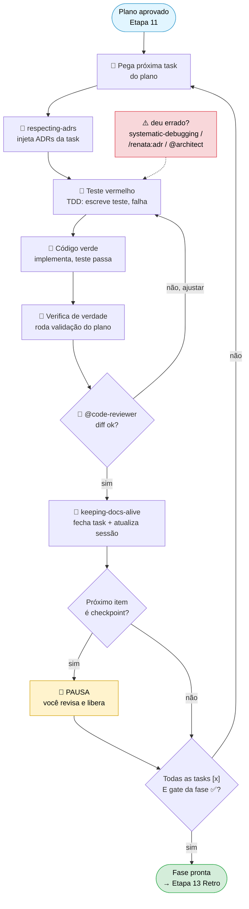
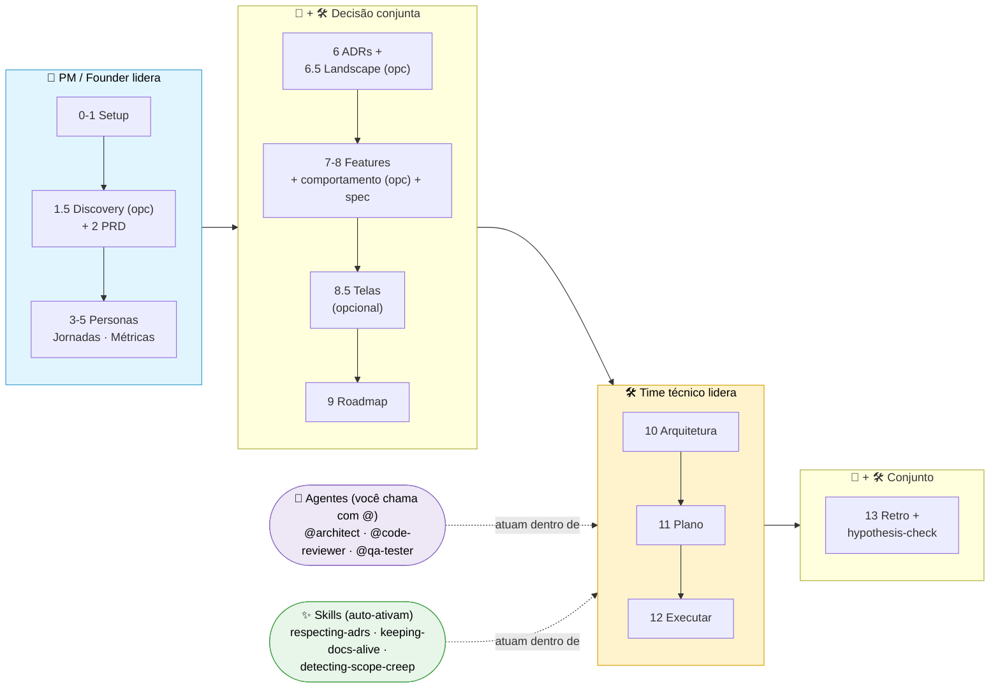
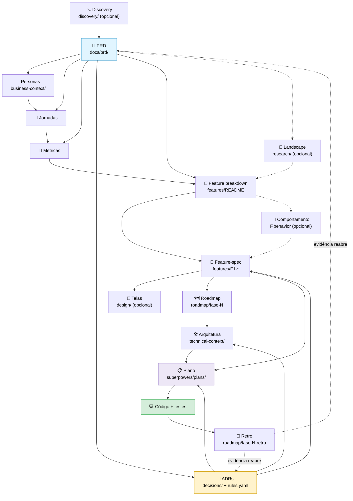

# METHOD — Princípios do RENATA

> 🇬🇧 [English version](METHOD.md)

> **Tese em uma frase:** decisão sem amarração paga juros, e a única forma de não pagar é amarrar persona → métrica → ADR → código.
>
> **RENATA** = **R**ecord · **E**vidence · **N**ame · **A**nchor · **T**est · **A**utomate. Os seis verbos do método: registra o porquê, mede a evidência, nomeia a persona, ancora a decisão, testa antes de fechar, automatiza o enforcement.

---

## Os 7 princípios

### 1. Persona antes de stack

Se você não consegue citar a persona afetada por uma feature/decisão, **a feature não está pronta pra ser construída**.

- Persona não é "usuário". Persona tem **nome, papel, dor numérica** (horas, %, R$).
- Toda feature aponta para a persona-âncora no campo `Vínculos`.
- Anti-personas (quem **não** é) são tão importantes quanto personas.

### 2. Métrica antes de feature

Toda hipótese de produto é falseável por uma **métrica decisiva** com baseline + alvo.

- "Vamos melhorar a UX" não é hipótese. "Contained rate sobe de 32% para 65%" é.
- Métrica sem baseline = fantasia. Sempre estimar baseline (mesmo aproximado) antes de construir.
- 3 camadas canônicas: **adoção** (alguém usa?) · **engajamento** (usa direito?) · **valor** (entrega resultado?) — mais uma 4ª opcional, **qualidade** (específica do produto), quando o produto depende dela.

### 3. ADR antes de código

Decisão estrutural (com impacto > 1 sprint) vira ADR **antes** de mergear código relacionado.

- Formato Michael Nygard: Contexto · Decisão · Alternativas · Trade-offs · Gatilho de revisão · Enforcement.
- Toda ADR tem **gatilho de revisão**. Decisão sem condição de reabrir é fé religiosa.
- Toda ADR tem **enforcement** quando possível (hook, lint, review checklist).
- Status: `proposed` → `accepted` → `superseded`. Sem "proposed" eterno (decide ou descarta em 1 sprint).

### 4. Plano em fases retomáveis

Toda feature não-trivial quebra em **fases granulares e retomáveis**, com critério de pronto verificável.

- Tamanho preferencial: **XS-M** (até alguns dias). **L** aceitável com justificativa. **XL deve quebrar**.
- Cada fase pode ser pausada e retomada sem perda de contexto.
- Critério de pronto = teste passa, hook não bloqueia, métrica observável.
- Última fase é sempre "Demo / Prep entrega" — não terminar feature na fase técnica.

### 5. Anti-escopo obrigatório

Toda doc lista o que NÃO está dentro. Listar o que não está é **mais difícil e mais valioso** que listar o que está.

- PRD tem escopo IN e escopo OUT.
- Roadmap tem anti-roadmap.
- Stack tem "o que NÃO está nesta stack".
- Personas tem anti-personas.

### 6. Entrega faseada com gates

Produto se entrega em **fases sequenciais** (Fase 0/1/2/3), cada uma com **gate explícito**.

- Próxima fase não inicia se anterior não bateu o gate.
- Cada fase tem objetivo **único** (não 5).
- Estimativas em t-shirt sizes (XS · S · M · L · XL). Semanas só após plano de implementação detalhado.

### 7. Doc viva, versionada, opinativa

Documentação não é descritiva — é **opinativa**. "O sistema usa Postgres" não é doc; "Usamos Postgres porque X, descartamos Y porque Z" é.

- Toda doc abre com tese de 1 parágrafo.
- Toda decisão tem âncora (persona, ADR, restrição operacional).
- Histórico no fim das docs vivas (PRD principalmente) mostra evolução.
- Markdown only. Diagramas mermaid embutidos. Sem dependência de ferramenta externa.

**Versionar a evolução (dogfood do Princípio 7).** Todo release do RENATA atualiza o `CHANGELOG.md` com o "O que há de novo" daquela versão, cria a git tag `vX.Y.Z` e publica o GitHub Release. O changelog é o "Histórico vivo" que o Princípio 7 prega — aplicado ao próprio plugin. Um produto que prega doc viva não pode esconder a própria evolução. **Sequência de release:** mover `Unreleased`→a versão no CHANGELOG · bump do `plugin.json` · commit · push · `git tag -a vX.Y.Z` + push das tags · publicar o GitHub Release · atualizar o marketplace clonado + reinstalar.

---

## O loop fecha — Evidência reabre decisão

> Os 7 princípios acima são todos do tipo **Build**: pré-condições que ancoram o trabalho *antes* de avançar (persona antes de stack, métrica antes de feature, ADR antes de código...). Setas que apontam pra frente.
>
> Este princípio é de outra natureza. É a **seta que volta** — o **Measure-Learn** que faltava. Sem ele, o método te leva do zero ao produto entregue com rigor e aí o mapa acaba: a hipótese nasce falseável e nunca é falseada, o baseline nasce estimado e nunca vira medido, a feature nasce e nunca é podada.

**Princípio do retorno: o loop não fecha na entrega. Dado real tem autoridade pra reabrir o que já foi decidido.**

- **Toda hipótese tem um veredito.** A métrica decisiva do PRD existe pra ser confrontada com o número real: ✅ confirmada · ❌ caiu · 🤔 inconclusiva. Hipótese que nunca recebe veredito não era falseável — era fé. (Fechado por `/renata:hypothesis-check`.)
- **Estimativa é dívida até virar medição.** Baseline-chute destrava o começo, mas antes de declarar uma feature *pronta de verdade*, a métrica precisa estar **observável** (instrumentada, não adivinhada). Estimar é largar um TODO 🟡, não fechar a conta.
- **Toda métrica tem um número que dispara decisão (kill criteria / tripwire).** Alvo sem threshold de fracasso é dashboard, não instrumento de gestão. "Se adoção < X% em N dias, para e repensa" é o que transforma medição em ação. (Definido em `/renata:metrics`.)
- **Premissa de negócio arriscada se testa antes de construir, não depois.** Risco técnico tem `/renata:spike`. Risco de **valor** ("alguém quer isso?") e **viabilidade** ("sustenta um negócio?") têm `/renata:assumption-test` — o teste mais barato que mata a premissa mais cara. (Os 4 riscos de Cagan: valor, usabilidade, viabilidade, factibilidade.)
- **Evidência reabre PRD, ADR e feature — inclusive pra matar.** Hipótese que caiu pode reabrir o PRD. Dado que contradiz uma ADR dispara seu gatilho de revisão. Feature entregue que não moveu a métrica é **candidata a sunset** — podar é tão produto quanto adicionar. O método é aditivo demais sem isso.

> **Em uma frase:** os 7 princípios preparam a decisão; este a mantém honesta depois que o mundo respondeu.

### Os selos de evidência

Toda afirmação de produto no método (uma dor, um JTBD, um why-now, uma premissa) carrega um selo dizendo em que ela se apoia:

| Selo | Nível | Significado |
|---|---|---|
| 🔴 | crença | Convicção do fundador — zero evidência externa |
| 🟡 | anedota | 1-2 relatos informais, não estruturados |
| 🟢 | entrevistado | Padrão ouvido espontaneamente em N≥3 entrevistas |
| ✅ | medido | Número real medido (instrumentação/dados) |

O selo **nunca bloqueia** o avanço — ele força honestidade ("você está apostando em 🔴 — declare e siga, ou teste por XS agora"). Os selos são carimbados no `/renata:discovery`, promovidos pelo `/renata:interview-debrief` (só evidência verbatim) e cobrados pelo `/renata:assumption-test` (veredicto) e `/renata:hypothesis-check` (✅ medido). É o **E do RENATA — Evidence — tornado visível.**

### Sobre os ombros de quem (linhagem)

O RENATA não inventa as suas partes — ele monta peças comprovadas e adiciona enforcement:

- **Marty Cagan** (SVPG, *Inspired*) — os 4 riscos de produto (valor, usabilidade, viabilidade, factibilidade) que `/renata:assumption-test` e `/renata:spike` dividem entre si.
- **Teresa Torres** (*Continuous Discovery Habits*) — discovery como hábito semanal, não fase; a escola por trás do `/renata:discovery` e do `/renata:persona`.
- **Steve Blank** (Customer Development) & **Rob Fitzpatrick** (*The Mom Test*) — o "saia do prédio" e como entrevistar sem envenenar as respostas; operacionalizados por `/renata:interview-kit` + `/renata:interview-debrief`.
- **Michael Nygard** — o formato de ADR que o `/renata:adr` cobra até o hook de commit.
- **Eric Ries / Lean Startup** — build-measure-learn; o loop que o `/renata:hypothesis-check` fecha.
- **Curso AINSTEINS / AI-Driven Development** (Eric Luque) — o ritual de slash commands e a estrutura em camadas do CLAUDE.md sobre a qual o plugin inteiro é construído.
- **Ecotrace Solutions** (empresa do Eric Luque) — onde o RENATA nasceu: o método rodou seus primeiros ciclos reais de produto lá antes de virar este plugin público.
- **DDD-lite** — a disciplina de camadas (domain → use case → adapter → repo) por trás das ADRs de adapter pattern.

**A contribuição própria do RENATA:** a amarração com enforcement automatizado — persona → métrica → ADR → código num fluxo único operado com IA, onde o *porquê* sobrevive à implementação porque hooks e gates se recusam a deixá-lo morrer.

---

## O fluxo de relance

O fluxo completo, do "tenho uma ideia" ao "released" (o guia operacional passo-a-passo é o [`GETTING-STARTED.pt-br.md`](GETTING-STARTED.pt-br.md)):

```mermaid
flowchart TD
    A["💡 Tenho uma ideia"] --> B["0. Pré-flight<br/>10min"]
    B --> C["1. Criar projeto<br/>5min"]
    C --> CD{"Problema já está claro?"}
    CD -->|sim| D["2. PRD<br/>1-2h · /renata:prd"]
    CD -->|"não, é só um palpite"| C15["1.5. Discovery<br/>/renata:discovery"]
    C15 --> D
    D --> E{"PRD aprovado?"}
    E -->|não| D
    E -->|sim| F["3. Personas<br/>30min · /renata:persona"]
    F --> G["4. Jornadas<br/>30min · /renata:user-journey"]
    G --> H["5. Métricas<br/>45min · /renata:metrics"]
    H --> I["6. ADRs<br/>2-4h · /renata:adr<br/>🛠 time tech entra"]
    I --> J["7. Features<br/>1h · /renata:feature-breakdown"]
    I -."opcional: gaps competitivos".-> I65["6.5. Landscape<br/>/renata:landscape"]
    I65 -.-> J
    J --> J5["7.5. Fasear<br/>/renata:phase-roadmap"]
    J -."opcional: regras densas".-> J77["7.7. Comportamento da feature<br/>/renata:feature-behavior"]
    J77 -.-> J5
    J5 --> K["8. Spec por fase<br/>1-2h · /renata:feature-spec"]
    K --> K2{"Produto tem UI<br/>significativa?"}
    K2 -->|não| KA{"Premissa de valor/<br/>viabilidade testada?"}
    K2 -->|sim| K3["8.5. Design de telas<br/>1-2h · /renata:screens"]
    K3 --> KA
    KA -->|"não, é só intuição"| KT["Testar premissa<br/>/renata:assumption-test"]
    KT -->|premissa caiu| D
    KT -->|premissa sustenta| L
    KA -->|sim| L["9. Roadmap<br/>1h · /renata:roadmap-gates"]
    L --> M["10. Arquitetura<br/>2-3h · 🛠 /renata:architecture"]
    M --> N{"Tudo pronto<br/>pra codar?"}
    N -->|não| O["Volta na etapa<br/>que falhou"]
    O --> E
    N -->|sim| P["11. Plano de execução<br/>15min · 🛠 /renata:plan-phase"]
    P --> Q["12. Executar<br/>🛠 dias-semanas<br/>↻ loop task-a-task"]
    Q --> R["13. Retro<br/>1h · /renata:retro"]
    R --> RH{"Entregou feature<br/>mensurável?"}
    RH -->|sim| HC["Veredito da hipótese<br/>/renata:hypothesis-check"]
    RH -->|não| S{"Próxima fase?"}
    HC -->|"❌ caiu / 🤔 inconclusiva"| HCB["Evidência reabre:<br/>PRD · ADR · sunset"]
    HCB --> D
    HC -->|"✅ confirmada"| S
    S -->|sim| Q
    S -->|"não, projeto pronto"| T["🎉 Released"]
    T -.->|"cliente/suporte/você<br/>acha um problema"| U["14. Bug report<br/>/renata:bug-report"]
    U -->|"pequeno, isolado"| U1["/renata:todo add"]
    U -->|"2+ sinais críticos<br/>ou crescendo"| U2["14. Incident<br/>🛠 /renata:incident"]
    U2 --> U3["Post-mortem<br/>/renata:retro"]
    U3 -.-> HCB

    classDef start fill:#e1f5ff,stroke:#3399cc,color:#000
    classDef done  fill:#d4edda,stroke:#28a745,color:#000
    classDef tech  fill:#fff3cd,stroke:#d39e00,color:#000
    classDef opt   fill:#e0d4f5,stroke:#8e6fc4,color:#000
    classDef val   fill:#d1ecf1,stroke:#17a2b8,color:#000
    classDef back  fill:#f8d7da,stroke:#dc3545,color:#000

    class A start
    class T done
    class I,M,P,Q,U2 tech
    class C15,I65,J77,K3 opt
    class KT,HC val
    class HCB back
```



**Como ler este mapa:**

- 🟡 **Amarelo** = etapa onde o **time técnico** entra junto (você não está mais sozinho).
- 🟣 **Roxo** = etapas opcionais (discovery, landscape, comportamento da feature, design de telas).
- 🔵 **Azul claro** = validação de produto (Measure-Learn): testar premissa antes, falsear hipótese depois.
- 🔴 **Vermelho** = evidência reabre uma decisão já tomada (PRD/ADR/sunset) — a seta que volta.
- ◇ **Losango** = decisão / gate. Se "não", volta. Se "sim", segue.
- ⬜ **Retângulo** = etapa que produz um documento ou código.

**Você vai chegar até "🎉 Released" seguindo esse caminho — não tem atalho.** E mesmo depois, o loop não fecha sozinho: feature mensurável entregue dispara `/renata:hypothesis-check`, e evidência pode te mandar de volta pro PRD. Released não é o fim da seta — a linha pontilhada saindo de "🎉 Released" é a Etapa 14 do tutorial: a primeira vez que um cliente acha um bug, é pra lá que você vai.

> 🧭 **Já tem uma base de código?** Este mapa assume greenfield. Para projeto existente, o ponto de entrada é `/renata:adopt` — veja [`ADOPTION.pt-br.md`](ADOPTION.pt-br.md).
>
> 🔁 **O nó "12. Executar" é um loop por dentro** (`↻ task-a-task`). Esse mapa o mostra como uma caixa só porque é a visão de pássaro. O ciclo detalhado dele — pegar task → teste → código → revisão → checkpoint — está na [Visão B](#-visão-b--o-loop-de-execução-etapa-12) abaixo e na Etapa 12 do tutorial.

---

## As 4 visões do método

O mapa acima é a **visão de fluxo** — como o processo anda no tempo. Mas o mesmo método tem outras 3 leituras úteis. Cada uma responde uma pergunta diferente:

| Visão | Pergunta que responde | Onde está |
|---|---|---|
| **A · Fluxo** | Em que ordem eu faço as coisas? | O mapa acima ↑ |
| **B · Loop de execução** | Como o "executar" roda por dentro? | [Aqui ↓](#-visão-b--o-loop-de-execução-etapa-12) e na Etapa 12 do tutorial |
| **C · Responsabilidade** | Quem faz o quê (eu / tech / agentes)? | [Aqui ↓](#-visão-c--responsabilidade-quem-faz-o-quê) |
| **D · Artefatos** | Que documento alimenta qual? | [Aqui ↓](#-visão-d--artefatos-o-que-alimenta-o-quê) |

### 🔁 Visão B — O loop de execução (Etapa 12)

Dentro do nó "12. Executar", a porta de entrada é o `/renata:execute` (que orquestra o `superpowers:executing-plans` por dentro). Para **cada task** do plano, este ciclo roda. 🤖 = loop conduz · 🧑 = você decide.



**Como ler:** o caminho feliz é T1→T7 girando até o gate fechar. `@code-reviewer` (T6) pode te jogar de volta pro teste. Checkpoints **pausam** e devolvem pra você. A caixa vermelha pontilhada é o "quando dá errado" (detalhado na Etapa 12.4 do tutorial) — ela reentra no ciclo pelo teste.

### 👥 Visão C — Responsabilidade (quem faz o quê)

Quem lidera cada etapa. O **PM/founder** (você) opera sozinho no começo; o **time técnico** entra na Etapa 6 e lidera da 10 em diante; os **agentes** (skills/subagents) atuam dentro da execução.



Etapa a etapa, quem é responsável:

| Etapa                               | Quem lidera                   | Quem entra junto                        |
| ----------------------------------- | ----------------------------- | --------------------------------------- |
| 0-1 (preparação)                  | Você (PM/founder)            | —                                      |
| 2 (PRD)                             | Você                         | —                                      |
| 3-5 (personas, jornadas, métricas) | Você                         | (opcional) UX se tiver                  |
| 6 (ADRs)                            | Você + 🛠**time tech** | Decisão conjunta                       |
| 7-8 (features, spec)                | Você                         | 🛠 Tech valida viabilidade              |
| 8.5 (design de telas)               | Você + (UX se tiver)         | 🛠 Tech valida com starter/restrições |
| 9 (roadmap)                         | Você                         | 🛠 Tech estima                          |
| 10 (arquitetura)                    | 🛠**Time tech**         | Você revisa                            |
| 11-12 (planejamento e execução)   | 🛠**Time tech**         | Você acompanha checkpoints             |
| 13 (retro)                          | Você + 🛠 time tech          | Conjunto                                |

**Tradução:** você (não-técnico) opera sozinho da Etapa 0 à 5. A partir da 6, chama alguém técnico. Da 10 em diante, o técnico lidera e você acompanha checkpoints. Os agentes são braços da execução — não decidem produto, executam disciplina.

### 📦 Visão D — Artefatos (o que alimenta o quê)

Cada etapa produz um documento, e cada documento **alimenta** os próximos. Esta é a cadeia de dependência: mexer num doc de cima obriga revisar os de baixo.



**Como ler:** o PRD é a raiz — quase tudo desce dele. As ADRs (amarelo) cruzam a cadeia: alimentam feature-spec, arquitetura **e** plano (por isso o hook protege código contra elas). As setas pontilhadas de volta são o loop Measure-Learn: a retro pode reabrir PRD ou ADR.

---

`<a id="ordem-alternancia"></a>`

## Por que essa ordem? (a alternância "o quê / como")

A confusão mais comum do método: *"como eu faço ADRs antes de detalhar features? Não deveria saber o que vou construir primeiro?"*

A resposta exige entender que **"definir o produto" tem múltiplos níveis de granularidade**, e o método **alterna** entre "o quê" e "como" em cada nível:

| Nível   | Etapa                            | Pergunta               | Resultado                            |
| -------- | -------------------------------- | ---------------------- | ------------------------------------ |
| Névoa    | 1.5. Discovery (opcional)        | QUE problema, de fato  | Problema claro + público + sementes  |
| Macro    | 2. PRD                           | O QUE em alto nível   | Tese + escopo IN + métrica decisiva |
| Contexto | 3-5. Personas/Jornadas/Métricas | POR QUÊ e PRA QUEM    | Restrições amarradas               |
| Macro    | 6. ADRs                          | COMO em alto nível    | Stack + estratégia                  |
| Médio   | 7. Feature breakdown             | O QUE em médio nível | Capacidades atômicas                |
| Médio   | 7.7. Comportamento da feature (opcional) | O QUE o usuário observa | Comportamento observável por feature (sem técnico) |
| Médio   | 7.5. Fasear o sistema            | QUANDO cada feature    | Todas as features em fases por tempo |
| Médio   | 8. Feature spec (por fase)       | COMO em médio nível  | Plano por feature da fase corrente   |
| Visual   | 8.5. Design de telas (opcional)  | COMO o usuário vê    | Inventário + fluxo + briefs         |
| Baixo    | 10. Arquitetura                  | COMO em baixo nível   | Diagramas técnicos                  |
| Micro    | 11. Plano de execução          | COMO em micro nível   | Passos código                       |

**Por que a alternância funciona:**

- Você **não consegue detalhar feature** sem saber qual é o stack (ADRs).
- Você **não consegue decidir stack** sem saber o que o produto faz em alto nível (PRD).
- **PRD já te dá os requisitos pra abrir ADRs.** Features só **detalham** o que o PRD já decidiu em alto nível.

**Exemplo concreto:**

Um PRD que diz "avatar humano realtime com RAG sobre KB da empresa, latência <2s, self-hosted" já **força** abrir ADRs sobre:

- Vector DB (porque "RAG")
- Transporte (porque "latência <2s")
- Modelo de lip sync (porque "realtime")
- Estratégia self-host vs API (porque "self-hosted")

Nenhuma dessas ADRs precisa esperar a feature spec — elas são **pré-requisitos** pra falar das features.

### ADRs nascem em qualquer etapa

A **Etapa 6** é só o **primeiro lote concentrado** de ADRs (as estruturais que destravam o resto). Você fará mais em outras etapas:

- **Durante Etapa 7** (ao ver features, percebe que precisa de ADR sobre algo)
- **Durante Etapa 10** (arquitetura revela decisão estrutural não-prevista)
- **Durante Etapa 12** (execução! escolhe biblioteca, padrão de teste, etc)
- **Durante Etapa 13 (retro)** — descobre que decisão antiga estava errada → ADR `superseded`

A regra é simples: **se aparece decisão com impacto > 1 sprint, abre `/renata:adr`. Não importa em que etapa você está.**

### Sintomas de ordem errada

| Sinal                                                                   | Diagnóstico                                                     |
| ----------------------------------------------------------------------- | ---------------------------------------------------------------- |
| Tentou escrever ADR-001 e não sabia se produto é mobile/web           | PRD raso. Volte à Etapa 2 e refine escopo IN.                   |
| Tentou escrever feature F1 e percebeu que precisava decidir stack antes | Falta ADR. Pause F1, abra `/renata:adr`.                              |
| Escreveu 8 ADRs mas elas não cobrem nenhuma feature real               | Detalhou demais cedo demais. Volte a features.                   |
| Plano de execução cita biblioteca que nenhuma ADR mencionou           | ADR faltando. Abra `/renata:adr` durante execução, depois continue. |

### Em uma frase

> **PRD pinta o quadro grande, ADRs decidem as cores e técnicas, features pintam os detalhes.**

---

`<a id="um-prd-vs-n-prds"></a>`

## 1 projeto = 1 PRD (com N hipóteses)

> **Regra do método:** todo projeto tem **exatamente um PRD**. Esse PRD pode (e geralmente deve) abrigar **N hipóteses**. Não existe "N PRDs por projeto" — se algo é separável a ponto de pedir PRD próprio, isso é **outro projeto**, não outro PRD aqui dentro.

A dúvida mais comum ao começar do zero: *"faço um PRD por hipótese? Um por persona? E quando crescer, crio outro PRD? E as ADRs, ficam dentro do PRD?"*

A confusão vem de tratar o PRD como **catálogo de features**. Ele não é. O PRD é o **portador da aposta deste projeto** (Princípio 2) — e a aposta pode ter várias hipóteses entrelaçadas. A unidade não é a feature nem a hipótese isolada; é o **projeto**, e cada projeto tem um PRD só.

### Quando é hipótese nova (no mesmo PRD) vs quando é outro projeto

| Situação | O que fazer | Por quê |
|---|---|---|
| Nova aposta no **mesmo motor/codebase**, reforça o produto, morre junto com ele se a tese-mãe cair | **Nova hipótese no PRD existente** | O `/renata:prd` suporta "N hipóteses entrelaçadas com N sinais de falsificação". Contexto num lugar só. |
| Nova capacidade que só **completa** o produto, sem nova aposta falseável | **Só feature** (`docs/features/`) apontando pro PRD | Nem toda feature é hipótese. Feature serve uma hipótese existente; não cria veredito novo. |
| Algo que **poderia ser cortado/vendido separado** sem matar este produto | **Outro PROJETO** (roda o RENATA do zero, pasta própria) | Não é PRD novo aqui — é outro produto. Compartilha código via lib/serviço, não via PRD. |

> ⚠️ **Não fragmente em "vários PRDs" dentro do projeto.** Se a aposta pertence a este produto, é hipótese no PRD existente. Se é separável de verdade, é **outro projeto** (outra pasta de docs, outro CLAUDE.md). O meio-termo "N PRDs no mesmo projeto" não existe no método — ele espalha o contexto, que é o oposto do que o método busca.

### Personas e jornadas não seguem as hipóteses — seguem as pessoas

Erro comum: achar que 1 hipótese = 1 persona = 1 jornada. A relação real:

- **1 persona-âncora** domina o PRD (Princípio 1). Pode haver secundárias.
- **N hipóteses** podem compartilhar a mesma persona ou ter personas diferentes. **Não force paridade.**
- **Jornadas são por persona**, não por hipótese. Cada persona real ganha sua `/renata:user-journey`.
- **Métrica decisiva é por hipótese** — cada aposta tem seu próprio número que a confirma ou mata.

### ADRs são transversais — não moram dentro do PRD

Outra inversão comum: *"adiciono as ADRs ao PRD?"* **Não.**

- ADRs vivem em `docs/decisions/` (numeradas, Nygard) — **nunca dentro do PRD**.
- Uma ADR estrutural (ex: "PostgreSQL como banco") é **transversal ao projeto inteiro**: vale pra todas as features de todas as hipóteses.
- Features **referenciam** ADRs via o campo `Vínculos` — não copiam. O PRD não lista ADRs.
- Como há **um PRD por projeto**, há também **um único conjunto de ADRs** governando tudo. Se uma decisão só vale pra uma hipótese específica, vira uma ADR com **escopo declarado** — mas continua em `docs/decisions/`, não no PRD.

### Exemplos

**Exemplo A — 1 PRD com N hipóteses (o caso normal).**
*TaskFlow*, gestão de tarefas pra freelancer solo. Duas hipóteses: **H1** "captura em <5s aumenta retenção" e **H2** "lembrete inteligente reduz tarefa esquecida em 40%". Mesma persona (Marina, freelancer), mesmo motor, se reforçam (capturar rápido só importa se a tarefa não for esquecida depois). → **1 PRD, 2 hipóteses, 2 métricas decisivas, 1 persona-âncora, 1 jornada, 1 conjunto de ADRs** (banco, auth, push). H1 e H2 vivem/morrem juntas: se ninguém usa o TaskFlow, as duas caem.

**Exemplo B — mesma persona, jornada nova → vira hipótese no mesmo PRD.**
TaskFlow ganha **emissão de nota fiscal**. Mesma Marina, mas é outra dor (burocracia fiscal, ~3h/mês) que o PRD não mapeava. → roda `/renata:user-journey Marina` pro novo fluxo fiscal, vira **hipótese H3 no mesmo PRD** (linha no Histórico registrando a expansão), reusa as ADRs existentes + talvez 1 nova (integração com API da prefeitura, ADR com escopo declarado). **Não** é PRD novo — é a mesma aposta crescendo.

**Exemplo C — produto separável → outro PROJETO (não outro PRD).**
TaskFlow quer lançar um **módulo de gestão de equipe** (vários freelancers num time, dashboard pro gestor). Outra persona (Rafael, gestor), outra métrica decisiva (produtividade do time), e — crucialmente — **poderia ser vendido separado** ou cortado sem matar o TaskFlow solo. → isso é **outro projeto**: roda o RENATA do zero em sua própria pasta, com seu próprio PRD, CLAUDE.md, personas e ADRs. Reaproveita código do TaskFlow como **biblioteca/serviço compartilhado** (não copiando docs). **Não** vire isso num segundo PRD dentro do projeto TaskFlow — separável de verdade = projeto separado.

### Sintomas de ter errado

| Sinal | Diagnóstico |
|---|---|
| PRD com 6 hipóteses que não se conversam | Algumas não são deste produto. As separáveis viram **outro projeto**; as demais ficam como hipóteses. |
| Criou um segundo PRD dentro do mesmo projeto | Não existe N PRDs por projeto. Ou é hipótese no PRD existente, ou é outro projeto (pasta própria). |
| Copiou ADRs dentro do PRD | ADR não mora no PRD. Mova pra `docs/decisions/` e referencie via `Vínculos`. |
| Criou hipótese nova a cada feature | Nem toda feature é hipótese. Se não tem aposta falseável própria, é **só feature** apontando pro PRD. |

### Em uma frase (1 projeto = 1 PRD)

> **Cada projeto tem 1 PRD com N hipóteses entrelaçadas → personas (por pessoa real) → jornadas (por persona) → métricas (por hipótese) → 1 conjunto de ADRs transversais em `docs/decisions/` → features que referenciam tudo. Cresceu uma aposta nova? Vira hipótese no mesmo PRD. É separável de verdade? Vira outro projeto — nunca um segundo PRD aqui.**


## Estrutura de doc canônica

```
docs/
├── prd/                    ← Micro PRD vivo (1 página)
├── business-context/       ← personas, jornadas, métricas
├── technical-context/      ← stack ancorada, arquitetura macro
├── architecture/           ← diagramas detalhados (C4, sequence, ER)
├── features/               ← F1..Fn com plano em fases
├── roadmap/                ← fases macro (Fase 0..N)
├── interviews/             ← kits de entrevista + debriefs + board de evidência
└── decisions/              ← ADRs numeradas (Nygard)
```

---

## Camadas do CLAUDE.md

```
1 · Identidade do produto    (nome, categoria, estágio, persona-âncora)
2 · Camada org               (princípios não-negociáveis)
3 · Camada repo              (stack, convenções)
4 · Camada feature           (PRD, fase, feature-âncora ativos)
5 · Camada session           (estado da sessão atual)
6 · Decisões já tomadas      (índice de ADRs)
7 · Como pedir coisas        (slash commands deste projeto)
8 · Anti-padrões              (o que NÃO fazer aqui)
9 · Próximos passos
```

---

## Slash commands canônicos

**Padrão didático — o comando ensina enquanto conduz.** Comandos que usam frameworks nomeados (ex: `/renata:discovery` com 5 porquês / JTBD) dão uma explicação de 1 linha de cada framework no momento do uso. O método atende quem ainda não sabe "fazer produto" (como o README promete) — então o conhecimento chega no fluxo, não como aula pré-requisito.

### Scaffold (setup do projeto)

| Comando                  | Quando usar                                                        | O que gera                                      |
| ------------------------ | ------------------------------------------------------------------ | ----------------------------------------------- |
| `/renata:init <nome>`         | Uma vez, no início de um projeto (diretório novo ou existente) — antes checa as dependências da máquina (`yq`, `jq`/`python3`, `git`) e oferece instalar o que faltar | Scaffold `CLAUDE.md` + `docs/` + `.claude/`     |
| `/renata:adopt [escopos]`      | Uma vez, numa **base de código existente** que adota o método — faz engenharia reversa do padrão, das features e de um PRD retroativo, confirmando item a item (ver [`ADOPTION.pt-br.md`](ADOPTION.pt-br.md)) | ADRs + code-pattern + `stack.md`/`arquitetura.md` + `docs/features/` + `docs/prd/` (tudo as-built, 🔄) |

### Planejamento (definir o quê)

| Comando                  | Quando usar                                                        | O que gera                                      |
| ------------------------ | ------------------------------------------------------------------ | ----------------------------------------------- |
| `/renata:discovery <ideia>`   | (Opcional, Etapa 0) Da intuição vaga ao problema claro — antes do PRD. Ensina os frameworks de discovery enquanto conduz | `docs/discovery/<data>-<slug>.md` |
| `/renata:prd <ideia>`         | Início de novo produto/feature grande                             | `docs/prd/<slug>.md`                          |
| `/renata:persona <nome>`      | Antes de qualquer feature focada em usuário                       | `docs/business-context/personas.md` (append)  |
| `/renata:user-journey <persona>`   | Após persona, antes de feature                                    | `docs/business-context/jornada.md` (append)   |
| `/renata:metrics`            | Após PRD + personas, antes de features                            | `docs/business-context/metricas.md`           |
| `/renata:adr <decisão>`      | Quando se identifica decisão estrutural                           | `docs/decisions/ADR-NNN-<slug>.md`            |
| `/renata:feature-spec <nome>` | Antes de implementar feature                                       | `docs/features/F<N>-<slug>.md`                |
| `/renata:landscape`           | (Opcional, pós-PRD) Pesquisa competitiva → gaps de diferenciação; curada junto, fontes obrigatórias; alimenta o breakdown | `docs/research/<data>-landscape.md`          |
| `/renata:feature-breakdown`   | Quando há 3+ features candidatas                                  | `docs/features/README.md` (binário MUST/OUT) |
| `/renata:feature-behavior`    | (Opcional) refina a feature como comportamento observável antes da spec técnica — quando Produto é separado de Engenharia ou as regras de negócio são densas | `docs/features/F<N>-<slug>.behavior.md` |
| `/renata:phase-roadmap`              | Após breakdown — distribuir todas as features em fases por tempo | `docs/roadmap/fases-overview.md`              |
| `/renata:roadmap-gates`              | Etapa 9 — blindar o roadmap: gate explícito e verificável por fase + 1 arquivo por fase | `docs/roadmap/fases-overview.md` (gantt + gates) + `fase-N-<nome>.md` |
| `/renata:architecture`               | Etapa 10 — sintetizar ADRs aceitas + feature-specs + spikes no mapa técnico (não decide nada novo) | `docs/technical-context/stack.md` + `arquitetura.md` (C4) |

### Design (entre planejamento e execução)

| Comando      | Quando usar                                      | O que gera                                               |
| ------------ | ------------------------------------------------ | -------------------------------------------------------- |
| `/renata:screens` | Produto tem UI significativa (entre Etapa 8 e 9) | `docs/design/inventory.md` + `flow.md` + `briefs/` |
| `/renata:extract-pattern <path>` | Destilar o padrão de um repo (starter/legado) em ADRs + doc carregável (envolve `@pattern-mapper`) | `docs/decisions/ADR-*` + `docs/technical-context/code-pattern-<scope>.md` |

### Desenvolvimento (operar dentro de uma fase)

| Comando                        | Quando usar                                                                                                    | O que gera                                                    |
| ------------------------------ | -------------------------------------------------------------------------------------------------------------- | ------------------------------------------------------------- |
| `/renata:plan-phase <fase>`          | Gerar plano de execução blindado (envolve `superpowers:writing-plans` + revisão `@architect`)           | `docs/superpowers/plans/<data>-fase-N-plan.md`              |
| `/renata:execute <fase>`           | Executar a fase com plano aprovado (envolve `superpowers:executing-plans` + gate de pronto + `@qa-tester`) | código + plano marcado `running`→done                     |
| `/renata:spike <pergunta>`          | Validar risco técnico antes de comprometer                                                                    | `docs/spikes/<data>-<slug>.md`                              |
| `/renata:phase-scope <fase>`        | Decidir o que cabe na fase com orçamento fixo                                                                 | `docs/roadmap/fase-N-scope.md` (MoSCoW completo)            |
| `/renata:triage <contexto>`         | Priorizar backlog de bugs/débitos                                                                             | `docs/triage/<data>-<contexto>.md` (MoSCoW completo)        |
| `/renata:todo <add\|sync\|list\|done>` | Registrar e controlar pendências que não bloqueiam                                                           | `docs/backlog/todos.md` (ordenado por impacto no andamento) |
| `/renata:refactor <alvo>`           | Guia refactor disciplinado                                                                                     | `docs/refactors/<data>-<slug>.md`                           |
| `/renata:retro [fase]`              | Retrospectiva ao fim de fase                                                                                   | `docs/roadmap/fase-N-retro.md`                              |

### Pós-produção (depois que já está no ar — fechando o loop com a realidade)

O método não para na retro de fase. Uma vez que o código está rodando em produção, um cliente (ou o próprio uso) eventualmente vai revelar um problema que o plano não previu. Estes dois comandos são a porta de entrada para esse momento — eles não entram em "Desenvolvimento" acima porque aquela seção é sobre trabalho ainda dentro de uma fase não lançada; esta é sobre o que já foi ao ar.

| Comando                                | Quando usar                                                                                                  | O que gera                          |
| --------------------------------------- | -------------------------------------------------------------------------------------------------------------- | ------------------------------------- |
| `/renata:bug-report <descrição bruta>` | Um cliente/suporte/você mesmo encontrou um problema em produção — estrutura o relato bruto em severidade + reprodução + impacto e roteia (hotfix / `/renata:todo` / `/renata:triage` / escalar) | `docs/bugs/<data>-<slug>.md`         |
| `/renata:incident <descrição>`         | O relato (ou um conjunto deles) é grande o bastante para precisar de coordenação ativa — declara, mantém uma timeline ao vivo, exige um checklist de resolução, e então entrega pro `/renata:retro` fazer o post-mortem | `docs/incidents/<data>-<slug>.md`   |

`/renata:bug-report` é a triagem de item único (como o acolhimento do pronto-socorro); `/renata:incident` é para quando já virou uma situação que precisa de um dono nomeado e atualizações de status. A maioria dos bugs de produção só precisa do primeiro.

### Navegação (transversal — em qualquer etapa)

| Comando         | Quando usar                                                     | O que gera                                               |
| --------------- | --------------------------------------------------------------- | -------------------------------------------------------- |
| `/renata:status [N]` | Saber em que etapa do fluxo você está e qual o próximo passo | Diagnóstico em tela (lê `.claude/progress-map.yaml`) |
| `/renata:next` | Versão micro do `/renata:status`: só "qual o próximo passo canônico?" + aviso de gap (trabalho à frente de prereq não satisfeito) | Resposta curta em tela (~10 linhas) |

### Validação de produto (Measure-Learn — fecha o loop)

| Comando                           | Quando usar                                                              | O que gera                                                               |
| --------------------------------- | ------------------------------------------------------------------------ | ------------------------------------------------------------------------ |
| `/renata:assumption-test <premissa>`   | **Antes** de construir: risco de valor/viabilidade não testado    | `docs/assumptions/<data>-<slug>.md`                                    |
| `/renata:interview-kit [premissa]`        | **Antes de uma entrevista:** roteiro Mom Test de 1 página (lido no celular) | `docs/interviews/kits/<data>-<slug>.md`                              |
| `/renata:interview-debrief <transcrição>` | **Depois de uma entrevista:** sinais verbatim por premissa + board de evidência + coaching do entrevistador | `docs/interviews/<data>-<slug>.md` + `docs/interviews/README.md` (board) + atualização de selos |
| `/renata:hypothesis-check [hipótese]` | **Depois** de construir: confrontar hipótese do PRD com dado real | `docs/hypothesis-checks/<data>-<slug>.md` + linha no Histórico do PRD |

> Estes dois materializam o princípio **"Evidência reabre decisão"** (ver "O loop fecha"). `/renata:assumption-test` mata a aposta errada antes do custo; `/renata:hypothesis-check` emite o veredito (✅/❌/🤔) e dispara ação — incluindo **sunset** de feature que não moveu a métrica.

### Quando usar MoSCoW binário vs completo

- **Binário (MUST / OUT)** em `/renata:feature-breakdown`: pra decidir o que entra no **produto**.
- **MoSCoW completo (MUST / SHOULD / COULD / WON'T)** em `/renata:phase-scope` e `/renata:triage`: pra **operar** dentro do produto com orçamento limitado.

### `/renata:todo` vs `/renata:triage` (não confundir)

- **`/renata:triage`** prioriza uma **rodada** de trabalho em MoSCoW — é uma decisão pontual ("o que ataco agora"). Gera um snapshot datado.
- **`/renata:todo`** é o **registro persistente** de pendências que não bloqueiam, ordenado por impacto no andamento (🔴 bloqueia fase / 🟡 importa / ⚪ nice-to-have). Vive em `docs/backlog/todos.md` e nasce colado ao contexto via marcador inline `<!-- TODO[data][impacto]: ... -->` no próprio doc, reconciliado por `/renata:todo sync`.
- Os dois conversam: os **WON'T** de um `/renata:triage` são candidatos naturais a virar entradas no `/renata:todo` pra não se perderem.

---

## Subagents canônicos

- **`@architect`** — revisa **proposta** de feature/decisão contra ADRs locais. Não escreve código.
- **`@code-reviewer`** — revisa **código pronto** (diff). Aponta bugs, padrões violados, testes ausentes.
- **`@qa-tester`** — QA pragmático: roda app de verdade (Playwright/manual), valida contra critérios de aceite do PRD/feature, reporta findings em formato estruturado. Complementa TDD; **não** substitui.
- **`@perf-auditor`** — análise profunda de performance, hot paths, gargalos.
- **`@security-reviewer`** — revisão de segurança leve (OWASP top 10 prático).
- **`@pattern-mapper`** — varre um repo e devolve o mapa do padrão (4 eixos, com força de evidência). Insumo do `/renata:extract-pattern`. Não escreve ADR/doc.

### Quando chamar cada agent

| Momento                             | Agent                  | Por quê                                    |
| ----------------------------------- | ---------------------- | ------------------------------------------- |
| Antes de codar                      | `@architect`         | Validar decisão contra ADRs                |
| Código pronto, antes de PR         | `@code-reviewer`     | Bugs, padrões, testes                      |
| Antes de marcar feature como pronta | `@qa-tester`         | Validação real contra critério de aceite |
| Latência/throughput abaixo do alvo | `@perf-auditor`      | Hot paths profundos                         |
| Mexeu em auth/dados sensíveis      | `@security-reviewer` | OWASP top 10                                |

> O `@pattern-mapper` não está na tabela porque você não o chama direto — ele roda **dentro** do `/renata:extract-pattern`, mapeando o padrão do repo (4 eixos) que o comando transforma em ADRs + um doc carregável.

---

## Skills canônicas (auto-ativáveis)

Skills do framework que carregam automaticamente quando o contexto bate:

- **`respecting-adrs`** — ativa em "implementar X", "que biblioteca usar". Força ler ADRs aceitas e validar proposta antes de codar.
- **`keeping-docs-alive`** — ativa em "terminei task", "vou pausar", "fase completa". Lembra de atualizar CLAUDE.md + `.claude/sessions/` + plano ativo.
- **`detecting-scope-creep`** — ativa em "aproveitando, vou também...", "já que estou aqui...". Compara com escopo IN/OUT da feature ativa, força decisão consciente antes de ampliar.

Skills do `superpowers:` (carregadas pelo Claude Code):

- `brainstorming`, `writing-plans`, `executing-plans`, `subagent-driven-development`
- `test-driven-development`, `systematic-debugging`
- `verification-before-completion` — **é o gate de pronto do Princípio 4**: nenhuma task fecha (`[x]`) sem "teste passa + hook não bloqueia". Amarrada no Passo 3 do `/renata:execute`. (Métrica observável, o 3º critério, é validada no fim de fase via `@qa-tester` / `/renata:hypothesis-check`.)
- `requesting-code-review`, `receiving-code-review`

### Diferença: skill vs agent vs slash command

| Tipo          | Como ativa                                     | Quando usar                                             |
| ------------- | ---------------------------------------------- | ------------------------------------------------------- |
| Skill         | Auto-ativa por contexto (description matching) | Reflexo, comportamento que**deveria** ser padrão |
| Agent         | Invocado explicitamente por nome (`@nome`)   | Persona/papel com método próprio                      |
| Slash command | Usuário digita `/nome`                      | Ritual estruturado com perguntas/output específico     |

---

## Hooks canônicos

- **`rules-violation.sh`** — lê `.claude/rules.yaml` e bloqueia commits que violem regras declarativas dos ADRs locais.
- **`etapa-gate.sh`** — hook PreToolUse. Lê `.claude/progress-map.yaml` e **bloqueia**
  (`exit 2`) a invocação de um command de etapa cujos `prereq` não estão satisfeitos.
  É o que torna a ordem canônica **forçada**, não só sugerida. Com
  `RENATA_STRICT_GATE=1` ele passa a exigir também o selo de verificação humana
  (`> ✅ Verificado por você`) nos artefatos de pré-requisito — pronto ≠ verificado; desligado por padrão.
- **`method-status-line.sh`** — hook SessionStart (`startup` + `resume`). Lê
  `.claude/progress-map.yaml` e mostra, ao abrir/retomar a sessão, em que etapa do
  fluxo o projeto está e qual o próximo passo. Não bloqueia nada — é orientação.

A detecção de progresso é neutra de idioma: cada comando gerador carimba `<!-- renata:step=N -->`
logo abaixo do título do doc gerado (invisível quando renderizado), e o `progress-map.yaml` amarra a
detecção da etapa nesse marcador — nunca em prosa de um idioma específico.

### Quem pertence a quê

Para evitar confusão entre artefatos do framework e conteúdo do projeto:

| Artefato                                     | Pertence ao          | Quem escreve                                                      |
| -------------------------------------------- | -------------------- | ----------------------------------------------------------------- |
| `${CLAUDE_PLUGIN_ROOT}/hooks/scripts/rules-violation.sh` | Framework            | RENATA (genérico, mesmo em todo projeto)                    |
| `.claude/rules.yaml.template`              | Framework            | RENATA (esquema vazio)                                       |
| **`.claude/rules.yaml`**             | **Projeto**    | **`/renata:adr`** (cada bloco nasce junto da ADR correspondente) |
| `docs/decisions/_template.md`              | Framework            | RENATA (template Nygard genérico)                           |
| `docs/decisions/_adr-frontend-template.md` | Framework            | RENATA (template pra ADR de starter)                         |
| `docs/decisions/ADR-NNN-*.md`              | Projeto              | `/renata:adr` (cada arquivo nasce de uma decisão)                     |
| **Starter kit (repo externo)**         | **Você/Time** | Mora**fora** do framework. Referenciado por ADR.            |
| **`frontend/` (clonado do starter)** | **Projeto**    | `/renata:init --starter` clona, depois você evolui                  |

**Princípio:** ADR e seu bloco em `rules.yaml` são **gêmeos**. Nascem juntos via `/renata:adr`. Vivem juntos. Se uma ADR vira `superseded`, seu bloco no `rules.yaml` é removido (ou atualizado para a ADR que a substituiu).

> ⚠️ **Anti-padrão observado na v0.1:** popular `rules.yaml` manualmente fora do fluxo `/renata:adr` é débito técnico — o YAML perde a amarração com a ADR. O `/renata:adr` escreve direto no `rules.yaml` com confirmação rápida do usuário, evitando esse desvio.

---

## Integrações externas (MCP)

O método suporta servidores **MCP** (Model Context Protocol) — git, Jira, banco de dados, etc. — de forma **opcional e configurável**. Regras:

- **Local é sempre a fonte de verdade.** Doc versionado (Princípio 7) é a verdade primária; o MCP é um **espelho**, nunca fonte cega.
- **Escreve local primeiro, espelha após confirmar.** Nada vai pro Jira/Git antes de existir e estar certo no local, e o push só acontece com confirmação explícita. Protege o sistema externo de dado provisório.
- **MCP como ação/leitura pontual** (abrir PR, ler issue, consultar banco) → baixo atrito, `mirror: false`, não compete com nada.
- **MCP como fonte espelhada** (Jira recebe as tarefas) → **decisão estrutural: exige `/renata:adr`**, porque muda onde a verdade espelha e pode aposentar fluxo nativo. O `/renata:adr` escreve o bloco `integrations:` no `rules.yaml` (gêmeo da ADR).
- **Fallback gracioso obrigatório.** Todo uso de MCP degrada pra local se o servidor estiver ausente/indisponível — idêntico ao `etapa-gate.sh` com `yq`. **Sem nenhum MCP, o framework funciona inteiro.**

Configuração em dois lugares: `.mcp.json` (raiz do projeto) declara os servidores; o bloco `integrations:` em `.claude/rules.yaml` mapeia capacidade → MCP. Capacidades canônicas: `tasks` · `pr` · `db` (extensível).

---

## Aplicabilidade — quando este método NÃO serve

Este framework não é o "jeito certo" de tudo. Não use se:

- ❌ **Você tá fazendo throwaway code** (script de 1 uso, prova de conceito de 1 dia). Burocracia mata velocidade.
- ❌ **Você está em codebase legada** com método estabelecido (não tente impor). Codebase legada **sem** método estabelecido é outra história — é pra isso que existe o `/renata:adopt` (ver [`ADOPTION.pt-br.md`](ADOPTION.pt-br.md)).
- ❌ **Time é grande (>15 pessoas)** — esse método é otimizado pra solo / squad pequeno (1-6). Para times grandes, complementar com RFC formal, sign-off, etc.
- ❌ **Domínio extremamente regulado** (banco, saúde) — adicionar camadas de compliance/auditoria que o método não cobre.

---

## Evolução do método

Este método **vai mudar**. Toda mudança nasce de fricção real de uso, não de teoria.

Quando uma regra do método for violada em um projeto e o resultado for melhor sem ela, **isso é dado** — atualizar o método.

> O método serve ao projeto. Não o contrário.
