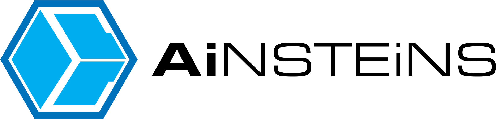

<p align="center">
  <picture>
    <source media="(prefers-color-scheme: dark)" srcset="https://raw.githubusercontent.com/AInsteinsBR/renata/main/assets/logoRenata-dark.svg">
    
  </picture>
</p>

<p align="center">
  <sub>by</sub>&nbsp;&nbsp;<picture>
    <source media="(prefers-color-scheme: dark)" srcset="https://raw.githubusercontent.com/AInsteinsBR/renata/main/assets/ainsteins-logo-dark.png">
    
  </picture>
</p>

<p align="center">
  <a href="https://www.claudepluginhub.com/plugins/ainsteinsbr-renata?ref=badge"></a>
</p>

> 🇧🇷 [Versão em português](README.pt-br.md)

> **R**ecord · **E**vidence · **N**ame · **A**nchor · **T**est · **A**utomate.

**RENATA** is a product method that ties **persona → metric → ADR → code**, shipped as a Claude Code plugin. It takes you from "I have an idea" to "code running in production" without losing the *why* behind each decision along the way.

> Created by **Eric Luque** · **AInsteins** — https://www.ainsteins.com.br

## Why RENATA exists

RENATA lives at an intersection nobody else occupies:

1. **Product frameworks** (Cagan, Torres, Lean) teach you to decide what to build — but stop at the code's border. The decision becomes a slide; the code is born orphaned from its why.
2. **AI coding / vibe-coding tools** generate code fast — but with no method: no persona, no metric, no recorded decision. Speed accruing interest.
3. **RENATA is the bridge, with enforcement:** the product method reaches *inside* the code — the ADR blocks the commit that violates it, the hook collects the gate, the hypothesis comes back to be falsified. The why survives the implementation.

**Who it's for:** a solo founder or a small PM+dev team building with AI, who wants product rigor without a product org.
**What it is NOT:** not project management (it doesn't replace your team's Scrum/kanban), not a code generator, not a product course — it's the method between your idea and your AI-written code.

---

## Install

```text
/plugin marketplace add AInsteinsBR/renata
/plugin install renata@ainsteins
```

> **Declared dependency:** `/renata:plan-phase` (Step 11) and `/renata:execute` (Step 12) wrap the [`superpowers`](https://github.com/obra/superpowers) plugin's `writing-plans` / `executing-plans` skills — it does **not** ship with RENATA. Install it too: `/plugin marketplace add obra/superpowers` + `/plugin install superpowers@superpowers-marketplace`. Both commands check for it in pre-flight and abort with instructions if it's missing. Recommended tooling for full hook enforcement: `jq` (or `python3`) for the stage gate, `yq` for ADR rules (`brew install jq yq`).

## Start a project

```text
/renata:init "My Product"
```

First checks the machine dependencies (`yq`, `jq`/`python3`, `git`) and offers to install what's missing; then creates `CLAUDE.md`, `docs/` and `.claude/` in the project, and activates ADR-violation blocking on commit (if the project uses git). Then follow `GETTING-STARTED.md`.

## Existing project?

```text
/renata:adopt
```

Already have code? `/renata:adopt` reverse-engineers the technical pattern (ADRs + code-pattern docs), the feature inventory, as-built specs and a retroactive PRD — confirming every item with you. Guide: [`ADOPTION.md`](ADOPTION.md).

## What's in the plugin

- **33 commands** — planning (`/renata:discovery`, `/renata:prd`, `/renata:persona`, `/renata:user-journey`, `/renata:metrics`, `/renata:adr`, `/renata:landscape`, `/renata:feature-breakdown`, `/renata:feature-behavior`, `/renata:phase-roadmap`, `/renata:roadmap-gates`, `/renata:architecture`, `/renata:feature-spec`), design (`/renata:screens`), validation (`/renata:assumption-test`, `/renata:interview-kit`, `/renata:interview-debrief`, `/renata:hypothesis-check`), development (`/renata:plan-phase`, `/renata:execute`, `/renata:spike`, `/renata:phase-scope`, `/renata:triage`, `/renata:todo`, `/renata:refactor`, `/renata:retro`, `/renata:extract-pattern`), post-production (`/renata:bug-report`, `/renata:incident`), navigation (`/renata:status`, `/renata:next`), and the scaffold (`/renata:init`, `/renata:adopt`).
- **6 agents** — `@architect`, `@code-reviewer`, `@qa-tester`, `@perf-auditor`, `@security-reviewer`, `@pattern-mapper`.
- **3 auto-activating skills** — `respecting-adrs`, `keeping-docs-alive`, `detecting-scope-creep`.
- **Hooks** — stage gate, in-session status, ADR-violation blocking on commit.

> **Note:** the method content (commands, docs) is currently written in Portuguese; identifiers (commands, agents, files) are in English. Full English localization is on the roadmap. For the philosophy, see `METHOD.md`; for the step-by-step, `GETTING-STARTED.md`; for adopting the method on an existing codebase, `ADOPTION.md`; for the appendices/cheatsheet, `REFERENCE.md`. For what's new in each version, see [`CHANGELOG.md`](CHANGELOG.md).

---

## Need help rolling it out?

RENATA is free and open (MIT). If you want to **deploy the method at your company** — setup, team training, custom code starters, or product/architecture consulting — **AInsteins** does that:

**https://www.ainsteins.com.br**

---

## Why "RENATA"

Every method needs a name. This one carries hers.

RENATA is named after my wife, Renata. Behind every project I build there are hours that belonged to us — evenings, weekends, the small precious time a couple has. She gave that time up, again and again, so these ideas could exist. Not grudgingly: she's the one who pushes me to create, who believes the thing is worth building before anyone else does.

So the acronym is real — **R**ecord, **E**vidence, **N**ame, **A**nchor, **T**est, **A**utomate, the six verbs of the method — but the name is a thank-you. To the person who anchors everything else.

— Eric

---

## License

MIT © Eric Luque / AInsteins. Use freely; keep the copyright notice.
