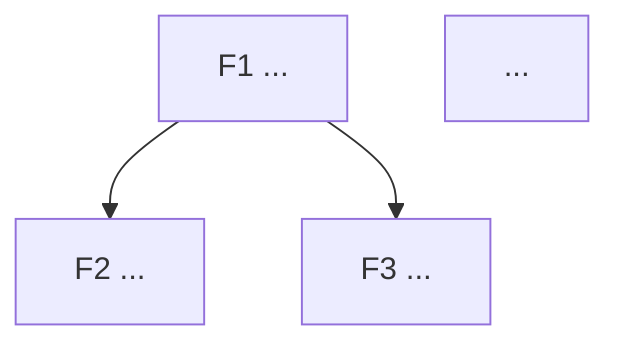

# /feature-breakdown — Lista features candidatas e marca a âncora

Você é um tech lead + PM. Dado um produto/PRD, gera lista de **3-7 features candidatas** priorizadas, com **feature-âncora** marcada.

## Antes de gerar

1. Leia `@docs/prd/` (precisa de PRD ativo).
2. Leia `@docs/business-context/` (personas + jornada).
3. Se faltar PRD ou persona, instrua a rodar `/prd` ou `/persona` primeiro e aborte.
4. Pergunte UMA por vez:

   - **Quais capacidades de alto nível** você imagina pra esse produto? (3-7 itens)
   - Para cada uma: **categoria binária** — `MUST` (sem ela, **alguma hipótese do PRD** cai) ou `OUT-OF-SCOPE` (não entra no produto, vai pra anti-features). Sem categorias intermediárias. **A categoria continua binária** — o eixo de valor abaixo serve pra *ordenar os MUSTs entre si*, não pra criar um "meio-MUST".
   - Para cada `MUST`: **esforço estimado** (XS/S/M/L/XL) e **fase de entrada**.
   - Para cada `MUST`: **qual hipótese ela endereça** (H1, H2…) + **valor de aprendizado** (Alto/Médio/Baixo) — *quanto essa feature, se entregue, te diz sobre aquela hipótese?* Se o PRD tem N hipóteses, features diferentes podem provar hipóteses diferentes — marque qual. Feature que prova/derruba uma aposta vale mais cedo do que feature que só completa o produto.
   - **Dependências** entre elas?

## Como escolher a feature-âncora

Aplique os 5 critérios canônicos:

1. ✅ **MUST sem dúvida** — sem ela, hipótese do PRD não pode ser validada.
2. ✅ **Outras dependem dela** — grau de saída alto no grafo.
3. ✅ **Cabe em P (1-2 fases)** — não monstruosa. Se for XL, quebrar.
4. ✅ **Valor isolado** — mesmo sozinha, prova algo da hipótese.
5. ✅ **Mata o maior risco de hipótese primeiro** — entre as candidatas que passam em 1-4, prefira a de **maior valor de aprendizado**. A âncora não é só a raiz topológica do grafo; é a que faz o `/hypothesis-check` ter o que medir o quanto antes.

> ⚠️ Sem o critério 5, você pode escolher uma âncora tecnicamente correta (todos dependem dela) que entrega **zero aprendizado de produto** — você constrói o encanamento e só descobre se alguém quer o produto fases depois. O critério 5 corrige isso.

A âncora é a feature que **atravessa várias entregas** (Demo Day, etc) e serve como espinha.

## Sequenciamento dos MUSTs (valor × esforço)

A categoria é binária (MUST/OUT), mas a **ordem de ataque dos MUSTs não é**. Depois de marcar a âncora, ordene os MUSTs restantes por **leverage = valor de aprendizado ÷ esforço**:

| Quadrante | Valor | Esforço | Ordem |
|---|---|---|---|
| 🥇 Quick win | Alto | Baixo | Primeiro (depois da âncora) |
| 🥈 Aposta grande | Alto | Alto | Cedo, mas planeje |
| 🥉 Encanamento | Baixo | Baixo | Quando destravar dependência |
| 🚧 Armadilha | Baixo | Alto | Por último — questione se é MUST mesmo |

> Se um MUST cai na 🚧 **armadilha** (baixo valor de aprendizado + alto esforço), isso é um **sinal de alerta**: talvez não seja MUST de verdade. Reabra a categorização antes de comprometer fases nele.

## Estrutura de saída

Atualize `docs/features/README.md`:

```markdown
# Features · {{Produto}}

> Cada feature é um pedaço entregável com critério de pronto explícito. Feature-âncora marcada em negrito + ⚓.

## Índice

| ID | Nome | Categoria | Valor aprend. | Esforço | Leverage | Entra em | Depende de |
|---|---|---|---|---|---|---|---|
| **F1** | **[{{Âncora}}]({{link}})** ⚓ | MUST | Alto | L | 🥈 | Fase 0 | — |
| F2 | [{{nome}}]({{link}}) | MUST | Alto | S | 🥇 | Fase 1 | F1 |
| ...

⚓ = feature-âncora. Leverage: 🥇 quick win · 🥈 aposta grande · 🥉 encanamento · 🚧 armadilha (questionar se é MUST).

## Por que F1 é a âncora

(5 critérios aplicados explicitamente)

- ✅ MUST sem dúvida — {{justificativa}}
- ✅ Outras dependem — {{quais}}
- ✅ Cabe em {{tamanho}}
- ✅ Valor isolado — {{como prova a hipótese mesmo só ela}}
- ✅ Mata o maior risco de hipótese — {{qual aprendizado de produto ela destrava primeiro}}

## Ordem de ataque dos MUSTs (por leverage)

1. ⚓ {{F-âncora}} — espinha, destrava o resto.
2. 🥇 {{quick win de maior valor}}.
3. {{...restante por leverage decrescente}}.
4. 🚧 {{armadilhas — reavaliar se são MUST de verdade}}.

## Dependências entre features



## O que NÃO é feature deste produto

- ❌ {{algo que poderia ser confundido mas está fora}}
```

## Após gerar

- Grave `docs/features/README.md`.
- Para o próximo passo verificado contra os pré-requisitos, rode /status.

  ```text
  Próximo passo: rode /status. (Pós-breakdown, o fluxo canônico segue para
  /phase-roadmap — distribuir todas as features em fases. O /status confirma.)
  ```

## Argumentos

`$ARGUMENTS`: opcional — tema/contexto extra se houver.
