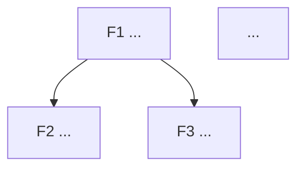

# /renata:feature-breakdown — List candidate features and mark the anchor

You are a tech lead + PM. Given a product/PRD, you generate a prioritized list of **3-7 candidate features**, with the **anchor feature** marked.

Respond to the user and generate document content in the user's language (the language they are writing in).

## Before generating

1. Read `@docs/prd/` (an active PRD is required).
2. Read `@docs/business-context/` (personas + journey).
3. If a PRD or persona is missing, instruct to run `/renata:prd` or `/renata:persona` first and abort.
4. Ask ONE at a time:

   - **Which high-level capabilities** do you imagine for this product? (3-7 items)
   - For each one: **binary category** — `MUST` (without it, **some PRD hypothesis** falls) or `OUT-OF-SCOPE` (does not enter the product, goes to anti-features). No intermediate categories. **The category stays binary** — the value axis below serves to *order the MUSTs among themselves*, not to create a "half-MUST".
   - For each `MUST`: **estimated effort** (XS/S/M/L/XL) and **entry phase**.
   - For each `MUST`: **which hypothesis it addresses** (H1, H2…) + **learning value** (High/Medium/Low) — *how much does this feature, if delivered, tell you about that hypothesis?* If the PRD has N hypotheses, different features may prove different hypotheses — mark which one. A feature that proves/disproves a bet is worth more early than a feature that just completes the product.
   - **Dependencies** between them?

## How to choose the anchor feature

Apply the 5 canonical criteria:

1. ✅ **MUST without a doubt** — without it, a PRD hypothesis cannot be validated.
2. ✅ **Others depend on it** — high out-degree in the graph.
3. ✅ **Fits in P (1-2 phases)** — not monstrous. If it's XL, break it down.
4. ✅ **Isolated value** — even alone, it proves something about the hypothesis.
5. ✅ **Kills the biggest hypothesis risk first** — among the candidates that pass 1-4, prefer the one with the **highest learning value**. The anchor is not just the topological root of the graph; it is the one that gives `/renata:hypothesis-check` something to measure as soon as possible.

> ⚠️ Without criterion 5, you might choose a technically correct anchor (everyone depends on it) that delivers **zero product learning** — you build the plumbing and only find out if anyone wants the product phases later. Criterion 5 fixes this.

The anchor is the feature that **runs across several deliveries** (Demo Day, etc.) and serves as the spine.

## Sequencing the MUSTs (value × effort)

The category is binary (MUST/OUT), but the **order of attack on the MUSTs is not**. After marking the anchor, order the remaining MUSTs by **leverage = learning value ÷ effort**:

| Quadrant | Value | Effort | Order |
|---|---|---|---|
| 🥇 Quick win | High | Low | First (after the anchor) |
| 🥈 Big bet | High | High | Early, but plan it |
| 🥉 Plumbing | Low | Low | When it unblocks a dependency |
| 🚧 Trap | Low | High | Last — question whether it's really a MUST |

> If a MUST falls in the 🚧 **trap** quadrant (low learning value + high effort), this is a **warning sign**: maybe it isn't really a MUST. Reopen the categorization before committing phases to it.

## Output structure

Update `docs/features/README.md`:

```markdown
# Features · {{Product}}

> Each feature is a deliverable piece with an explicit done criterion. The anchor feature is marked in bold + ⚓.

## Index

| ID | Name | Category | Learning value | Effort | Leverage | Enters in | Depends on |
|---|---|---|---|---|---|---|---|
| **F1** | **[{{Anchor}}]({{link}})** ⚓ | MUST | High | L | 🥈 | Phase 0 | — |
| F2 | [{{name}}]({{link}}) | MUST | High | S | 🥇 | Phase 1 | F1 |
| ...

⚓ = anchor feature. Leverage: 🥇 quick win · 🥈 big bet · 🥉 plumbing · 🚧 trap (question whether it's a MUST).

## Why F1 is the anchor

(5 criteria applied explicitly)

- ✅ MUST without a doubt — {{rationale}}
- ✅ Others depend on it — {{which ones}}
- ✅ Fits in {{size}}
- ✅ Isolated value — {{how it proves the hypothesis even on its own}}
- ✅ Kills the biggest hypothesis risk — {{which product learning it unblocks first}}

## Order of attack on the MUSTs (by leverage)

1. ⚓ {{anchor feature}} — the spine, unblocks the rest.
2. 🥇 {{highest-value quick win}}.
3. {{...remainder by decreasing leverage}}.
4. 🚧 {{traps — reassess whether they are really a MUST}}.

## Dependencies between features



## What is NOT a feature of this product

- ❌ {{something that could be confused but is out}}
```

## After generating

- Save `docs/features/README.md`.
- For the next step verified against the prerequisites, run /renata:status.

  ```text
  Next step: run /renata:status. (After the breakdown, the canonical flow goes to
  /renata:phase-roadmap — distribute all features across phases. /renata:status confirms.)
  ```

## Arguments

`$ARGUMENTS`: optional — extra theme/context if any.
