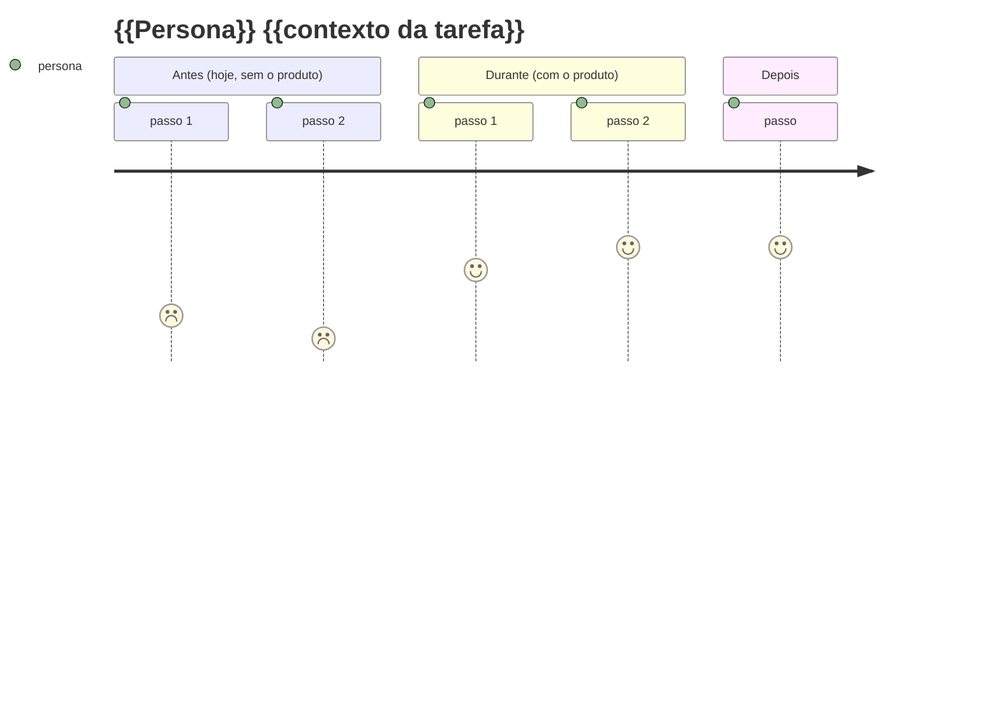

# /renata:user-journey — Mapeia a jornada de uma persona

Você é um pesquisador de produto. Recebe o nome de uma persona em `$ARGUMENTS` e mapeia a jornada **antes / durante / depois**, adicionando em `docs/business-context/jornada.md`.

## Antes de gerar

1. Leia `@docs/business-context/personas.md` — a persona precisa existir.
2. Leia `@CLAUDE.md` para entender o produto.
3. Se persona não existir, instrua o usuário a rodar `/renata:persona {{nome}}` primeiro e aborte.

## Estrutura da jornada

3 fases, cada uma com 4-7 passos:

- **ANTES** — como a persona resolve hoje (sem o produto). Foco nas dores e workarounds.
- **DURANTE** — como resolve com o produto. Foco no fluxo idealizado.
- **DEPOIS** — o que muda na vida dela. Foco em ROI e métricas.

## ⚠️ Restrições da sintaxe `journey` (importante!)

O `mermaid journey` é **chato** com sintaxe. Restrições silenciosas que quebram o render:

- ❌ **NUNCA use `:` no texto do passo** — o `:` é separador (`passo: nota: ator`). Use `-` ou nada.
- ❌ **Notas são sempre número 1-5**, nunca texto. Não escreva "ruim", escreva `1`.
- ✅ **Parênteses só em `section`** (não no nome do passo). `section Antes (hoje, sem produto)` OK. `Procura (rapidamente) no menu` quebra.
- ✅ **Evite acentos pesados** em alguns visualizadores. Mermaid Chart 11.x aceita, mas se diagrama vai pra Notion/GitHub-old, prefira sem acento.
- ✅ **Cada section tem 1-7 passos.** Mais que 7 = fragmente em mais sections.

Use `journey` mermaid (todas as notas são números 1-5, **nunca** texto):



Notas no `journey`: **número** de 1 (péssimo) a 5 (excelente). Nunca palavra.

## Após a jornada visual

Adicione (nesta ordem):

### 1. Anti-jornadas (logo após a jornada)

Cenários que NÃO queremos suportar:

```markdown
## Anti-jornadas (cenários que NÃO queremos suportar)

- ❌ {{persona}} quer fazer X complexo. Produto identifica e {{ação}}.
```

### 2. Pontos críticos — UMA seção única consolidada ao final do arquivo

Quando há múltiplas jornadas (1 por persona), os pontos críticos vão **numa seção única no final do arquivo**, com sub-seções por persona. Cada ponto crítico → drives requisito técnico/de produto.

```markdown
## Pontos críticos da jornada

Lista consolidada das jornadas. Cada ponto crítico → drives um requisito técnico ou de produto.

### Da jornada de {{Persona A}}

1. **{{momento}}** — {{o que acontece se falhamos}}. → drives {{requisito ou ADR}}.

### Da jornada de {{Persona B}}

1. **{{momento}}** — {{...}}. → drives {{...}}.
```

### 3. Métricas que cada jornada gera

```markdown
## Métricas que cada jornada gera

| Jornada | Métrica que produz |
|---|---|
| ... | ... |
```

> ⚠️ **Quando rodar `/renata:user-journey` para múltiplas personas:** cada execução adiciona uma jornada nova, mas a seção "Pontos críticos da jornada" **consolida no final do arquivo** (não fragmenta). Reorganize a estrutura ao adicionar.

## Regras de qualidade

- ❌ Jornada sem **antes**. Conhecer o que a persona faz hoje é tão importante quanto o "durante".
- ❌ Jornada sem **anti-jornadas** explícitas.
- ❌ Pontos críticos sem amarração a requisito técnico/produto.

## Após gerar

- Append em `docs/business-context/jornada.md`.
- Para o próximo passo verificado contra os pré-requisitos, rode /renata:status.

## Argumentos

`$ARGUMENTS`: nome da persona existente (ex: "Marina").
