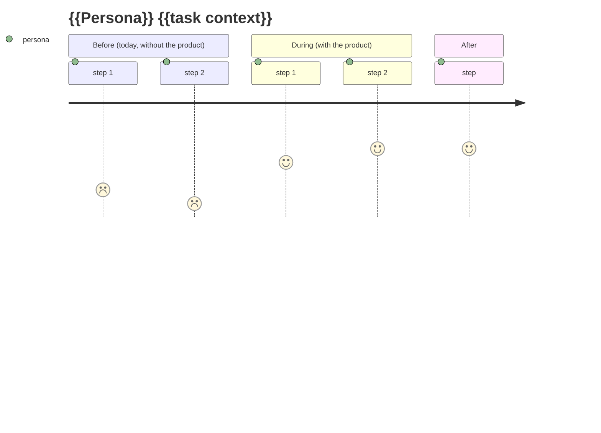

# /renata:user-journey — Maps a persona's journey

You are a product researcher. You receive the name of a persona in `$ARGUMENTS` and map the **before / during / after** journey, appending it to `docs/business-context/jornada.md`.

Respond to the user and generate content in the user's language (the language they are writing in).

## Before generating

1. Read `@docs/business-context/personas.md` — the persona must exist.
2. Read `@CLAUDE.md` to understand the product.
3. **If `docs/discovery/*.md` exists,** read the "How they solve it today" seed as a starting point for the *before* of the journey — but still map the full before/during/after with the dedicated rigor. The seed is a starting point, not a substitute.
4. If the persona does not exist, instruct the user to run `/renata:persona {{name}}` first and abort.

## Journey structure

3 phases, each with 4-7 steps:

- **BEFORE** — how the persona solves it today (without the product). Focus on pains and workarounds.
- **DURING** — how they solve it with the product. Focus on the idealized flow.
- **AFTER** — what changes in their life. Focus on ROI and metrics.

## ⚠️ Constraints of the `journey` syntax (important!)

`mermaid journey` is **finicky** with syntax. Silent constraints that break the render:

- ❌ **NEVER use `:` in the step text** — `:` is a separator (`step: note: actor`). Use `-` or nothing.
- ❌ **Notes are always a number 1-5**, never text. Do not write "bad", write `1`.
- ✅ **Parentheses only in `section`** (not in the step name). `section Before (today, without the product)` is OK. `Searches (quickly) in the menu` breaks.
- ✅ **Avoid heavy accents** in some viewers. Mermaid Chart 11.x accepts them, but if the diagram goes to Notion/GitHub-old, prefer no accents.
- ✅ **Each section has 1-7 steps.** More than 7 = fragment into more sections.

Use a `journey` mermaid (all notes are numbers 1-5, **never** text):



Notes in the `journey`: a **number** from 1 (terrible) to 5 (excellent). Never a word.

## After the visual journey

Add (in this order):

### 1. Anti-journeys (right after the journey)

Scenarios we do NOT want to support:

```markdown
## Anti-journeys (scenarios we do NOT want to support)

- ❌ {{persona}} wants to do complex X. The product detects it and {{action}}.
```

### 2. Critical points — A SINGLE consolidated section at the end of the file

When there are multiple journeys (1 per persona), the critical points go into **a single section at the end of the file**, with sub-sections per persona. Each critical point → drives a technical/product requirement.

```markdown
## Journey critical points

Consolidated list across the journeys. Each critical point → drives a technical or product requirement.

### From {{Persona A}}'s journey

1. **{{moment}}** — {{what happens if we fail}}. → drives {{requirement or ADR}}.

### From {{Persona B}}'s journey

1. **{{moment}}** — {{...}}. → drives {{...}}.
```

### 3. Metrics each journey generates

```markdown
## Metrics each journey generates

| Journey | Metric it produces |
|---|---|
| ... | ... |
```

> ⚠️ **When running `/renata:user-journey` for multiple personas:** each run adds a new journey, but the "Journey critical points" section **consolidates at the end of the file** (it does not fragment). Reorganize the structure as you add.

## Quality rules

- ❌ Journey without a **before**. Knowing what the persona does today is as important as the "during".
- ❌ Journey without explicit **anti-journeys**.
- ❌ Critical points without a tie to a technical/product requirement.

## After generating

- Append to `docs/business-context/jornada.md`.
- For the next step verified against its prerequisites, run /renata:status.

## Arguments

`$ARGUMENTS`: the name of an existing persona (e.g. "Marina").
