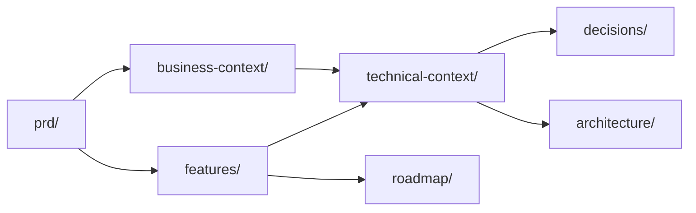

# Documentação · {{PROJECT_NAME}}

> Estrutura criada pelo RENATA. Padrão opinativo — toda decisão amarra a persona, ADR ou restrição operacional.

---

## Mapa

---

## Pastas

| Pasta | O que tem | Quando ler |
|---|---|---|
| `prd/` | Micro PRD vivo (1 página). | Sempre. |
| `business-context/` | Personas, jornadas, métricas. | Antes de discutir feature ou stack. |
| `technical-context/` | Stack ancorada, arquitetura macro. | Antes de codar ou abrir ADR. |
| `architecture/` | Diagramas detalhados (C4, sequence, ER). | Durante implementação. |
| `features/` | F1..Fn + plano em fases. | Ao iniciar feature ou priorizar. |
| `roadmap/` | Fase 0..N — escopo, dependências, riscos. | Planejamento macro. |
| `decisions/` | ADRs numeradas (Nygard). | Decisões estruturais ou "por que diabos foi assim". |

---

## Como começar este projeto

1. **Escreva o PRD** — `/prd <ideia>`. Resultado em `prd/`.
2. **Extraia personas** — `/persona <nome>`. Resultado em `business-context/personas.md`.
3. **Mapeie a jornada** — `/user-journey <persona>`. Resultado em `business-context/jornada.md`.
4. **Defina métricas** — manual em `business-context/metricas.md` (4 camadas: adoção, engajamento, valor, qualidade).
5. **Liste features candidatas** — `/feature-breakdown`. Resultado em `features/README.md` com âncora marcada.
6. **Especifique a feature âncora** — `/feature-spec <âncora>`. Resultado em `features/F1-<slug>.md`.
7. **Para decisões estruturais** — `/adr <decisão>`. Resultado em `decisions/ADR-NNN-<slug>.md`.
8. **Arquitetura macro** — manual em `technical-context/arquitetura.md` com mermaid.

---

## Convenções de escrita

- **Cada doc abre com tese de 1 parágrafo.**
- **Cada decisão tem âncora** (persona, ADR, restrição operacional).
- **Todo escopo IN tem escopo OUT.**
- **Estimativas em t-shirt sizes:** XS (<1d) · S (1-3d) · M (3-7d) · L (1-2 semanas) · XL (>2 semanas).
- **Diagramas:** mermaid embutido.

---

## O que NÃO está aqui

Esta pasta foi criada vazia por design. Conteúdo nasce de uso real, não de "porque o template manda".

Não preencher por preencher. Se uma pasta ficou vazia depois de semanas, ou ela não serve ou o método não bate com este projeto.
